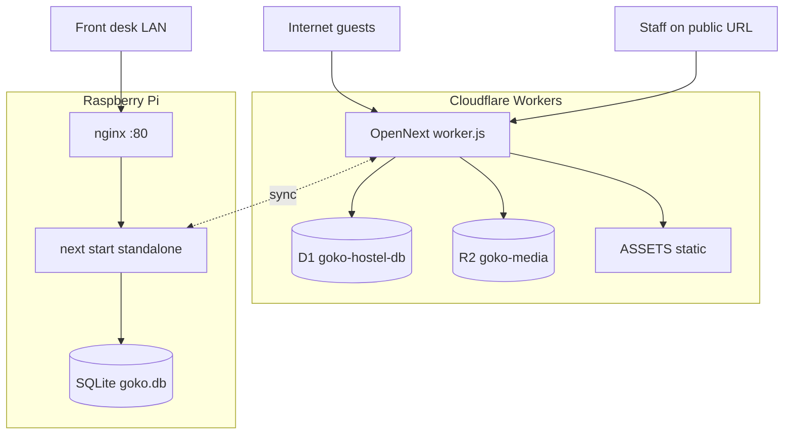
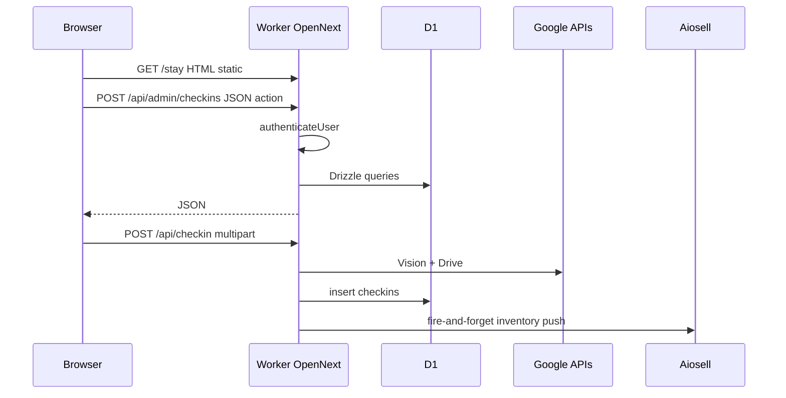

# Architecture

**Git-safe.** Passwords: [secrets-and-access.md](secrets-and-access.md). Deploy: [maintain.md](maintain.md). Bindings: `wrangler.jsonc`.


One Next.js app, two runtimes, SQLite everywhere, action-based POST APIs, files split between Drive (PII) and R2 (CMS JPEGs).

## Live identifiers (committed)

Passwords and account tokens: [secrets-and-access.md](secrets-and-access.md).

| | |
|--|--|
| Site | https://www.gokohostel.com |
| Admin | https://www.gokohostel.com/admin |
| Pi tunnel | https://pi.gokohostel.com |
| Worker / D1 / R2 | `wrangler.jsonc` (`goko-hostel-latest-webpage`, `goko-hostel-db`, `goko-media`) |

## Runtime split



Detection: `process.env.GOKO_RUNTIME === "pi"` (`src/lib/runtime.ts`).

`getDb()` (`src/db/index.ts`):

- Pi → `src/db/pi.ts` (`better-sqlite3`, cached).
- Else → `src/db/cloudflare.ts` via OpenNext `getCloudflareContext()`, binding `DB`.

`better-sqlite3` is an **optional** dependency so the Worker bundle does not require a native module. Pi **must** compile it (`setup-pi.sh` installs build tools).

`next.config.ts`:

- `images.unoptimized: true` (no Cloudflare Images optimizer).
- Pi: `output: "standalone"`.
- Inlines `BUILD_VERSION` and `NEXT_PUBLIC_GOKO_RUNTIME`.
- OpenNext Cloudflare **dev** monkey-patch only if `OPENNEXT_CLOUDFLARE_DEV=1` or `NEXT_DEV_WRANGLER_ENV` is set. Plain `npm run dev` does not load Wrangler.

---

## Request path (Cloudflare)



**Marketing pages** in `src/app/(marketing)/` export `dynamic = "force-static"`. They ship seed HTML. Events/Community then `GET /api/site?page=events|community` (D1, cache headers). Do not add `force-dynamic`, `connection()`, ISR Durable Objects, or OpenNext incremental cache for those pages — that SSR path caused Worker Error **1102** on the old 10ms Free CPU budget. Paid Workers is a safety net, not a reason to SSR `/events`.

**Admin / food / kitchen** are client components (`"use client"`). They are a SPA inside Next: password in React state, `fetch` to POST routes.

---

## API shape

Almost all mutating admin APIs are **one POST URL + `action` string**, not REST.

```
POST /api/admin/checkins
{ password, username?, action: "assignBed", ... }
```

Why: one auth check, related ops in one file, small surface for a future mobile app. Cost: not CDN-cacheable, no OpenAPI. See [decisions.md](decisions.md).

Public GETs exist where caching or guest phones matter: `/api/food/menu`, `/api/food/status`, `/api/site`, `/api/media/...`.

Full list: [api-map.md](api-map.md).

---

## Data layer

- **ORM:** Drizzle, SQLite dialect (`src/db/schema.ts`).
- **SQL applied in production:** `migrations/*.sql` via Wrangler D1. **Not** `drizzle/migrations` from `drizzle-kit generate`.
- **Money:** food / expenses / ledger / salary are integers in **paise** (₹1 = 100). **Bookings** calendar amounts are **rupees**.
- **Timestamps:** ISO strings. Date-only: `YYYY-MM-DD`. Month partitions: `JUNE-2026` (`getMonthKey()`).
- **Sync columns** on operational tables: `sync_id`, `sync_updated_at`, `sync_source`, often `deleted_at`.

Do **not** wrap `queries.ts` helpers in `db.transaction()`. Those helpers call `getDb()` again and on D1 that fights the open transaction (food-order 500s). Stock uses SQL `SET qty = qty - ?`. Changelog item 7.

---

## File storage (split on purpose)

| Content | Store | Why |
|---------|--------|-----|
| Passport / Aadhaar / visa / expense bills | Google Drive | Staff can open Drive; PII not on R2; monthly folders |
| CMS card + hero JPEGs | R2 `goko-media` via `/api/media/{key}` | Public, cacheable, not synced to Pi |
| Seeded photos still in git | `public/images/`, `public/legacy-images/` | Fallback + historical seed |
| Hero **videos** | `public/videos/hero/` | Not CMS; Events uses hero A, Community uses hero B |

If `MEDIA` is unbound, CMS upload returns **503**. Guest ID upload still uses Drive.

---

## Frontend architecture

| Layer | Pattern |
|-------|---------|
| Marketing | Server-rendered static HTML + client islands (carousels, CMS hydrate) |
| Admin | Client SPA, `next/dynamic` per section (first click spinner) |
| State | No Redux/Zustand. `useState` per panel. `BookingGateProvider` for Book now (then fresh configured guest destination; blank/error → enquiry). `useTabWithHistory` syncs `?section=` / `?tab=` |
| Guest cart | `localStorage` `gokoFoodCart` / `gokoFoodPhone` |
| Kitchen auth | HttpOnly scope-specific server session; optional Remember me extends it to 15 days |
| Admin auth | HttpOnly server session; optional Remember me extends the revocable session to 15 days; passwords are never stored in browser storage |
| Admin fetch helper | `useAdminApi` → **only** `POST /api/admin/checkins`. Other tabs use their own URLs. |
| PWA | `public/sw.js` (admin register). Failover via `/api/failover-config`. See [llm-onboarding.md](llm-onboarding.md). |

No shared Tab primitive — each page filters its own tab list by `adminOnly` / permission keys.

---

## Worker bindings (`wrangler.jsonc`)

| Binding | Resource |
|---------|----------|
| `DB` | D1 `goko-hostel-db` |
| `MEDIA` | R2 `goko-media` |
| `ASSETS` | OpenNext static `.open-next/assets` |

`compatibility_date` `2025-11-01`, `nodejs_compat`. Observability enabled.

Wrangler `migrations` tags v1/v2 create then **delete** OpenNext ISR Durable Object `DOQueueHandler`. Do not re-add it.

---

## Build / deploy (committed facts)

| Script | What |
|--------|------|
| `npm run dev` | Next dev (no Wrangler unless env flags) |
| `npm run build` | `next build` — **CI**, not the Worker |
| `npm run cf:build` | OpenNext Worker bundle |
| `npm run deploy:cf` | OpenNext build + deploy |
| `npm run build:pi` | Standalone with `GOKO_RUNTIME=pi` |

GitHub `ci.yml` runs test → lint → `next build` → audit. **It does not deploy.** There is no `deploy-cloudflare.yml`. Dashboard **Workers Builds** on `goko-hostel-latest-webpage` **does** ship on push to `main` (`npm run cf:build` then `wrangler deploy`). Local Wrangler (`npm run deploy:cf` from a worktree) is the fallback; stamps live in `MAINTAINER.local.md`.

Never run `next build` / `deploy:cf` in the same checkout as a live `npm run dev` (shared `.next`).

---

## Pi stack (committed shape)

App clone + `.env.local` + SQLite file + nginx reverse proxy to `next start -p 3000` + PM2 process (live name historically `goko`) + optional Cloudflare Tunnel + optional dnsmasq LAN failover.

Pi migrator **skips** `0035_site_cms.sql`, `0041_splits.sql`, `0081_split_expense_idempotency.sql`, `0064_food_bill_share_tokens.sql`, and `0079_site_hero_videos.sql` (still stamps `_migrations` so it will not retry). CMS, hero videos, splits, and bill-share tables are not in `syncEngine` and not in `seed-pi.ts`. Splits nav is hidden when `NEXT_PUBLIC_GOKO_RUNTIME === "pi"`.

Hardware, IPs, passwords: gitignored [secrets-and-access.md](secrets-and-access.md) + `MAINTAINER.local.md`. Do not copy secrets into this file.

---

## CPU / SSR constraints (why pages look “dumb”)

OpenNext can SSR a route. On Workers **Free**, CPU was 10ms and `/events` SSR blew Error 1102. The fix is static shells + client fetch to `/api/site`. Keep that split even on Paid (30s CPU): D1 wait is not the same as JS CPU, and static assets skip Worker JS.

Admin god-routes (`checkins`, `food-orders`) are large. Tests under `cpu-*.test.ts` exist to keep hot paths from growing carelessly. Prefer not adding SSR work to marketing routes.
