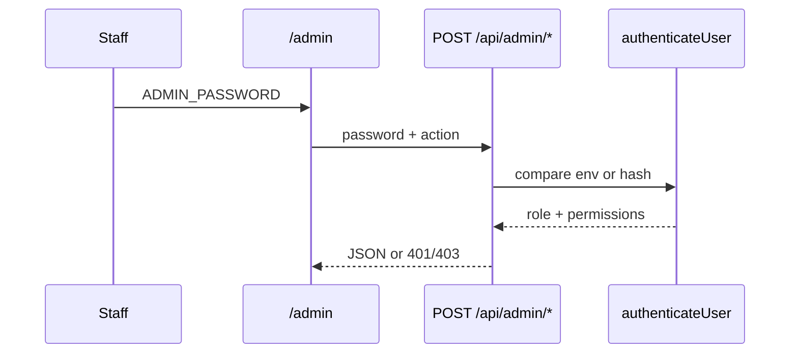

# Auth and RBAC

Guest photo-listings add no permission keys: dates-only availability remains public, cloud-only and read-only. Administrator-only Booking Settings saves `maxSelectedBeds` with existing revision/CAS protection; availability serializes only that public limit, not gateway settings. Browser bed selection is advisory; `prepareGuestCheckout` re-reads and enforces `maxSelectedBeds` server-side. Lookup retains email-code verification. Native guest checkout/payment writes are gated by readiness + `GOKO_NATIVE_GUEST_CHECKOUT_ENABLED` (test Razorpay only); live cutover remains blocked. See [guest booking UI](guest-booking-ui.md).

Staff WhatsApp routing adds no permissions or aliases. Management → My Preferences is available to every authenticated admin-shell user, but does not expose any other Management tab to users lacking its existing gate. Booking-template, review preparation, and Food Bill gates remain authoritative; the prepared-draft panel is within the authenticated shell and retains drafts only for their owner. The app preference is device-local and keyed by username. See [WhatsApp messaging](whatsapp-messaging.md).

Notification delivery uses `canReceiveBookingNotifications`, `canReceiveCheckinNotifications`, `canReceiveFoodNotifications`, `canReceiveTaskNotifications`, `canReceiveAttentionNotifications`, `canReceiveOperationsNotifications`, and `canReceiveReminderNotifications`. Admin assigns these category grants in Users; legacy DB users with none of the category keys keep all categories until explicitly configured. The user may further mute allowed events per device but cannot override an admin denial. `/api/push` derives endpoint ownership from the authenticated session. Lock-screen food alerts use first names only. See [Push notifications](push-notifications.md).

**Git-safe.** Passwords: [secrets-and-access.md](secrets-and-access.md).

Code: `src/lib/auth.ts`, `src/lib/actionPermissions.ts`, `src/lib/adminNav.ts`.

---

## How login works

The admin and kitchen SPAs authenticate once through `/api/auth/login`. The server issues an HttpOnly session cookie; subsequent API calls do not send or store the password. “Remember me” extends that server-side session to 15 days; otherwise admin sessions last 8 hours and kitchen sessions 12 hours. `/api/auth/logout` revokes the current session and `/api/auth/session` restores the UI state. Cloudflare and Pi sessions are local to each runtime.



**Env passwords:** values in [secrets-and-access.md](secrets-and-access.md).

| Env | Username when required | Result |
|-----|------------------------|--------|
| `ADMIN_PASSWORD` | omitted, or `admin` | `role: admin`, `permissions: {}`, **bypasses** all maps |
| `MANAGER_PASSWORD` | omitted, or `manager` | `role: manager`, `permissions: {}` |

DB users retain the JSON `permissions` object. New password hashes use a versioned per-user salted PBKDF2-SHA-256 KDF with 100,000 iterations (the Cloudflare Workers WebCrypto ceiling); legacy hashes migrate after successful login.

Kitchen (`authenticateKitchen`): env admin **or** env manager **or any DB user hash** (no username). Standalone `/kitchen` access uses the `scope=kitchen` session cookie; the embedded Admin → Food Orders → Active Orders view uses the already-authenticated `scope=admin` session and remains behind the `canViewFoodOrders` page/tab gate. Passwords are not stored in browser storage.

---

## Gate function

```ts
// src/lib/actionPermissions.ts
actionAllowed(role, permissions, required)
// admin → always allowed (unless required === "admin_only" and role !== admin)
// admin_only → admin_required if not admin
// string | string[] → any listed key true on permissions
```

**Trap:** env manager has empty permissions → **forbidden** on every gated action. That is intentional (changelog item 2). Give them a DB user with keys, or use `ADMIN_PASSWORD`.

Website CMS: **admin role only**, not a permission key. **403 on Pi.**

`auth` on checkins returns `{ role, permissions }` with no extra gate. `changeMyPassword` is **omitted** from `ACTION_PERMISSIONS`, so `actionAllowed(undefined)` → **allowed** for any authenticated user.

Bookings, Timeline, and Inventory custom date ranges are view filters. They do not add permissions or change the existing page/action authorization: Bookings still requires `canViewBookings`, Timeline `canViewTimeline`, and Inventory `canManageInventory`.

`/api/admin/channel-manager`: admin role for configuration and mutation actions; `getSyncLogs` is a read-only exception gated by `canViewLogs`. `/api/admin/food` uses a per-action permission map for menu, stock, and food settings; admin bypasses all permissions. `getBillBranding` is an OR of `canGenerateFoodBills` | `canManageFoodSettings` | `canViewFoodOrders` (returns bill branding keys + `food_tax_rate` only). `updateFoodSettings` / Bill Settings UI / `bills` R2 upload require `canManageFoodSettings`. Food-orders `createBillShareLink` is an OR of `canGenerateFoodBills` | `canMarkPaid` | `canViewFoodOrders`; it validates phone ownership of the selected hostel `checkinId` or walk-in normalized guest name before minting an identity-scoped link. The public phone lookup remains unauthenticated but returns no order details until an ambiguous identity is selected.

`/api/admin/booking-settings`: `getSettings`, `saveSettings`, and `checkGatewayReadiness` require authenticated **admin role**, and all return 403 on Pi. Same gate for `getEmailTemplates` / `saveEmailTemplates` / `getSmsTemplates` / `saveSmsTemplates`. Management's `bookingSettings` and `razorpayPayments` tabs are admin-only/Cloudflare-only. No new permission key or fallback is introduced for this foundation. Invalid saved drafts fail closed with 409 `BOOKING_SETTINGS_INVALID`; partial saves preserve other saved fields. `/api/booking/config` and `/api/booking/destination` are public but expose only validated guest routing, not the authenticated Channel Manager config. Their dedicated query selects only guest destination/API base columns, never password or webhook-secret columns. Readiness currently means configuration presence only, never capture/webhook/provider verification. Native checkout is disabled. See [Website booking foundation](flows-website-booking.md).

Booking Settings saves additionally require the revision returned by `getSettings`; stale/missing revisions and intervening database writes return 409 `BOOKING_SETTINGS_CONFLICT` without overwriting drafts. `/api/admin/booking-payments` is authenticated **admin-role-only** for every action including `listWebsiteAttempts` (Website payments ledger) and the ₹1 test preview actions (connectivity, list, create, get, claim checkout, verify callback, reconcile, refund, retry webhook); manager/staff permissions and compatibility aliases never grant access. The admin UI may send an empty password after login because authentication then resolves the existing admin session cookie; an empty or missing session is still rejected with 401. All gateway routes/services reject Pi. New test orders/checkout claims/refunds require `RAZORPAY_TEST_PREVIEW_ENABLED=true`; reconciliation survives disabling it with original test keys. No stored payment permission is introduced for this isolated preview. `/api/webhooks/razorpay` is public but requires exact-byte HMAC against configured test and/or live webhook secrets and a valid event ID. It does not accept a client-selected environment. See [Razorpay workflows and release boundary](integrations-razorpay.md).

`/api/admin/reviews`: admin **or** `canViewReviews`.

`/api/admin/import` uses the shared session and `canAddCheckin`. `/api/admin/upload` uses the shared session and `canAddCheckin` or `canEditRecords`.

Form C: token = `ADMIN_PASSWORD` or fallback `"goko-form-c-secret"`.

Sync: `ADMIN_PASSWORD` **or** `SYNC_SECRET`.

Aiosell webhook: D1 `channel_config.webhookSecret` via `Authorization` or `x-api-key` (raw or `Bearer …`). 503 if inactive or secret empty. 401 on mismatch.

---

New Razorpay test order/checkout/refund operations additionally require a current test webhook secret and successful preflight of every gateway table/column. These setup checks do not weaken the admin-role or Pi denial gates.

## Full permission keys (Users UI)

From `ManagementUsers.tsx`. Admin bypasses all. Putting a key in the UI **does not** always mean the API checks it (see [llm-onboarding.md](llm-onboarding.md) §4).

**Nav:** `canViewDashboard`, `canViewBookings`, `canViewBeds`, `canViewTimeline`, `canViewRecords`, `canViewFoodOrders`, `canViewAccounts`, `canViewSplits`, `canViewReviews`, `canViewManagement`, `canViewAudit`, `canViewLogs`, `canViewTasks`

**Check-in:** `canAddCheckin`, `canAssignBed`, `canCheckout`, `canMarkClean`, `canEditRecords`, `canDeleteRecords`

**Booking:** `canAddBooking`, `canCheckIn`, `canCheckOut`, `canDeleteBooking`, `canRecordBookingPayments`, `canCorrectBookingPayments`, `canManageBookingContacts`, `canManageBookingTemplates`

**Food:** `canViewFoodOrders`, `canViewFoodTabs`, `canPlaceOrders`, `canEditFoodOrders`, `canVoidFoodOrders`, `canMarkPaid`, `canApplyFoodDiscounts`, `canGenerateFoodBills`, `canManageInventory`, `canViewMenu`, `canManageMenuCategories`, `canManageMenuItems`, `canToggleMenuAvailability`, `canManageFoodSettings`. The food payment modal may call `getFoodReceiptAccounts` with an empty password after login; it authenticates through the existing admin session cookie and still requires `canMarkPaid` (or admin bypass).

**Expenses:** `canAddExpense`, `canEditExpense`, `canDeleteExpense`, `canViewExpenses`, `canViewFoodBills`, `canAddIncome`, `canReconcileCash`, `canReconcileOnline`, `canSettlePlatformPayments`, `canAdjustPlatformReceivables`, `canManageAccountSettings`, `canManageVendors`, `canManageEmployees`, `canManagePayroll`

**Splits:** `canAddSplitExpense`, `canEditSplitExpense`, `canDeleteSplitExpense`, `canSettleSplits`, `canManageSplits` (plus nav `canViewSplits`). `payGokoReimbursement` / Goko-as-payer add **and update** / `listAccounts` also need `canAddExpense` (inline AND; `actionAllowed` arrays are OR).

**Reviews:** `canViewReviews`, `canSendReviewRequests`, `canEditReviewRequests`, `canManageReviewSettings`

**Analytics:** `canViewAnalytics`

**Tools:** `canUseQRGenerator`, `canManageAttendance`, `canViewQuickLinks`, `canManageTasks`

**Notification categories:** `canReceiveBookingNotifications`, `canReceiveCheckinNotifications`, `canReceiveFoodNotifications`, `canReceiveTaskNotifications`, `canReceiveAttentionNotifications`, `canReceiveOperationsNotifications`, `canReceiveReminderNotifications`. These are delivery grants rather than page/action authorization keys; the push sender enforces them before device preferences.

`canManageInventory` gates the **Inventory** admin tab and `/api/admin/inventory`, plus stock controls inside Menu. Menu viewing and administration use the dedicated menu permissions above.
`canCheckIn` / `canCheckOut` are grantable calendar controls. The booking API remains backward-compatible with `canAddBooking`. `canManageBookingContacts` permits staff to add, edit, and delete custom phone/email rows on any booking; PMS-origin rows are immutable, and this permission does not change food-tab, check-in identity, review, or payment lookup behavior.
Obsolete keys and their planned cleanup are tracked in [permission-debt.md](permission-debt.md).

Menu deletion permissions are unchanged: `canManageMenuItems` archives an item and `canManageMenuCategories` archives a category and its items. Archiving preserves historical orders; it does not grant permission to delete order history.

### Admin nav permissions

| Section | Key |
|---------|-----|
| dashboard | `canViewDashboard` |
| bookings | `canViewBookings` |
| beds | `canViewBeds` |
| timeline | `canViewTimeline` |
| inventory | `canManageInventory` |
| records | `canViewRecords` |
| foodOrders | `canViewFoodOrders` |
| expenditure | `canViewAccounts` |
| splits | `canViewSplits` (omitted from `ADMIN_NAV` on Pi) |
| reviews | `canViewReviews` |
| management | `canViewManagement` for operational tabs; authenticated users may enter only My Preferences without it |

Admin always sees all. Staff see first allowed section (`firstVisibleAdminSection`).

Management tabs: My Preferences is self-service for every authenticated admin-shell user and grants no operational access. Other tabs keep their existing parent and tab gates: most are `adminOnly: true`; exceptions include Audit (`canViewAudit`), Logs (`canViewLogs`), History, Rates, Menu (`canViewMenu`), Food Settings (`canManageFoodSettings`), QR (`canUseQRGenerator`), Account Settings (`canManageAccountSettings`), Analytics (`canViewAnalytics`; existing managers retain compatibility access), Links & QRs (`canViewQuickLinks`), and To Do (`canViewTasks` or `canManageTasks`). Users without existing Management access see only My Preferences. The QR Generator API enforces `canUseQRGenerator` as well as the UI gate. To Do viewers see the shared active queue but can update only tasks assigned to themselves; `canManageTasks` controls create/edit/reassign/archive/reopen and all-task management. Dashboard task data is returned for the authenticated DB user with `canViewTasks` or `canManageTasks`. Recording a purchase-task expense additionally requires existing `canAddExpense`. Audit retention and log-level settings remain admin-only; Links & QRs mutations are admin-only. The public guest page is `/quick-links`; it exposes active cards only. Website hidden when `NEXT_PUBLIC_GOKO_RUNTIME === "pi"`.

---

## Action maps (source of truth in routes)

### `/api/admin/checkins`

| Actions | Perm |
|---------|------|
| list, verifyCheckin, getFormCData | `canViewRecords` |
| getBookingResolutionData | `canAddBooking` **or** `canViewRecords` |
| searchBookingsForCheckin | `canAddBooking` |
| linkBookingToCheckin, markCheckinNoBookingNeeded | `canAddBooking` |
| add | `canAddCheckin` |
| addPast, reExtractFormC, updateFormCData, removeFormCSubmission | admin_only |
| update | `canEditRecords` |
| delete | `canDeleteRecords` |
| getDeleteInfo | `canDeleteRecords` |
| getDashboard, markVibeMatched | `canViewDashboard` |
| checkoutBed, checkoutGuest, undoCheckout, getPendingFoodTab | `canCheckout` **or** `canViewDashboard` |
| getBeds | `canViewBeds` **or** `canViewTimeline` |
| getBedHistory | `canViewBeds` |
| assignBed, unassignBed, changeBed | `canAssignBed` **or** `canViewBeds`; physical bed assignment is independent of online booking-bed assignment, so a checked-in online guest uses the normal Beds flow and may take any physically available slot; assignment targets the check-in identity |
| markClean | `canMarkClean` |

Before deletion, Records checks linked food orders using `getDeleteInfo` and shows their order numbers, totals, and statuses. Deleting a check-in preserves historical food orders and physical bed rows by clearing their nullable `checkinId` references before deleting the check-in record.
| getBookings, getUpcomingBookings, updateBookingStatus | `canViewBookings` |
| addBooking | `canAddBooking` |
| deleteBooking | `canDeleteBooking` |
| audit reads (`getAuditLog`, `getInventoryAuditLog`) | `canViewAudit` |
| system/PMS log reads (`getSystemLogs`, `getSyncLogs`) | `canViewLogs` |
| users, audit retention, backup, settings, stats, health, rate scrape, initDorms… | admin_only |

Audit presentation fields are read-only enrichments; they do not change the `canViewAudit` requirement or grant access to any additional data.

### `/api/admin/attendance`

`getAuditHistory` is a history-only read for the Management → Audit → Attendance tab and uses `canViewAudit`; it does not return payroll or attendance-calendar data. `getMonth`, `getPayroll`, and attendance/policy mutations require `canManageAttendance` for manager and staff accounts; admin bypasses the permission map. The Management → Attendance calendar uses the same permission for editing.

### `/api/admin/tasks`

`listTasks` requires `canViewTasks` or `canManageTasks`; `getTaskAssignees`, create/edit/archive/reopen and follower selection require `canManageTasks`. Create and edit require only a title when supplied; the assignee is optional and can be cleared to leave a task unassigned. Followers must be active database users. `updateAssignedTask` and task-file uploads require `canViewTasks` plus an exact assignee match unless the user has `canManageTasks`. `createTaskExpense` requires `canAddExpense`, validates a purchase task and one-to-one task link, and reuses the task’s Drive attachments. Task assignment/completion pushes are additionally filtered by `canReceiveTaskNotifications` and device preferences. Task rows, including follower usernames, are synced with soft-delete; Drive objects are not synced.

Dashboard checkout rows show room status from a matched booking and food status from active check-in orders. Room matching is read-only and identity-first: it uses the check-in booking reference, then a unique normalized phone or guest-name match with overlapping stay dates. A physical bed’s booking assignment is never used as an identity match; planned room/bed labels are displayed separately and do not change physical occupancy or payment state. Unlinked legacy guests are shown as room `not_linked`. An overall clear state is shown only when a room is linked and both room and food balances are clear.

Active `Walk-in` and `Offline booking` check-ins with no exact or unique identity/date booking match show a Records resolution prompt to users with `canAddBooking`. The prompt supports creating a booking from the check-in, linking a selected existing booking, or permanently marking no booking needed. Resolution state is stored on the check-in and is synced; creating a booking preserves the self-check-in reference as the manual booking reference and reuses the existing assignment path. Aiosell inventory is updated only when at least one selected bed is `online`; `offline` and `block` assignments remain internal.

For `add`, `addPast`, and `update`, any non-Indian nationality must use `idType=passport` and include a stored visa document link. The Admin Records UI prompts for visa uploads; self-check-in enforces the same rule through its public validation flow. Indian guests may use Aadhaar, Driving Licence, or Passport. Records **Past** is admin-only in both UI and API (`addPast: admin_only`); it creates an archival check-in only, not a PMS booking.

### `/api/admin/bookings`

Guest-detail-only booking edits omit an unchanged nightly rate, so they preserve the saved total instead of repricing under changed tax or discount settings.

Calendar PMS. View keys `canViewBookings`; this includes `getCalendarData`, `getAllBookings`, and booking details. `getAllBookings` is read-only, date-overlap filtered, paginated, and includes cancelled/no-show/closed rows without changing calendar visibility. `editReservation` uses `canAddBooking` and is available from the detail panel for manual/offline/walk-in bookings; the server validates all guest, date, capacity, assignment, pricing, and state rules. Manual booking edits may also change final amount received: increases require a payment method and online receipt account when applicable; decreases are either correction-only or a recorded cash/online/split refund, with online receipt reversal. Mutating `canAddBooking` / `canDeleteBooking` / `canCheckIn` / `canCheckOut`. `getPendingFoodTab` is the same OR as `checkOut`. `releaseForNoShow`, `cancelBooking`, `hardDeleteRecordsWalkinBooking`, `refundWebsiteOrphan`, `markNoShow`, and `retryNoShow` require `canDeleteBooking`; full cancel of a Records-linked walk-in reopens the check-in to pending; hard-delete permanently removes only Records-linked manual walk-in/offline bookings (not OTA/website). Release-for-no-show is Booking.com-only, preserves the OTA row locally as `guest_declined`, frees beds/Aiosell inventory, and allows no-show only after check-in. Rollback check-in/out = admin_only. Unassigned **Reject** is admin/manager (`role`), not `canDeleteBooking` — staff 403 on full-cancel of a stay with no assigned beds. Env manager can Reject without that key; assigned cancel still needs `canDeleteBooking`.

Walk-in creation may record an optional cash or online advance. `getRoomReceiptAccounts` is available to `canAddBooking`, `canCheckIn`, `canRecordBookingPayments`, or `canDeleteBooking` users and returns only active room-receipt account display data. `canDeleteBooking` is included so staff already authorized to cancel/no-show can select an account for an online refund; it does not grant collection permission. Online advances create the normal booking receipt and are server-validated against the recomputed total; manual reservation edits can correct or adjust collected money, and reject totals below the final amount received.

Eligible OTA pay-at-property bookings have a dedicated payment flow: `collectOtaBookingPayment` requires `canRecordBookingPayments` plus the existing booking view gate. It records a cash/online/split collection and does not grant booking edit, check-in, cancellation, or refund rights. `refundOtaBookingPayment` remains under `canDeleteBooking`; immediate cancellation/no-show refunds also require authorization for that lifecycle action. `correctOtaBookingPayment` requires `canCorrectBookingPayments` (reason-required; reverses mistaken journal Paid, does not refund the guest). Admin bypass behavior remains unchanged.

### `/api/admin/inventory`

All actions: `canManageInventory`. Bulk actions write the local mutation, then wait for the bounded Aiosell push before reporting PMS success. If the local write succeeds but PMS rejects or times out, the response reports the failed sync separately and the UI offers a PMS-only retry; local inventory/rate/restriction data is retained. The protected scheduled inventory retry remains a server-side safety net for dirty inventory rows.

### `/api/admin/food-orders`

`getCombinedBillOptions` is a bill-supporting read with the same `canGenerateFoodBills` OR `canViewFoodOrders` gate as `getCombinedBill`. `saveOrderEdits` uses the edit/place/view gate and commits staged item changes, inventory deltas, optional exact refunds, payment projections, receipts, and audit entries transactionally; its operation ID makes retries idempotent. `cancelUnpaidOrder` uses the void/place/view gate, verifies the order has zero net collected amount, then marks it cancelled, restores inventory, and records modification/audit history. Paid or partially paid orders are rejected by the server. All unpaid read paths derive inclusion from net due (`amount_paid - amount_refunded`) instead of trusting a stale payment-status projection, so walk-ins and hostel orders remain billable. Item editing and payment correction controls are outside the Bill view; Bill contains outstanding items and payment actions.

View list/tabs: `canViewFoodOrders` / `canViewFoodTabs`; the Order Summary UI accepts either of those view permissions and is also available to pay-only staff with `canMarkPaid`. Combined Bill supporting reads (`getCombinedBill`, `getGuestsWithTabs`, `getGuestTab`, `getMenu`) also allow `canGenerateFoodBills`. Place/void/qty/market-price finalization: `canPlaceOrders` or view. Pay, payment correction, refund, and one-order revert: `canMarkPaid`; discount: `canApplyFoodDiscounts` or `canMarkPaid`; payment is rejected while an active line remains price-pending. `markOrderPaid`, `applyDiscount`, and `removeDiscount` accept multiple order IDs and apply the combined write/audit/receipt operation transactionally, so a validation or write failure does not leave a partial combined result. Food payment is balance-based: `amount_paid` is preserved through edits, combined payment charges only outstanding balances oldest order first, and an individual revert clears only the selected order’s payment. Order Summary uses `listOrders` for bounded recent paid orders while unpaid/partial balances remain visible without an age cutoff; its Bill view allows `canMarkPaid` users to correct or revert one order at a time. Managers receive these capabilities through the same stored permission keys as staff; the environment manager remains intentionally empty-permission and must use a DB user with the required keys. The former destructive `cleanupOldOrders` action is retired; the Audit tab applies global retention as a read boundary while preserving food-order records.

### `/api/admin/expenses`

list/getMy: `canViewExpenses`. add: `canAddExpense`. update/delete: edit/delete expense keys. food revenue **and** room revenue (`getRoomRevenue`): `canViewFoodBills`. ledger: `canViewAccounts`. income: `canAddIncome`. cash reconcile: `canReconcileCash`; configured-account reconcile: `canReconcileOnline`. The retired `canReconcileAccounts` and `canReconcile` keys grant both scopes during compatibility. Undo reconciliation is Admin-only. Opening balance: `canManageAccountSettings` (legacy alias `canManageAccounts`).

`getAccountActivity` requires both `canViewAccounts` and `canViewExpenses`; this is an AND gate. Its online food rows are payment-level projections over per-order receipts, and Cash includes manual income/expenses plus journaled food and room cash movements. These projections do not grant payment or reconciliation permissions. `getExpenseEditOptions` requires `canEditExpense`.

Accounts UI shows the Reconcile tab when either scoped reconciliation permission is available. Every account is saved separately; server authorization is selected from the submitted cash/online target.

### `/api/admin/splits`

Every action requires `canViewSplits`. Then: list* → view; people/groups → `canManageSplits`; `addExpense` → `canAddSplitExpense`; update/delete → edit/delete keys; `addSettlement` / `deleteSettlement` / `payGokoReimbursement` → `canSettleSplits`. Goko cash paths **and** `listAccounts` **also** require `canAddExpense` after the map. 403 on Pi. See [flows-splits.md](flows-splits.md).

### `/api/admin/account-settings`

Accounts/vendors/categories actions use `canManageAccountSettings` (or legacy `canManageAccounts`) or admin; employee actions also accept `canManageEmployees`, and payroll actions use `canManagePayroll`. `getFoodReceiptAccounts` is a read-only active, non-virtual account list gated by `canMarkPaid` for the food payment modal; it does not grant account-management access. `removeEmployee` requires `canManageEmployees` (or the account-settings fallback) and only removes an inactive employee from the roster; linked history is retained.

### `/api/admin/platform-settlements`

`list` requires `canViewAccounts`. Platform and inclusive check-in date filtering, mobile whole-card selection, and selected money totals operate only on the rows returned by `list` and do not relax action authorization. `createSettlement`, `allocate`, `allocateBatch`, and `refreshWebsiteFees` require `canSettlePlatformPayments`; `adjust`, `setWebsiteFees`, and `recognizeMissing` (ops API backfill; not exposed in Accounts UI) require `canAdjustPlatformReceivables`. Admin bypasses all maps. Virtual platform accounts are deliberately excluded from bank-receipt defaults and reconciliation.

---

## Public / guest (no staff password)

Check-in, food menu/order/status/bills, `/api/site`, `/api/media`, `/api/settings`, `/api/validate-id`, review token page, Aiosell webhook (provider auth, not staff password).

Kitchen is staff-passworded but not full admin RBAC. Its `updateStatusBulk` action only permits the forward stage transitions placed → preparing, preparing → ready, and ready → served; it skips orders that have moved out of the requested stage so stale screens cannot move them backward or across stages.
# Internal native hold milestone (17 September 2026)

Accepted-quote persistence/recovery verifies original hold ownership and rejects Pi. It adds no route, active permission or compatibility alias; internal acceptance is opt-in. SQL protects immutable evidence, but that does not authorize payment/booking fulfilment. See [accepted-quote workflow](native-accepted-quotes.md).

Internal quote/refund calculators add no permission or endpoint. Checked-in/out cancellation calculations are rejected for staff-workflow handling; this is a lifecycle guard, not a substitute for authorization. Future refund APIs still require explicit money-action permission maps and atomic claims. See [scope](native-booking-quotes-and-refunds.md).

Read-only recovery now requires the original UUID request key and matching owner-token hash in the storage query; missing requests/wrong owners return the same 404. Hold-aware advisory selection remains internal and opt-in. Both reject Pi before storage access; neither adds a route or bypasses existing staff authorization. No public guest capability is enabled. Storage failures are sanitized.

The [physical inventory hold primitive](native-inventory-hold-foundation.md) adds no page, public/admin API action or permission key. Creation is Cloudflare-only and default-disabled via `GOKO_NATIVE_HOLD_INTERNAL_ENABLED`; recovery/release require the original hashed owner token. No guest authorization, payment permission or production checkout is implemented by this primitive. Existing permission aliases and page gates are unchanged. Public exposure requires the remaining pool/quota, fulfilment, abuse-protection and Pi ownership release gates first.
# Public guest booking verification

Real-rate preview uses the same public read-only availability API as `/book`, not administrator routes or credentials. No mutation permission, cross-origin proxy or database provisioning is added. Preview lookup/email and payment remain blocked.

`/api/guest-booking/availability` is read-only public advisory data; no PMS guest/physical allocation details are serialized. `/api/guest-booking/lookup` is cloud-only reference/email OTP authentication, not admin-session or RBAC access. Single-use, ten-minute challenges permit five attempts and ten-minute per-booking email cooldown. Checkout/verify/cancel/status are token-gated guest routes (not admin RBAC); they require readiness and env gates. Administrator keys and compatibility aliases are unchanged. Activation and edge abuse controls: [guest-booking-ui.md](guest-booking-ui.md).
