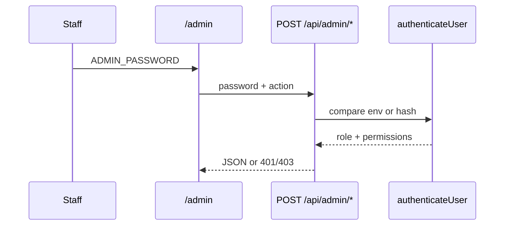

# Auth and RBAC

**Git-safe.** Passwords: [secrets-and-access.md](secrets-and-access.md).

Code: `src/lib/auth.ts`, `src/lib/actionPermissions.ts`, `src/lib/adminNav.ts`.

---

## How login works

There are **no JWT cookies**. The admin SPA keeps the password in React state (optional “remember me” in localStorage). `/admin` opens directly to one username/password form; every new login sends `{ password, username, action }`. The server determines whether the account is admin, manager, or a database user from those credentials. Older remembered sessions without a username remain supported for compatibility.



**Env passwords:** values in [secrets-and-access.md](secrets-and-access.md).

| Env | Username when required | Result |
|-----|------------------------|--------|
| `ADMIN_PASSWORD` | omitted, or `admin` | `role: admin`, `permissions: {}`, **bypasses** all maps |
| `MANAGER_PASSWORD` | omitted, or `manager` | `role: manager`, `permissions: {}` |

DB users: `users.password_hash` = SHA-256(password + `"goko-salt-2026"`). JSON `permissions` object.

Kitchen (`authenticateKitchen`): env admin **or** env manager **or any DB user hash** (no username). Stored in `sessionStorage.kitchen_pw`.

---

## Gate function

```ts
// src/lib/actionPermissions.ts
actionAllowed(role, permissions, required)
// admin → always allowed (unless required === "admin_only" and role !== admin)
// admin_only → admin_required if not admin
// string | string[] → any listed key true on permissions
```

**Trap:** env manager has empty permissions → **forbidden** on every gated action. That is intentional (changelog item 2). Give them a DB user with keys, or use `ADMIN_PASSWORD`.

Website CMS: **admin role only**, not a permission key. **403 on Pi.**

`auth` on checkins returns `{ role, permissions }` with no extra gate. `changeMyPassword` is **omitted** from `ACTION_PERMISSIONS`, so `actionAllowed(undefined)` → **allowed** for any authenticated user.

`/api/admin/channel-manager`: **admin role only**. `/api/admin/food` uses a per-action permission map for menu, stock, and food settings; admin bypasses all permissions.

`/api/admin/reviews`: admin **or** `canViewReviews`.

`/api/admin/import` and `/api/admin/upload`: env `ADMIN_PASSWORD` / `MANAGER_PASSWORD` only — **not** DB users.

Form C: token = `ADMIN_PASSWORD` or fallback `"goko-form-c-secret"`.

Sync: `ADMIN_PASSWORD` **or** `SYNC_SECRET`.

Aiosell webhook: D1 `channel_config.webhookSecret` via `Authorization` or `x-api-key` (raw or `Bearer …`). 503 if inactive or secret empty. 401 on mismatch.

---

## Full permission keys (Users UI)

From `ManagementUsers.tsx`. Admin bypasses all. Putting a key in the UI **does not** always mean the API checks it (see [llm-onboarding.md](llm-onboarding.md) §4).

**Nav:** `canViewDashboard`, `canViewBookings`, `canViewBeds`, `canViewTimeline`, `canViewRecords`, `canViewFoodOrders`, `canViewAccounts`, `canViewSplits`, `canViewReviews`, `canViewManagement`

**Check-in:** `canAddCheckin`, `canAssignBed`, `canCheckout`, `canMarkClean`, `canEditRecords`, `canDeleteRecords`

**Booking:** `canAddBooking`, `canCheckIn`, `canCheckOut`, `canDeleteBooking`, `canManageBookingTemplates`

**Food:** `canViewFoodOrders`, `canViewFoodTabs`, `canPlaceOrders`, `canEditFoodOrders`, `canVoidFoodOrders`, `canMarkPaid`, `canApplyFoodDiscounts`, `canGenerateFoodBills`, `canManageInventory`, `canViewMenu`, `canManageMenuCategories`, `canManageMenuItems`, `canToggleMenuAvailability`, `canManageFoodSettings`

**Expenses:** `canAddExpense`, `canEditExpense`, `canDeleteExpense`, `canViewExpenses`, `canViewFoodBills`, `canAddIncome`, `canReconcileAccounts`, `canManageAccountSettings`, `canManageVendors`, `canManageEmployees`, `canManagePayroll`

**Splits:** `canAddSplitExpense`, `canEditSplitExpense`, `canDeleteSplitExpense`, `canSettleSplits`, `canManageSplits` (plus nav `canViewSplits`). `payGokoReimbursement` / Goko-as-payer add **and update** / `listAccounts` also need `canAddExpense` (inline AND; `actionAllowed` arrays are OR).

**Reviews:** `canViewReviews`, `canSendReviewRequests`, `canEditReviewRequests`, `canManageReviewSettings`

**Analytics:** `canViewAnalytics`

**Tools:** `canUseQRGenerator`, `canManageAttendance`, `canViewQuickLinks`

`canManageInventory` gates the **Inventory** admin tab and `/api/admin/inventory`, plus stock controls inside Menu. Menu viewing and administration use the dedicated menu permissions above.
`canCheckIn` / `canCheckOut` are grantable calendar controls. The booking API remains backward-compatible with `canAddBooking`.
Obsolete keys and their planned cleanup are tracked in [permission-debt.md](permission-debt.md).

### Admin nav permissions

| Section | Key |
|---------|-----|
| dashboard | `canViewDashboard` |
| bookings | `canViewBookings` |
| beds | `canViewBeds` |
| timeline | `canViewTimeline` |
| inventory | `canManageInventory` |
| records | `canViewRecords` |
| foodOrders | `canViewFoodOrders` |
| expenditure | `canViewAccounts` |
| splits | `canViewSplits` (omitted from `ADMIN_NAV` on Pi) |
| reviews | `canViewReviews` |
| management | `canViewManagement` |

Admin always sees all. Staff see first allowed section (`firstVisibleAdminSection`).

Management tabs: most `adminOnly: true`. Exceptions: History, Rates (visible), Menu (`canViewMenu`), Food Settings (`canManageFoodSettings`), QR (`canUseQRGenerator`), Account Settings (`canManageAccountSettings`), Analytics (`canViewAnalytics`; existing managers retain compatibility access), and Links & QRs (`canViewQuickLinks`). Links & QRs mutations are admin-only; non-admin users are read-only. The public guest page is `/quick-links`; it exposes active cards only. Website hidden when `NEXT_PUBLIC_GOKO_RUNTIME === "pi"`.

---

## Action maps (source of truth in routes)

### `/api/admin/checkins`

| Actions | Perm |
|---------|------|
| list, verifyCheckin, getFormCData | `canViewRecords` |
| add | `canAddCheckin` |
| addPast, reExtractFormC, updateFormCData | admin_only |
| update | `canEditRecords` |
| delete | `canDeleteRecords` |
| getDashboard, markVibeMatched | `canViewDashboard` |
| checkoutBed, checkoutGuest, undoCheckout, getPendingFoodTab | `canCheckout` **or** `canViewDashboard` |
| getBeds | `canViewBeds` **or** `canViewTimeline` |
| getBedHistory | `canViewBeds` |
| assignBed, unassignBed, changeBed | `canAssignBed` **or** `canViewBeds`; physical bed assignment is independent of online booking-bed assignment, so a checked-in online guest uses the normal Beds flow and may take any physically available slot; assignment targets the check-in identity |
| markClean | `canMarkClean` |
| getBookings, getUpcomingBookings, updateBookingStatus | `canViewBookings` |
| addBooking | `canAddBooking` |
| deleteBooking | `canDeleteBooking` |
| users, audit, backup, settings, stats, health, rate scrape, initDorms… | admin_only |

Dashboard checkout rows show room status from a matched booking and food status from active check-in orders. Room matching is read-only and prefers the current bed/date booking assignment, then the check-in booking reference, then a unique normalized phone or guest-name match; unlinked legacy guests are shown as room `not_linked`. An overall clear state is shown only when a room is linked and both room and food balances are clear.

For `add`, `addPast`, and `update`, any non-Indian nationality must use `idType=passport` and include a stored visa document link. The Admin Records UI prompts for visa uploads; self-check-in enforces the same rule through its public validation flow. Indian guests may use Aadhaar, Driving Licence, or Passport.

### `/api/admin/bookings`

Guest-detail-only booking edits omit an unchanged nightly rate, so they preserve the saved total instead of repricing under changed tax or discount settings.

Calendar PMS. View keys `canViewBookings`; this includes `getCalendarData`, `getAllBookings`, and booking details. `getAllBookings` is read-only, date-overlap filtered, paginated, and includes cancelled/no-show/closed rows without changing calendar visibility. `editReservation` uses `canAddBooking` and is available from the detail panel for manual/offline/walk-in bookings; the server validates all guest, date, capacity, assignment, pricing, and state rules. Manual booking edits may also change final amount received: increases require a payment method and online receipt account when applicable; decreases are either correction-only or a recorded cash/online/split refund, with online receipt reversal. Mutating `canAddBooking` / `canDeleteBooking` / `canCheckIn` / `canCheckOut`. `getPendingFoodTab` is the same OR as `checkOut`. Rollback check-in/out = admin_only. Unassigned **Reject** is admin/manager (`role`), not `canDeleteBooking` — staff 403 on full-cancel of a stay with no assigned beds. Env manager can Reject without that key; assigned cancel still needs `canDeleteBooking`.

Walk-in creation may record an optional cash or online advance. `getRoomReceiptAccounts` is available to `canAddBooking` or `canCheckIn` users and returns only active room-receipt account display data. Online advances create the normal booking receipt and are server-validated against the recomputed total; manual reservation edits can correct or adjust collected money, and reject totals below the final amount received.

### `/api/admin/inventory`

All actions: `canManageInventory`.

### `/api/admin/food-orders`

View list/tabs: `canViewFoodOrders`. Place/void/qty: `canPlaceOrders` or view. Pay/discount: `canMarkPaid`. cleanupOldOrders: admin_only.

### `/api/admin/expenses`

list/getMy: `canViewExpenses`. add: `canAddExpense`. update/delete: edit/delete expense keys. food revenue **and** room revenue (`getRoomRevenue`): `canViewFoodBills`. ledger: `canViewAccounts`. income: `canAddIncome`. reconcile: `canReconcileAccounts` (legacy alias `canReconcile`). opening balance: `canManageAccountSettings` (legacy alias `canManageAccounts`).

Accounts UI uses `canReconcileAccounts` on the Reconcile tab; `canReconcile` remains a compatibility alias.

### `/api/admin/splits`

Every action requires `canViewSplits`. Then: list* → view; people/groups → `canManageSplits`; `addExpense` → `canAddSplitExpense`; update/delete → edit/delete keys; `addSettlement` / `deleteSettlement` / `payGokoReimbursement` → `canSettleSplits`. Goko cash paths **and** `listAccounts` **also** require `canAddExpense` after the map. 403 on Pi. See [flows-splits.md](flows-splits.md).

### `/api/admin/account-settings`

Entire route: `canManageAccountSettings` (or legacy `canManageAccounts`) or admin.

---

## Public / guest (no staff password)

Check-in, food menu/order/status/bills, `/api/site`, `/api/media`, `/api/settings`, `/api/validate-id`, review token page, Aiosell webhook (provider auth, not staff password).

Kitchen is staff-passworded but not full admin RBAC.
