# Data model

**Git-safe.** Schema: `src/db/schema.ts`. Repository SQL: `migrations/0001_initial.sql` … `0069_ota_postpaid_booking_payments.sql`. Repository migrations are not proof of deployment; what production D1 has *applied* is in `MAINTAINER.local.md`. D1 id is in committed `wrangler.jsonc`. Pi migrator applies the common migration set (it skips CMS/splits/bill-share migrations as configured); gateway/native tables remain unused/unsynced on Pi and their services reject Pi.

Money = **paise** integers except `bookings` amounts, which are **rupees**. Dates = ISO or `YYYY-MM-DD`. Month keys = `JUNE-2026`.

Sync columns on operational tables: `sync_id`, `sync_updated_at`, `sync_source`, often `deleted_at`. CMS tables have **no** sync columns.

---

## Conventions

| Kind | Storage |
|------|---------|
| ₹500.50 food/ledger | `50050` paise |
| ₹500 stay (bookings) | `500` rupees |
| Instant | `new Date().toISOString()` |
| Calendar day | `"2026-08-29"` |
| Occupied nights | `[checkin, checkout)` — `stayNights()` |
| Boolean-ish | SQLite integer 0/1 |
| JSON blobs | text columns (`form_c_data`, `permissions`, `photos`, `tags`) |

---

## Table catalog

### Guest / beds

| Table | Role |
|-------|------|
| `checkins` | Guest register. `status` active / checked_out. `verified` yes/pending/no/spoof_warning. Drive URLs in `id_card_link`, `visa_link`. Walk-in/offline booking reconciliation uses `booking_resolution`, `booking_linked_ref`, and resolution audit fields. |
| `dorms` | Named rooms. Unique `name`. |
| `beds` | Physical bed. `status` available / occupied / cleanup. Denormalized guest fields and `checkin_id` when occupied. `is_blocked`. `checkin_id` is independent from booking-bed assignments. |
| `bed_history` | Append-only assign/checkout/clean/swap. |
| `bookings` | OTA + manual + Aiosell. Amounts in **rupees** (food is paise). `goko_booking_id`, `cm_booking_id`. `booking_cycle` separates reused cancelled/no-show reservations; `payment_override` protects a manual payment decision from later channel payloads. Desk collect: `payment_method` cash/online/split, `cash_received`, `change_given`. Prepaid check-in copies `amount_paid` = total as online for compatibility, while the actual receivable is in the platform journal. Cancel-after-check-in refund: `amount_refunded` (does **not** reduce `amount_paid`), `refund_method`, `refund_cash`. |
| `booking_bed_assignments` | Date-range bed hold. `inventory_pool` online/offline/block. |
| `booking_history` | Booking audit. The global audit-retention policy bounds Audit-tab reads and manual cleanup. |

### Food

| Table | Role |
|-------|------|
| `menu_categories` | Sections, Kannada name, `discount_exempt`. |
| `menu_items` | Fixed price paise or price-on-request flag, optional indicative min/max range and price basis, tags JSON, stock. |
| `food_orders` | Header. Unique `order_number`, unique `idempotency_key` when set. Create paths (guest + admin `placeOrderForGuest`) require a client UUID and return `duplicate: true` on retry. Operational rows are preserved; the Audit-tab history view applies the global audit-retention cutoff without deleting orders. |
| `food_order_items` | Snapshot name/price, explicit `pricing_status` (`fixed`/`pending`), optional line notes (staff custom badge from Set price, max 24 chars). `status` active/voided. |
| `order_modifications` | Kitchen/admin change log. |

### Accounts

| Table | Role |
|-------|------|
| `accounts` | Cash/bank/virtual platform accounts. `opening_balance` paise. `is_virtual=1` accounts are excluded from bank receipt selectors and reconciliation. |
| `platform_payment_profiles` | Configurable OTA profile and deduction policy linked to a virtual account. |
| `platform_receivable_entries` | Immutable gross/tax/commission/TDS/TCS/expected-net recognition and reversal journal in paise, keyed by booking cycle/event. |
| `platform_settlements` | Real bank payout header with actual credit date and bank account. |
| `platform_settlement_allocations` | One-to-many payout-to-booking-cycle allocation journal in paise. |
| `gateway_settlement_allocations` | Cloudflare-only payout-to-website-payment allocation journal in paise. |
| `vendors` | Directory. |
| `employees` | Salary paise + frequency. |
| `employee_attendance` | Current per-day attendance state. |
| `employee_attendance_history` | Attendance audit events; Audit-tab reads and manual audit cleanup follow the global retention policy. |
| `salary_payments` | Plus auto `expenses` row. |
| `expenses` | Bills. Drive links. `expense_date` is the accounting/ledger date; `created_at` remains the audit insertion timestamp. `created_month` follows `expense_date`. Purchase-task expenses have a unique nullable `task_id`. |
| `tasks` | Assignable operational work. Login-user ownership, status, scheduling, append-only notes JSON, shopping-items JSON (shopping type), Drive attachment metadata, JSON follower usernames, and soft archive. Followers remain on the synced task row rather than a separate relation. |
| `daily_income` | Manual income; `source_detail` labels Other entries. Also retains legacy `food_revenue_auto`. |
| `daily_ledger` | Unique `(date, account_id)`. |

### Channel / inventory

| Table | Role |
|-------|------|
| `channel_config` | Aiosell credentials (**production password lives here**, not env). Auto-push flags. |
| `room_type_mapping` | Dorm → Aiosell room code + total inventory. |
| `rate_plan_mapping` | Rate plan codes per room mapping. |
| `daily_rates` | Per plan per date: rate + restrictions. Unique (plan, date). |
| `channels` | Sales channel names (Booking.com, etc.). |
| `channel_rates` | Per plan × channel × date. |
| `bed_type_config` | Occupancy rules per dorm. |
| `bed_blocks` | OOO date ranges. |
| `inventory_overrides` | Online/offline ceilings. |
| `inventory_dirty` | Pending Aiosell push keys. |
| `channel_sync_log` | PMS HTTP audit. `direction` push\|pull; `type` inventory / rate / restriction / reservation / fetch / noshow (auto-push suffix e.g. `inventory (auto)`). Payloads stored as sent. Last 30 days kept (pruned on insert and list). |

### Razorpay test preview (Cloudflare-owned, never synced)

| Table | Role |
|-------|------|
| `gateway_preview_attempts` | Unique request key/receipt, original test key ID, fixed 100-paise order creation/recovery and one-use checkout claim. SQL checks prohibit live environment/other amounts. |
| `gateway_preview_payments` | Provider payment ID → attempt FK; validated capture latch and monotonic refunded paise, no guest/card PII or booking-account mutation. |
| `gateway_preview_refunds` | One full test refund reservation per payment FK; unique local/provider IDs and receipt; unresolved results remain reserved and processed state is terminal. |
| `gateway_preview_webhooks` | Unique event ID, raw-byte SHA-256 digest, minimal resource IDs and retry/processed/ignored state. Not a raw-PII store or bank receipt. |

Source SQL: `0057_razorpay_test_preview.sql` and `0058_razorpay_webhook_refund_id.sql`. These tables lack sync columns and are absent from sync allowlists. Gateway APIs/services reject Pi even if the common migrator creates empty copies. See [integration/recovery details](integrations-razorpay.md).

### Native guest checkout ledger (Cloudflare-owned, never synced)

| Table | Role |
|-------|------|
| `native_booking_checkouts` | Idempotent `request_key`, owner/guest access hashes, FKs to booking/hold/accepted quote, optional `amends_checkout_id` (0063), payment choice, test/live environment, state machine, Razorpay order/key/receipt, `due_now_paise` (0 or ≥100), one-use `checkout_started_at`, closure reason. |
| `native_inventory_holds` | Physical bed-ID holds; optional `exclude_booking_id` (0063) so amend holds may overlap the booking being changed. |
| `native_booking_payments` | Provider payment ID → checkout FK; variable amount (≥100 paise); monotonic capture/refund plus optional provider fee/tax evidence. |
| `native_booking_refunds` | One refund reservation per payment; variable amount; submitting/unknown/pending/processed/failed. |
| `native_booking_webhooks` | Unique event ID + payload hash; routes via `notes.goko_checkout_id`. |

Source: `0062_native_guest_checkout.sql` + `0063_guest_booking_amend.sql`. Orchestration in `nativeGuestCheckout.ts` (`prepareGuestAmend` / `fulfilGuestAmend`). Readiness in `nativeCheckoutReadiness.ts`. Fulfilment **releases** the hold then assigns beds (0059 forbids assign-while-held). Durable Razorpay cross-check fields are merged into `bookings.rawData` as `websiteCheckout` / `nativeCheckout` (`websiteCheckoutSnapshot.ts`) on fulfil and orphan capture. Separate from `gateway_preview_*`.

### Internal native physical holds (Cloudflare-owned, never synced)

The [quote/refund calculators](native-booking-quotes-and-refunds.md) add no schema themselves. The separate `native_accepted_quotes` table (0060) now persists one protected snapshot per unique hold FK; active-hold/date matching is guarded on insert, and updates/deletes are rejected. It has no sync columns/allowlist entry and is not a provisional PMS booking, atomic refund claim or payment/bank evidence. Migration 0060 was applied only to disposable local test databases. See [accepted-quote workflow](native-accepted-quotes.md).

Read-only owner recovery retains original hold evidence after disable/release/expiry. An internal advisory selector excludes active overlapping leases using the database clock. New creation/selection preflights all hold columns and six expected-table trigger installations. No new migration, synchronization, shared-calendar/PMS calculation or quota guarantee is added by these services.

Internal native milestone: `native_inventory_holds` (0059) stores request/owner fingerprints, 1–4 physical IDs and a maximum 900-second lease. Same-database SQL triggers reject overlapping active assignments, blocks and holds, and guard subsequent assignment/block writes. Migration **0065** allows claim-time lease renew (`created_at`/`expires_at` while held). It is not synchronized and does not yet enforce aggregate online quotas or cross-database Pi ownership. See [scope](native-inventory-hold-foundation.md).

### CMS (Cloudflare D1 only — not on Pi)

| Table | Role |
|-------|------|
| `site_events` | Cards; `is_past`; photos JSON. |
| `site_community_spaces` | Space cards + icon name. |
| `site_page_copy` | PK `page` = `events` \| `community`, JSON content. |
| `site_hero_videos` | Desktop/mobile MP4 library (+ poster URL) in R2. |
| `site_page_heroes` | Per-page desktop/mobile library id or `builtin:A\|B:…`. |

### Splits (Cloudflare D1 only — not on Pi)

| Table | Role |
|-------|------|
| `split_members` | People. Seeded Goko `is_house=1`. Unique `user_id` where not null. Unique `is_house` where `= 1`. |
| `split_groups` | Named groups. No seed group. |
| `split_group_members` | Unique `(group_id, member_id)`. |
| `split_expenses` | IOU header. Integer paise. Optional `hostel_expense_id` (unique where not null). Soft-delete `deleted_at`. |
| `split_expense_shares` | `paid_amount` / `owed_amount`. Unique `(expense_id, member_id)`. |
| `split_settlements` | from/to/amount. Goko reimburse sets `hostel_expense_id` + `split_expense_id`. Unique `hostel_expense_id` where not null. |

### System

| Table | Role |
|-------|------|
| `settings` | Key-value (OAuth tokens, food hours, `image_validation`, `primary_server`). |
| `users` | Staff. |
| `tasks` | Staff work queue; nullable `assignee_user_id` points to `users`, with null meaning unassigned; `follower_usernames` is a JSON array of stable active-user usernames used for completion recipients. |
| `audit_log` | Who did what. Raw action, target, and details are retained; the Management Audit API adds friendly presentation fields and bounded reference-name enrichment without changing the table schema. |
| `system_logs` | App errors/events. Structured error context is stored as sanitized JSON in `details`, correlated with `request_id`; last 30 days kept (pruned on insert and list). |
| `api_stats` | Vision/Drive counters by month. |
| `rate_scrapes` | Competitor scrape jobs. |
| `qr_history` | Saved QR configs. |
| `push_subscriptions` | Per-browser web-push endpoint, authenticated owner, keys, and muted notification event IDs. |
| `review_requests` / `review_feedback` | Review funnel. |
| `food_bill_share_tokens` | Opaque My Bills WhatsApp links (`token`, phone, optional checkin_id, expires_at). Cloudflare-only (0064); not Pi-synced. |
| `quick_link_sections` | Custom admin sections for reusable links and QR/image cards. |
| `quick_links` | Ordered link/QR cards; `is_active` hides a card from non-admin viewers. |
| `sync_log` / `sync_conflicts` / `sync_id_map` | Pi ↔ CF. |

---

## FK map (Drizzle references)

```mermaid
erDiagram
  dorms ||--o{ beds : dorm_id
  dorms ||--o{ room_type_mapping : dorm_id
  dorms ||--o{ bed_type_config : dorm_id
  dorms ||--o{ bed_blocks : dorm_id
  dorms ||--o{ inventory_overrides : dorm_id
  beds ||--o{ booking_bed_assignments : bed_id
  beds ||--o{ bed_blocks : bed_id
  bookings ||--o{ booking_bed_assignments : booking_id
  bookings ||--o{ booking_history : booking_id
  checkins ||--o{ food_orders : checkin_id
  checkins ||--o{ review_requests : checkin_id
  menu_categories ||--o{ menu_items : category_id
  menu_items ||--o{ food_order_items : menu_item_id
  food_orders ||--o{ food_order_items : order_id
  food_orders ||--o{ order_modifications : order_id
  accounts ||--o{ expenses : account_id
  tasks ||--o| expenses : task_id
  accounts ||--o{ daily_income : account_id
  accounts ||--o{ daily_ledger : account_id
  accounts ||--o{ salary_payments : account_id
  vendors ||--o{ expenses : vendor_id
  employees ||--o{ salary_payments : employee_id
  room_type_mapping ||--o{ rate_plan_mapping : room_mapping_id
  rate_plan_mapping ||--o{ daily_rates : rate_plan_id
  rate_plan_mapping ||--o{ channel_rates : rate_plan_id
  channels ||--o{ channel_rates : channel_id
  review_requests ||--o{ review_feedback : review_request_id
  split_groups ||--o{ split_group_members : group_id
  split_members ||--o{ split_group_members : member_id
  split_groups ||--o{ split_expenses : group_id
  split_expenses ||--o{ split_expense_shares : expense_id
  split_members ||--o{ split_expense_shares : member_id
  split_groups ||--o{ split_settlements : group_id
```

Beds also store `dorm_name` denormalized. Checkins are **not** FK’d from `beds` (match by guest name/contact). Assignments are the date-aware occupancy source for Aiosell.

---

## Settings keys (synced subset)

Synced to Pi (`syncEngine` `SYNCABLE_SETTINGS`):

`image_validation`, `guest_min_age`, `guest_max_age`, `show_dob_in_records`, `log_level`, `food_tax_rate`, `food_kitchen_hours`, `food_tab_limit`, `food_kitchen_busy`, `food_confirm_with_guest`, `food_kannada_labels` (**stale name**), `food_cafe_tables`, `primary_server`.

Also used but **not** in that sync list: `food_kannada_kitchen_print`, `food_kannada_kitchen_display`, `food_kitchen_whatsapp`, `food_customer_whatsapp`, `food_show_out_of_stock`, `food_payment_history_days`, `food_approval_in_kitchen`, `review_google_url`, `failover_enabled`, `pi_local_url`, OAuth blobs.

**Not synced as tables:** OAuth in settings, CMS, channel_config, push, reviews, inventory/rates, **split_***.

---

## What Pi never has

`site_events`, `site_community_spaces`, `site_page_copy`, `site_hero_videos`, `site_page_heroes`, `split_members`, `split_groups`, `split_group_members`, `split_expenses`, `split_expense_shares`, `split_settlements`, `food_bill_share_tokens`. Migrator skips `0035_site_cms.sql`, `0041_splits.sql`, `0081_split_expense_idempotency.sql`, `0064_food_bill_share_tokens.sql`, and `0079_site_hero_videos.sql` (among other Cloudflare-only stamps) but stamps `_migrations`. Public `/events` on Pi = git `src/content/events.ts`. Splits nav is hidden on Pi.
# Cloud-only guest booking verification

The existing settings row `website_booking_settings_v1` JSON now includes `maxSelectedBeds` (integer 1–100; absent field defaults to 4). No new table/migration is needed for the browsing limit. Existing revision-protected admin saves retain payment fields; availability exposes only the public limit, never the full settings JSON.

Migration 0061 adds `guest_booking_lookup_challenges`: opaque ID, unique secret-bound booking/email request digest, booking FK, code hash, database-clock expiry, bounded attempts and single-use flag. It contains no plaintext code/contact and is not Pi-synced. This is ephemeral authentication, not a reservation/payment ledger. See [guest booking UI](guest-booking-ui.md).
