# Data model

**Git-safe.** Schema: `src/db/schema.ts` — **52** `sqliteTable`s. Applied SQL: `migrations/0001_initial.sql` … `0042_booking_stay_payments.sql`. What production D1 has *applied* is in `MAINTAINER.local.md`. D1 id is in committed `wrangler.jsonc`. Pi migrator applies `0042` (it skips only `0035` CMS and `0041` splits).

Money = **paise** integers except `bookings` amounts, which are **rupees**. Dates = ISO or `YYYY-MM-DD`. Month keys = `JUNE-2026`.

Sync columns on operational tables: `sync_id`, `sync_updated_at`, `sync_source`, often `deleted_at`. CMS tables have **no** sync columns.

---

## Conventions

| Kind | Storage |
|------|---------|
| ₹500.50 food/ledger | `50050` paise |
| ₹500 stay (bookings) | `500` rupees |
| Instant | `new Date().toISOString()` |
| Calendar day | `"2026-08-29"` |
| Occupied nights | `[checkin, checkout)` — `stayNights()` |
| Boolean-ish | SQLite integer 0/1 |
| JSON blobs | text columns (`form_c_data`, `permissions`, `photos`, `tags`) |

---

## Table catalog

### Guest / beds

| Table | Role |
|-------|------|
| `checkins` | Guest register. `status` active / checked_out. `verified` yes/pending/no/spoof_warning. Drive URLs in `id_card_link`, `visa_link`. |
| `dorms` | Named rooms. Unique `name`. |
| `beds` | Physical bed. `status` available / occupied / cleanup. Denormalized guest fields when occupied. `is_blocked`. |
| `bed_history` | Append-only assign/checkout/clean/swap. |
| `bookings` | OTA + manual + Aiosell. Amounts in **rupees** (food is paise). `goko_booking_id`, `cm_booking_id`. Desk collect: `payment_method` cash/online/split, `cash_received`, `change_given`. Prepaid check-in copies `amount_paid` = total as online. Cancel-after-check-in refund: `amount_refunded` (does **not** reduce `amount_paid`), `refund_method`, `refund_cash`. |
| `booking_bed_assignments` | Date-range bed hold. `inventory_pool` online/offline/block. |
| `booking_history` | Booking audit. |

### Food

| Table | Role |
|-------|------|
| `menu_categories` | Sections, Kannada name, `discount_exempt`. |
| `menu_items` | Price paise, tags JSON, stock. |
| `food_orders` | Header. Unique `order_number`, unique `idempotency_key`. |
| `food_order_items` | Snapshot name/price. `status` active/voided. |
| `order_modifications` | Kitchen/admin change log. |

### Accounts

| Table | Role |
|-------|------|
| `accounts` | Cash/bank. `opening_balance` paise. |
| `vendors` | Directory. |
| `employees` | Salary paise + frequency. |
| `salary_payments` | Plus auto `expenses` row. |
| `expenses` | Bills. Drive links. `created_month`. |
| `daily_income` | Manual income; `source_detail` labels Other entries. Also retains legacy `food_revenue_auto`. |
| `daily_ledger` | Unique `(date, account_id)`. |

### Channel / inventory

| Table | Role |
|-------|------|
| `channel_config` | Aiosell credentials (**production password lives here**, not env). Auto-push flags. |
| `room_type_mapping` | Dorm → Aiosell room code + total inventory. |
| `rate_plan_mapping` | Rate plan codes per room mapping. |
| `daily_rates` | Per plan per date: rate + restrictions. Unique (plan, date). |
| `channels` | Sales channel names (Booking.com, etc.). |
| `channel_rates` | Per plan × channel × date. |
| `bed_type_config` | Occupancy rules per dorm. |
| `bed_blocks` | OOO date ranges. |
| `inventory_overrides` | Online/offline ceilings. |
| `inventory_dirty` | Pending Aiosell push keys. |
| `channel_sync_log` | PMS HTTP audit. `direction` push\|pull; `type` inventory / rate / restriction / reservation / fetch / noshow (auto-push suffix e.g. `inventory (auto)`). Payloads stored as sent. Last 30 days kept (pruned on insert and list). |

### CMS (Cloudflare D1 only — not on Pi)

| Table | Role |
|-------|------|
| `site_events` | Cards; `is_past`; photos JSON. |
| `site_community_spaces` | Space cards + icon name. |
| `site_page_copy` | PK `page` = `events` \| `community`, JSON content. |

### Splits (Cloudflare D1 only — not on Pi)

| Table | Role |
|-------|------|
| `split_members` | People. Seeded Goko `is_house=1`. Unique `user_id` where not null. Unique `is_house` where `= 1`. |
| `split_groups` | Named groups. No seed group. |
| `split_group_members` | Unique `(group_id, member_id)`. |
| `split_expenses` | IOU header. Integer paise. Optional `hostel_expense_id` (unique where not null). Soft-delete `deleted_at`. |
| `split_expense_shares` | `paid_amount` / `owed_amount`. Unique `(expense_id, member_id)`. |
| `split_settlements` | from/to/amount. Goko reimburse sets `hostel_expense_id` + `split_expense_id`. Unique `hostel_expense_id` where not null. |

### System

| Table | Role |
|-------|------|
| `settings` | Key-value (OAuth tokens, food hours, `image_validation`, `primary_server`). |
| `users` | Staff. |
| `audit_log` | Who did what. |
| `system_logs` | App errors/events. Last 30 days kept (pruned on insert and list). |
| `api_stats` | Vision/Drive counters by month. |
| `rate_scrapes` | Competitor scrape jobs. |
| `qr_history` | Saved QR configs. |
| `push_subscriptions` | Web push. |
| `review_requests` / `review_feedback` | Review funnel. |
| `quick_link_sections` | Custom admin sections for reusable links and QR/image cards. |
| `quick_links` | Ordered link/QR cards; `is_active` hides a card from non-admin viewers. |
| `sync_log` / `sync_conflicts` / `sync_id_map` | Pi ↔ CF. |

---

## FK map (Drizzle references)

```mermaid
erDiagram
  dorms ||--o{ beds : dorm_id
  dorms ||--o{ room_type_mapping : dorm_id
  dorms ||--o{ bed_type_config : dorm_id
  dorms ||--o{ bed_blocks : dorm_id
  dorms ||--o{ inventory_overrides : dorm_id
  beds ||--o{ booking_bed_assignments : bed_id
  beds ||--o{ bed_blocks : bed_id
  bookings ||--o{ booking_bed_assignments : booking_id
  bookings ||--o{ booking_history : booking_id
  checkins ||--o{ food_orders : checkin_id
  checkins ||--o{ review_requests : checkin_id
  menu_categories ||--o{ menu_items : category_id
  menu_items ||--o{ food_order_items : menu_item_id
  food_orders ||--o{ food_order_items : order_id
  food_orders ||--o{ order_modifications : order_id
  accounts ||--o{ expenses : account_id
  accounts ||--o{ daily_income : account_id
  accounts ||--o{ daily_ledger : account_id
  accounts ||--o{ salary_payments : account_id
  vendors ||--o{ expenses : vendor_id
  employees ||--o{ salary_payments : employee_id
  room_type_mapping ||--o{ rate_plan_mapping : room_mapping_id
  rate_plan_mapping ||--o{ daily_rates : rate_plan_id
  rate_plan_mapping ||--o{ channel_rates : rate_plan_id
  channels ||--o{ channel_rates : channel_id
  review_requests ||--o{ review_feedback : review_request_id
  split_groups ||--o{ split_group_members : group_id
  split_members ||--o{ split_group_members : member_id
  split_groups ||--o{ split_expenses : group_id
  split_expenses ||--o{ split_expense_shares : expense_id
  split_members ||--o{ split_expense_shares : member_id
  split_groups ||--o{ split_settlements : group_id
```

Beds also store `dorm_name` denormalized. Checkins are **not** FK’d from `beds` (match by guest name/contact). Assignments are the date-aware occupancy source for Aiosell.

---

## Settings keys (synced subset)

Synced to Pi (`syncEngine` `SYNCABLE_SETTINGS`):

`image_validation`, `guest_min_age`, `guest_max_age`, `show_dob_in_records`, `log_level`, `food_tax_rate`, `food_kitchen_hours`, `food_tab_limit`, `food_kitchen_busy`, `food_confirm_with_guest`, `food_kannada_labels` (**stale name**), `food_cafe_tables`, `primary_server`.

Also used but **not** in that sync list: `food_kannada_kitchen_print`, `food_kannada_kitchen_display`, `food_kitchen_whatsapp`, `food_customer_whatsapp`, `food_show_out_of_stock`, `food_payment_history_days`, `food_approval_in_kitchen`, `review_google_url`, `failover_enabled`, `pi_local_url`, OAuth blobs.

**Not synced as tables:** OAuth in settings, CMS, channel_config, push, reviews, inventory/rates, **split_***.

---

## What Pi never has

`site_events`, `site_community_spaces`, `site_page_copy`, `split_members`, `split_groups`, `split_group_members`, `split_expenses`, `split_expense_shares`, `split_settlements`. Migrator skips `0035_site_cms.sql` and `0041_splits.sql` but stamps `_migrations`. Public `/events` on Pi = git `src/content/events.ts`. Splits nav is hidden on Pi.
