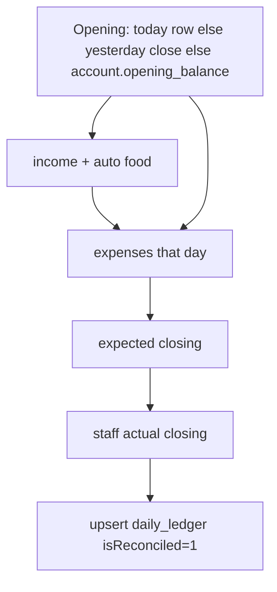

# Accounts (expenses, ledger, salary)

**Git-safe.** Admin `/admin` → Accounts. Bill photos → Google Drive (folder id in secrets file) under `Goko Bills/{MONTH}/`.

---

## Tabs

| Tab | Perm (non-admin) | API |
|-----|------------------|-----|
| Add Expense | `canAddExpense` | `addExpense` |
| Add Income | `canAddIncome` | `getIncomeAccounts`, `addDailyIncome` |
| Daily Ledger | `canViewAccounts` | `getDailyLedger` (quick add also needs `canAddIncome`) |
| Expense Records | `canViewExpenses` | `listExpenses` |
| Income Records | `canViewAccounts` | `listIncomeRecords` |
| Food Revenue | `canViewFoodBills` | `getFoodRevenue` |
| Room Revenue | `canViewFoodBills` | `getRoomRevenue` |
| Reconcile | `canReconcileAccounts` | `getReconciliation`, `saveReconciliation`, `undoReconciliation` |

Account Settings (Management): accounts/vendors/employees/salary — `canManageAccountSettings`. Bulk XLSX: `/api/admin/bulk-import-accounts`.

---

## Money

Ledger / expenses / food / salary integers are **paise**. UI: rupees × 100 on the way in.

**Room Revenue** (`getRoomRevenue`) uses booking amounts, which are **rupees** — do not divide by 100. Prepaid check-in records `amountPaid` as online; the OTA prepaid card is only stays not yet recorded.

---

## Add expense

Amount, stay vs food, category, vendor, cash/online, account if online, notes, bill images (base64). Drive upload failure still saves the expense with empty/failed link. Audit `expense_added`.

**Splits bridge:** Goko-as-payer and `payGokoReimbursement` insert the same `expenses` row (paise, `getMonthKey()` UTC, cash `accountId` null, never `paySalary` / Salary). See [flows-splits.md](flows-splits.md). Splits IOUs are **not** Accounts until cash moves.

---

## Ledger + reconcile

Manual income sources are Stay Revenue, Food Revenue, Refund Received, and Other. Other requires a separate source detail; description remains optional notes. Refund Received means positive money returned to Goko (for example, a vendor refund), not a refund paid to a guest. Cash has no account id; online income always names an active account. The Add Income page and Daily Ledger quick-add use the same form and validation.

Income cannot be added to or deleted from an account/date that is already reconciled; undo that reconciliation first.

Unique `(date, account_id)`. Mismatch highlight if |diff| > ₹0.50. `adjustOpeningBalance` without reconciling (manage accounts). `undoReconciliation` clears the lock.

Food and room **online** receipts are automatically recorded in `guest_receipts` against the selected receiving bank and included in reconciliation; manual `daily_income` remains separate. Cash remains manual. Food revenue is still based on paid non-cancelled food orders. Income Records reports only manual `daily_income`; Food Revenue and Room Revenue remain operational reports.

---

## Room Revenue

Accounts tab cloned from Food Revenue. `getRoomRevenue` (`canViewFoodBills`): stays whose **check-in date** is in `[fromDate, toDate]` and `occupiedForRoomRevenue` — `checked_in`, `checked_out`, or `cancelled` with `checkedInAt` set. No-shows and cancel-before-check-in are out.

Goko till = `amountPaid` (never invent OTA prepaid as collected). Cash/online split via `payment_method` + `cash_received` (`cashCollected` / `onlineCollected` in `src/lib/stayPayment.ts`). Cash method uses `amountPaid`, not tender. Paid rows with empty method → summary **Collected (no method)**. Refunds (`amount_refunded`) reduce net Room Revenue and do **not** reduce `amountPaid`. Room Revenue does **not** auto-post `daily_income`.

---

## Salary

`paySalary` → `salary_payments` **and** `expenses` category Salary. Month string on both.

---

## Bulk import

XLSX template → validate → dedupe → batch 50. Duplicate expense: date + amount + category + notes. Income: date + amount + source + source detail + description. Online rows require an account; cash rows must not include one. Excel serial dates supported.
