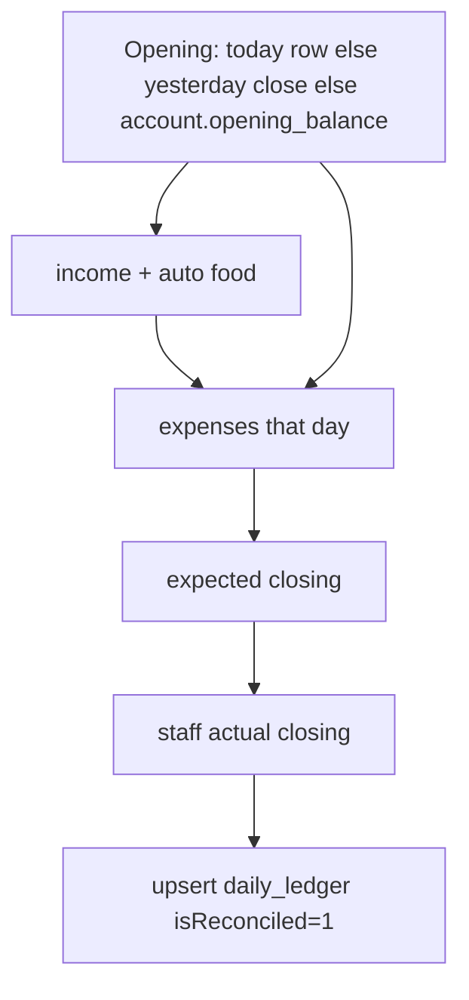

# Accounts (expenses, ledger, salary)

**Git-safe.** Admin `/admin` → Accounts. Bill photos → Google Drive (folder id in secrets file) under `Goko Bills/{MONTH}/`.

---

## Tabs

| Tab | Perm (non-admin) | API |
|-----|------------------|-----|
| Add Expense | `canAddExpense` | `addExpense` |
| Add Income | `canAddIncome` | `getIncomeAccounts`, `addDailyIncome` |
| Daily Ledger | `canViewAccounts` | `getDailyLedger` (quick add also needs `canAddIncome`) |
| Expense Records | `canViewExpenses` | `listExpenses` |
| Income Records | `canViewAccounts` | `listIncomeRecords` |
| Food Revenue | `canViewFoodBills` | `getFoodRevenue` |
| Room Revenue | `canViewFoodBills` | `getRoomRevenue` |
| Reconcile | `canReconcileCash` or `canReconcileOnline` | `getReconciliation`, `saveReconciliation`; Admin-only `undoReconciliation` |
| OTA Receivables | `canViewAccounts`; mutations additionally require `canSettlePlatformPayments` / `canAdjustPlatformReceivables` | `/api/admin/platform-settlements`: list, createSettlement, allocate, adjust |

Account Settings (Management): accounts/vendors/employees/salary. Employee deactivation uses `canManageEmployees`; an inactive employee can be removed from the roster with a sync tombstone, retaining compensation, payroll, and attendance history. Bulk XLSX: `/api/admin/bulk-import-accounts`.

---

## Money

Ledger / expenses / food / salary integers are **paise**. UI: rupees × 100 on the way in.

**Room Revenue** (`getRoomRevenue`) uses booking amounts, which are **rupees** — do not divide by 100. Prepaid check-in records `amountPaid` as online; the OTA prepaid card is only stays not yet recorded.

---

## Add expense

Amount, expense date (defaults to today in IST and cannot be future), stay vs food, category, vendor, cash/online, account if online, notes, bill images (base64). The selected expense date controls its accounting month and Daily Ledger/Reconciliation day; creation time remains the audit timestamp. Drive upload failure still saves the expense with empty/failed link. Audit `expense_added`.

**Splits bridge:** Goko-as-payer and `payGokoReimbursement` insert the same `expenses` row (paise, split expense date, cash `accountId` null, never `paySalary` / Salary). See [flows-splits.md](flows-splits.md). Splits IOUs are **not** Accounts until cash moves.

---

## Ledger + reconcile

Manual income sources are Stay Revenue, Food Revenue, Refund Received, and Other. Other requires a separate source detail; description remains optional notes. Refund Received means positive money returned to Goko (for example, a vendor refund), not a refund paid to a guest. Cash has no account id; online income always names an active account. The Add Income page and Daily Ledger quick-add use the same form and validation.

Income cannot be added to or deleted from an account/date that is already reconciled; undo that reconciliation first.

Unique `(date, account_id)`. Cash (`account_id = null`) and each configured online account are reconciled independently, with their own actual closing, notes, actor, timestamp, and action button. Multiple online accounts may be completed in any order by different authorized users. The day is complete only after Cash and every active account are reconciled. Mismatch highlight if |diff| > ₹0.50. `adjustOpeningBalance` works without reconciling (manage accounts). Admin-only `undoReconciliation` clears only the selected account lock.

Food and room **online** receipts are automatically recorded in `guest_receipts` against the selected receiving bank and included in reconciliation; manual `daily_income` remains separate. A combined food payment keeps per-order receipt allocations but shares one operation ID, so Account Activity shows the bank-sized payment once (reference like `D261-01 + 17 more`). One Pay confirm from Order Summary, Combined Bill, or Dashboard checkout food pay is one Account Activity row for the confirmed amount; separate Mark Paid / payment-detail saves for the same guest stay separate. `markOrderPaid` assigns a single `operation_id` even when the client omits `receiptId`. Ordinary food and non-OTA room cash portions are recorded prospectively in `cash_payment_events`; OTA postpaid cash remains in `booking_payment_events`. Cash Account Activity and reconciliation include those journals plus manual cash income and expenses. Tender returned as change is excluded. Historical ordinary cash totals are not backfilled because their transaction dates cannot be reconstructed safely. Virtual platform accounts remain excluded from bank reconciliation and receipt-account selectors.

Account Activity retains the guest/order reference and authenticated payment creator. Order Summary includes recent paid orders within the configured visibility window and keeps unpaid orders visible indefinitely. Food revenue remains based on paid non-cancelled food orders. Expense and Income Records use inclusive ISO accounting-date ranges, defaulting to the first of the previous month through today; expense filtering never uses legacy `created_month` labels.

Reconciliation balances use the latest prior actual close as a checkpoint, then include all account activity after that close through the selected date. When no actual close exists, the account opening balance is the base and all activity through the selected date is included. Cash corrections are append-only but displayed net against their original operation and business date; real refunds remain separate negative movements on the refund date. The detail rows remain scoped to the selected day. Financial edits, additions, and deletions are blocked when an affected transaction date is covered by a later actual close until reconciliation is undone.

Ordinary cash corrections reduce the latest recorded collections first, spanning operations when needed while retaining each original business date. They never attach to a refund. Corrections exceeding recorded collections are rejected for review; legacy cash history is not inferred. Conflicting reuse of a cash operation ID is rejected. Cash source balances and any split online receipts commit with their journal entries in one database batch/transaction.

## OTA receivables and settlement

Prepaid OTA bookings are recognized when the guest is checked in: any `paymentStatus === prepaid` check-in calls `recognizePlatformBooking` (idempotent by booking cycle), even if the compatibility `amountPaid` write was already applied. Recognition records gross charge, tax charged, tax withheld, commission, TDS, TCS, other deductions, and expected net payout in an immutable booking-cycle journal. Platform Receivables exposes each component with booking, guest, and stay details so tax charged is not confused with tax withheld or platform fees. The loaded list can be filtered client-side by platform and inclusive check-in date; hidden selections are removed, and the selected summary totals known values while marking incomplete Razorpay fee/net totals Pending. Mobile cards select from their non-interactive surface and turn green when selected. These view controls do not create a bank receipt or change authorization. A platform profile automatically creates a virtual account such as `MakeMyTrip Receivable` or `Goibibo Receivable`; virtual accounts never participate in daily reconciliation. The `recognizeMissing` API action (not exposed in the Accounts UI) backfills prepaid checked-in stays whose `checkin_date` is on or after `2026-09-20` and that still lack a recognition row; it requires `canAdjustPlatformReceivables`, skips already-recognized cycles, and continues past per-booking money/parse errors so one bad Aiosell float does not abort the batch.

Direct website Razorpay payments are shown from the Cloudflare-only native checkout ledger. Captured payments stay receivable until a real bank payout is recorded. Razorpay-reported fee and fee tax fields are retained with payment evidence and deducted, along with refunds, from the expected net; until both fee and tax are verified, net outstanding remains pending and the payment cannot be allocated. Staff can `refreshWebsiteFees` (provider evidence wins) or `setWebsiteFees` for still-null fields only (`canAdjustPlatformReceivables` for manual; settle permission for refresh). Website test-mode payments are excluded. Each payout can be allocated to multiple compatible receivable rows in one multi-row write, with remaining payout and booking/payment balances checked before insert. Unallocated and explicitly acknowledged variance amounts remain visible. Cancellations, post-recognition OTA modifications, refunds, and reversals append adjustment rows rather than overwriting history. A cancelled/no-show row reused by Aiosell increments `booking_cycle` so the new stay cannot inherit old receivable or refund state.

`pah: true` (pay at hotel) remains a normal desk collection and is not recognized as an OTA receivable. Missing/unsupported currency is not guessed into INR. Existing historical rows are not silently rewritten; the Sep-20+ `recognizeMissing` API action is the explicit reviewed ops backfill (one-shot after deploy, not a standing UI control). Website Razorpay rows use the same settlement-compatibility rule as OTA rows: with no payout selected, or with a `razorpay-website` payout selected, checkboxes stay enabled when outstanding is positive; other payout platforms leave website rows disabled.

Room booking receipt writers now pass paise to `guest_receipts` (booking UI amounts remain rupees). Existing pre-0054 room receipt rows are left untouched because their unit provenance cannot be safely inferred; review those rows before any historical correction.

---

## Room Revenue

Accounts tab cloned from Food Revenue. `getRoomRevenue` (`canViewFoodBills`): stays whose **check-in date** is in `[fromDate, toDate]` and `occupiedForRoomRevenue` — `checked_in`, `checked_out`, or `cancelled` with `checkedInAt` set. No-shows and cancel-before-check-in are out.

Goko till = `amountPaid` (never invent OTA prepaid as collected). Cash/online split via `payment_method` + `cash_received` (`cashCollected` / `onlineCollected` in `src/lib/stayPayment.ts`). Cash method uses `amountPaid`, not tender. Paid rows with empty method → summary **Collected (no method)**. Refunds (`amount_refunded`) reduce net Room Revenue and do **not** reduce `amountPaid`. Room Revenue does **not** auto-post `daily_income`.

For eligible OTA postpaid INR bookings, the append-only `booking_payment_events` journal supplies collection/refund tender values by booking cycle, avoiding double-counting the booking's compatibility `amountPaid` projection. Stay totals remain selected by **check-in date**. The separate **Postpaid OTA payments received** section is selected by payment business date and shows collection, refund, net Goko movement, cash/online split, and unresolved cancelled/no-show advances; it is a cash-movement report, not earned room revenue. Corrections are excluded as actual movement but offset the reconciliation balance. Future occupied-stay totals include net collections/refunds, including advances; payment itself does not change subtotal, tax, or billed total. Archived cycle snapshots preserve future OTA rebook history, but older cycles overwritten before rollout cannot be reconstructed.

Cash collections/refunds feed Cash Reconcile directly from journal cash portions exactly once. Online collection/refund portions create linked positive/negative `guest_receipts` in the selected active non-virtual account and therefore flow through online account activity/reconciliation. Do not add these same payments as manual Stay Revenue or Daily Ledger income. Legacy opening balances have unknown actual dates and are not shown in the payment-date movement section.

When sync merges real refunds from disconnected replicas that exceed the Goko collection total, the booking detail and Room Revenue show a review warning and preserve the negative net instead of dropping a real refund. Check the event/tender history and reconcile the actual cash/bank movements before posting further refunds.

---

## Salary

`paySalary` → `salary_payments` **and** `expenses` category Salary. Month string on both.

---

## Bulk import

XLSX template → validate → dedupe → batch 50. Duplicate expense: date + amount + category + notes. Income: date + amount + source + source detail + description. Online rows require an account; cash rows must not include one. Excel serial dates supported.
