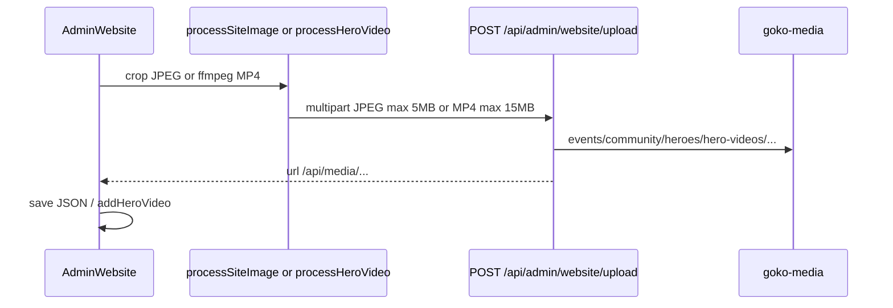

# Website CMS (Events + Community + Hero Videos)

**Git-safe.** Admin only: `/admin` → Management → **Website**. **Hidden on Pi builds.** API 403 if `GOKO_RUNTIME=pi`. Upload 503 if R2 `MEDIA` unbound.

---

## Why static HTML + GET /api/site

Workers Free CPU (10ms) Error **1102** when OpenNext SSR’d `/events`. Pages are `force-static` with seed from `src/content/events.ts` / `community.ts`. Client hydrates `GET /api/site?page=events|community|stay|heroes` (`Cache-Control: public, s-maxage=60, stale-while-revalidate=300`).

| D1 result | Page shows |
|-----------|------------|
| Query throws | TypeScript seed |
| 0 rows | **Empty CMS** (not seed) |
| Rows | CMS + page copy JSON |

Do not add `force-dynamic`, ISR Durable Objects, or OpenNext R2 incremental cache.

### Hero videos

Managed under Website → **Hero Videos** (not per Events/Community form).

- **Libraries:** desktop MP4 list + mobile MP4 list (R2 folder `hero-videos/`). Built-in A/B from git (`/videos/hero/...`) appear as virtual catalog entries.
- **Assignments:** each marketing page picks one desktop + one mobile clip. Tablet uses the desktop file with CSS `object-cover` (no third upload).
- **Encode:** admin browser runs ffmpeg.wasm once on upload (`processHeroVideo`), then POSTs processed MP4 (≤15MB) + JPEG poster.
- **Public hydrate:** `HeroBackdrop` / `PageRibbon` take `pageKey` and fetch `/api/site?page=heroes` (shared module promise). Seed props remain git A/B until live data arrives. No `force-dynamic` on marketing pages.
- **Stills:** Events/Community still use CMS `hero.ribbonImage` (JPEG in `heroes/`) as reduced-motion / no-video fallback.

Page keys: `home`, `stay`, `story`, `events`, `community`, `how-to-reach`, `faqs`, `reviews`, `booking-enquiry`, `book` (also `/book/preview` + Find my booking tab), `booking-confirmation` (`/booking/[reference]`), `self-checkin`, `things-to-do`. Out of scope: `/quick-links`, food-order, kitchen, admin.

---

## Upload pipeline

Public GET `/api/media/{key}` preserves stored content type, supports `Accept-Ranges` / Range for video, long cache. Safe media keys allow hyphenated folders (`quick-links`, `hero-videos`).

GC: `countMediaUrlRefs` (includes `site_hero_videos` url + poster). Delete R2 only if ref count 0. Page assignments block `deleteHeroVideo` while referenced (`countPageHeroRefs`).

Allowed stored URLs: `/images/...`, `/legacy-images/...`, `/api/media/{safeKey}`; hero builtins also use `/videos/hero/...`.

---

## Tables (not synced, not in seed-pi)

`site_events`, `site_community_spaces`, `site_page_copy`, `site_hero_videos`, `site_page_heroes`.

Migrations `0035_site_cms.sql` and `0079_site_hero_videos.sql` are **skipped** on Pi (filename still stamped in `_migrations`).
