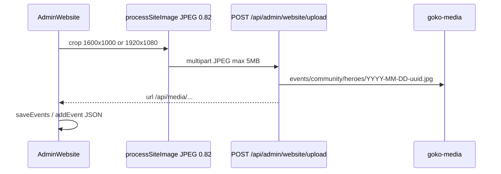

# Website CMS (Events + Community)

**Git-safe.** Admin only: `/admin` → Management → **Website**. **Hidden on Pi builds.** API 403 if `GOKO_RUNTIME=pi`. Upload 503 if R2 `MEDIA` unbound.

---

## Why static HTML + GET /api/site

Workers Free CPU (10ms) Error **1102** when OpenNext SSR’d `/events`. Pages are `force-static` with seed from `src/content/events.ts` / `community.ts`. Client hydrates `GET /api/site?page=events|community` (`Cache-Control: public, s-maxage=60, stale-while-revalidate=300`).

| D1 result | Page shows |
|-----------|------------|
| Query throws | TypeScript seed |
| 0 rows | **Empty CMS** (not seed) |
| Rows | CMS + page copy JSON |

Do not add `force-dynamic`, ISR Durable Objects, or OpenNext R2 incremental cache.

Hero **videos** stay in git (`heroVideoA` Events, `heroVideoB` Community). CMS edits stills (`hero.ribbonImage`).

---

## Upload pipeline

Public GET `/api/media/{key}` preserves the stored image content type and uses a long cache. Safe media keys allow hyphenated folder names such as `quick-links`, while rejecting `..` and unsafe path traversal.

GC: `countMediaUrlRefs` via SQL `instr`. Delete R2 only if ref count 0. `discardMedia` for abandoned uploads.

Allowed stored URLs: `/images/...`, `/legacy-images/...`, `/api/media/{safeKey}`.

---

## Tables (not synced, not in seed-pi)

`site_events`, `site_community_spaces`, `site_page_copy`.

Migration `0035_site_cms.sql` is **skipped** on Pi (filename still stamped in `_migrations`).
