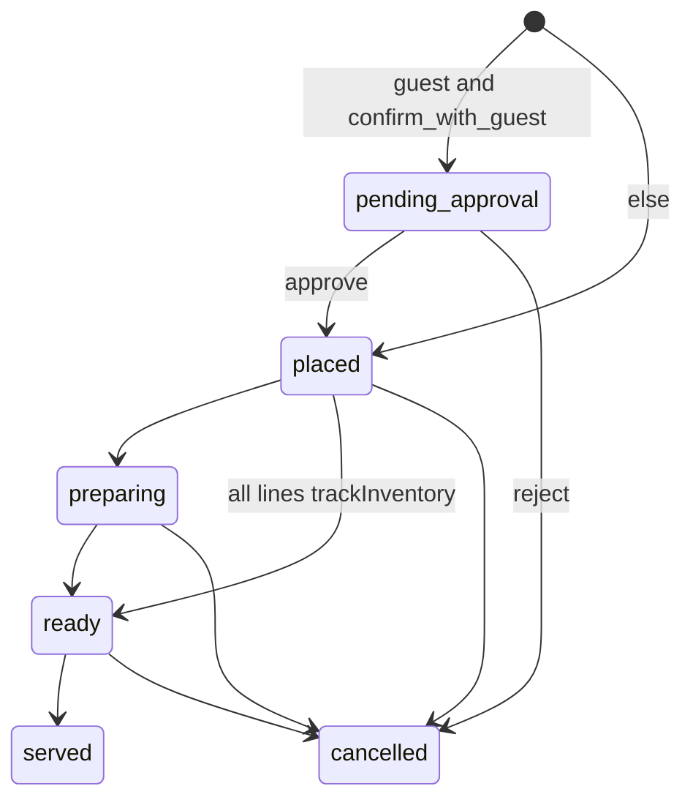

# Food and kitchen

**Git-safe.** Kitchen login: `ADMIN_PASSWORD` or `MANAGER_PASSWORD` or **any DB user password** (`authenticateKitchen`, no username). Stored in `sessionStorage.kitchen_pw`. Values: [secrets-and-access.md](secrets-and-access.md).

Menu/settings admin: `/api/admin/food` uses `canViewMenu`, `canManageMenuCategories`, `canManageMenuItems`, `canToggleMenuAvailability`, `canManageInventory`, and `canManageFoodSettings`. Admin bypasses all permissions.

Food payment saves retain per-order balance allocations. Online allocations share a receipt operation ID so Account Activity shows one combined bank entry for whatever amount was confirmed in that Pay modal. Order Summary Bill **Pay · ₹pending** and Combined Bill **Pay** call `markOrderPaid` with every selected unpaid `orderIds` plus the modal `receiptId`; Dashboard checkout food pay passes an explicit `receiptId` too. Per-order Edit Payment / Mark Paid via `updatePaymentDetails` remains a separate collection. Cash and split-cash portions are written prospectively to `cash_payment_events` using the net retained amount; food refunds append negative cash movements and payment corrections append linked adjustments.

Collecting an outstanding balance after Order More preserves earlier tender totals (cash followed by online becomes split). Payment batches reject stale balances and invalid fractional/negative cash amounts before recording additional collections. Cash corrections and their source balance updates commit together.

Management → Menu → Menu Items includes a live search field. Typing filters the current category selection by English item name, Kannada item name, or category name; the same results appear in card and table views.

---

## Guest

`/food-order`: `GET /api/food/menu` → phone `GET /api/food/lookup` (active/recent check-ins; if none, `displayName` from latest past check-in by phone) → cart in `localStorage` (`gokoFoodCart`, `gokoFoodPhone`) → `POST /api/food/order`. Price-on-request items show an optional indicative range, create pending-price lines, and may be mixed with fixed-price items. Active guest session in `sessionStorage` (`gokoFoodSession`) restores the menu after `/my-bills` or browser back; **Logout** clears session + `gokoFoodPhone` and returns to phone entry. Browser back: category drill-down and cart use `usePanelHistory` / `history` (one step at a time); back from the menu grid does **not** return to phone (only Logout does). The View Cart FAB and reorder toast are `inset-x-4 mx-auto` — do not center them with `left-1/2 -translate-x-1/2` on the same node as Framer `y`/`scale`.

Server order of checks (`src/app/api/food/order/route.ts`):

1. Required `guestName` + non-empty `items`; each qty integer 1–50.
2. Required UUID `idempotencyKey` (`parseCreateIdempotencyKey`). Missing/invalid → 400.
3. If `guestType === "hostel"`: phone must match that `checkinId` among active checkins, else recently checked-out within `food_checkout_grace_days`.
4. Kitchen hours (`food_kitchen_hours`, default `08:00-15:00,18:00-23:30` IST) — closed → 400.
5. `food_kitchen_busy === "true"` → **503**.
6. Item availability + stock (`trackInventory` → `stockQuantity`); compute subtotal/tax/total.
7. Idempotency key lookup **after** validation: complete order → `{ duplicate: true }` (no second insert/stock/push). Incomplete header (`total > 0`, zero `food_order_items`, not cancelled) with matching totals → heal by inserting lines + stock/push (`healed: true`). Mismatched unpaid incomplete → `abandonIncompleteFoodOrder` + **409** `incomplete_food_order`.
8. Tab limit (`food_tab_limit` paise, 0 = unlimited) for hostel guests.
9. Create order header then line items + `decrementStock` (`SET qty = qty - ?`). **No** `db.transaction()` (D1 + `getDb()` bug). If line insert fails, cancel the unpaid header via `abandonIncompleteFoodOrder` (refuses paid rows or rows that already have lines) and return 500 with create-failed copy. On UNIQUE conflict, re-lookup the idempotency key (same heal/duplicate path) before treating the failure as an `order_number` collision.
10. If **every** line is `trackInventory` **and** status is `placed` (not pending_approval) → `updateFoodOrderStatus(..., "ready")` (skips kitchen cook steps).
11. Fire-and-forget web push if VAPID is set.

Guest `FoodCart` and admin Place Order (`placeOrderForGuest`) each mint one `crypto.randomUUID()` per attempt and regenerate **only after success**, so retries reuse the same key. Admin create requires the same UUID key and uses `food_orders.idempotency_key` (migration **0011**). Duplicate admin Place Order clicks therefore return `{ duplicate: true }` instead of a second billable order. Incomplete orphans (header without lines) show `INCOMPLETE_FOOD_ORDER_BANNER` in Order Summary and remain cancellable when unpaid. This is **not** an RBAC issue — 403 permission denials happen before insert and do not auto-retry.

Hostel + `checkinId`: payment `on_tab`. Else `pending`. Guest-created + `food_confirm_with_guest === "true"` → status `pending_approval`. Admin `placeOrderForGuest` starts `placed`.

Checkout warning: `getPendingFoodTab` in `src/lib/foodTabDb.ts` sums unpaid hostel orders (`on_tab`/`pending`, not `cancelled`) for matching `checkins` (phone-normalized) and returns `orderIds`. Admin UI copy/guards live in `src/lib/foodTab.ts` (no `getDb`). Calendar Check Out Guest, Beds checkout, Timeline, and Dashboard today-checkout **live-call** it before confirming. Empty / non-normalizable phone (`canLookupFoodTab`) or lookup failure: `foodTabUncheckedMessage` (staff can still proceed). Dashboard Pay aborts checkout if `markOrderPaid` fails. Cafe walk-in tabs (`guestType=walkin`, no `checkin_id`) are not attached to a stay. Unassign is not checkout. Checkout APIs do not hard-block.

`/food-order/status`: poll ~10s until `served` or `cancelled` (`shouldPollOrderStatus` in `orderStatus.ts`).

`/my-bills`: `GET /api/food/bills?phone=` (guest types phone) or `GET /api/food/bills?t=` (opaque share token from staff WhatsApp). Token path returns `viaToken: true` and omits `phone` from the JSON; the page shows “Shared bill link” instead of the number. Tokens live in Cloudflare-only `food_bill_share_tokens` (migration **0064**, 7-day expiry); Pi migrator skips that file. Back uses `router.back()` (returns to `/food-order` menu when opened from there).

---

## Status machines

Item: `active` → `voided` (stock restored).

---

## Kitchen `/kitchen` — POST `/api/food/kitchen`

Actions: `listOrders`, `updateStatus`, `toggleItemAvailability`, `rejectItem`, `updateItemQuantity`, `addItemToOrder`, `toggleBusy`, `getMenuItems`, `getOrderModifications`.

Poll `listOrders` ~5s. Audio on new. Columns: New (`placed`) / Preparing / Ready. Active Orders includes every non-cancelled workflow order in `pending_approval`, `placed`, `preparing`, or `ready`, regardless of age; only an explicit kitchen transition to `served` removes it. The primary D1 reads for the board retry one transient failure and load order items/menu tags in bounded batches, so a short database blip or a large active set does not make the kitchen unavailable; optional modification metadata is queried in `D1_IN_BATCH_SIZE` (25) IN chunks and may fail without hiding orders. API/poll failures are surfaced to staff instead of being rendered as an empty kitchen. Approval section if `food_approval_in_kitchen`. Bluetooth ESC/POS (`thermalPrint.ts`); Kannada from `food_kannada_kitchen_print` / `food_kannada_kitchen_display` (default **on** unless setting is the string `"false"`).

Admin Food Orders embeds kitchen + tabs + place-for-guest + combined PDF/thermal + mark paid (cash/online/split). Its Active Orders kitchen requests use the current admin session; standalone `/kitchen` requests use the kitchen session. **Order Summary** uses the server-provided unpaid tab aggregate before a hostel guest is opened, then recalculates from the loaded unpaid orders; paid orders are never included in the pending amount. Walk-in tabs use normalized **phone + guest name**, so reused dummy numbers do not merge different named guests. The walk-in-only phone key retains staff placeholders `1`–`9`; names normalize Unicode compatibility, case, outer whitespace, and repeated spaces while retaining punctuation to avoid merging distinct entered names. Missing identity fields remain separate per order, cafe tables keep their generated table session, and hostel tabs remain keyed only by `checkinId`. The guest drawer footer is Print (thermal) / **Bill** / Order More. Order More keeps the selected hostel guest, walk-in, or cafe table locked in a compact Place Order row until place succeeds, **Change guest**, **Add New Order**, or leaving the Place tab (prefill is not cleared on mount, so async tab URL remounts cannot drop the guest). Hostel Place Order retries `getActiveGuests` a few times to enrich bed/contact; the Order More stub already carries `checkinId` for place. Bill opens an in-drawer guest-style tab (same `GuestFoodBillCard` as My Bills) with Pay → `RecordPaymentModal`, Discount → `DiscountModal`, and **WhatsApp** → `createBillShareLink` followed by the preference-aware shared staff launcher (opaque `/my-bills?t=` URL; walk-in links are scoped to normalized name + phone and hostel links to `checkinId`; branding for the HTML bill caches without embedding the payment QR as a data URL). Phone lookup with multiple identities returns a name chooser before any order details. PDF / Cash / Online / Discount / group Kitchen are removed from that footer (per-order kitchen print remains). **Combined Bill** stacks one `GuestFoodBillCard` per selected identity (each with its own preference-aware WhatsApp), plus Print Combined / Download PDF / Discount / Pay. Server load uses bind-safe `getFoodOrdersByCheckinIds` / `getFoodOrdersByIds` and dedupes by order id before totaling. Combined Discount applies one percentage or fixed discount across **unpaid** (`foodDue > 0`) selected orders with the existing exempt-category and tax rules. **Remove Discount** clears every selected order with `discount > 0` and **no money collected** (`foodAmountPaid === 0`) — unpaid discounted tabs and 100%-zeroed rows that only look paid because total and `amountPaid` are both 0. Orders with real collections keep their discount. The Discount modal defaults to **Fixed Amount** (Percentage is second); percent values over 100 show *max discount % can be 100 itself* and block apply; ≥50% of discountable requires confirm. Summary Discount shows errors/success toasts (no silent close). Combined Pay opens `RecordPaymentModal` for the combined total; cash/split tender is allocated once across orders and online portions create receipts per order. Multi-order pay, discount, and discount removal are transactional and fail without partial writes. Pending special-price (`pricingStatus === "pending"`) lines are amber-highlighted; Bill is blocked until Set price clears them. **Set price** opens a mobile-friendly modal (not `window.prompt`) for final ₹/unit plus an optional custom badge label (stored in `food_order_items.notes`, max 24 chars; shown as a violet pill like Modified). Food Orders → Edit Order → Set price finalizes pending market-price lines; payment and final billing require all active lines to be priced. Indicative ranges are maintained in Management → Menu and are informational only.

---

Editing and Combined Bill invariants: staged quantity, void, and pending-price edits are sent through one atomic `saveOrderEdits` batch with an idempotency key (D1 `batch()`, synchronous SQLite transaction on Pi). Entering item edit mode always exposes an explicit **Cancel editing** action, even before a draft exists; the edit icon is not a second toggle while that session is active. Served-order quantity changes are held per item at the order level, so repeated increases/decreases and edits to multiple lines show together in one **Modify order quantities** confirmation; one shared optional reason/notes value is included by the single outer **Save changes** action. The summary contains no inner Save/Cancel buttons and compares original quantities to the final draft; reversing a quantity removes its no-op summary. Failed saves retain the draft and reuse the same operation ID for an unchanged request. Quantity controls use the latest pending or staged quantity, until the server-side inventory ceiling is reached. Additions preserve previously collected money and expose only the incremental due. Reductions below net collected require an exact cash/online/split refund; the refund event, receipt, modification history, payment projection, inventory delta, and audit entry commit together. Tracked inventory increases are reserved atomically and rejected with a conflict when stock is insufficient; reductions restore stock and availability. Kitchen quantity edits and Order More use the same stock ceiling. Modification/cancellation reasons are optional and are still audited when supplied. An unpaid order has a red **X** beside its food-edit action; confirmation lists the guest, order number, items, quantities, and total. Confirming uses `cancelUnpaidOrder`, preserves audit/history, restores stock, and marks the order cancelled. Paid or partially paid orders do not expose this action and are rejected server-side if called directly. Combined Bill offers all non-cancelled hostel and walk-in groups with positive net due and renders only outstanding items. Payment correction/revert and food-item editing are available from the order view, not inside Bill. In the Admin edit confirmation, quantity changes use “Modify …” with one outer “Save changes”; item cancellation and whole-order cancellation remain distinct flows.

## Settings keys (`/api/admin/food` `FOOD_SETTINGS_KEYS`)

Exact names in code. UI defaults in `AdminFoodSettings.tsx`.

| Key | Default-ish | Effect |
|-----|-------------|--------|
| `food_kitchen_hours` | `08:00-15:00,18:00-23:30` | Guest orders blocked when closed |
| `food_kitchen_open` / `food_kitchen_close` | legacy | UI concatenates into hours if hours empty |
| `food_kitchen_busy` | `false` | Guest POST 503 iff string `"true"` |
| `food_tax_rate` | `5` | percent. **0 is 0%** — `foodTaxPercent` in `src/lib/foodLookup.ts`. Never `Number(x) || 5`. |
| `food_tab_limit` | `0` | unpaid cap paise; 0 unlimited |
| `food_checkout_grace_days` | (parsed in `foodLookup.ts`) | hostel order after checkout |
| `food_cafe_tables` | `6` | admin place-order tables |
| `food_confirm_with_guest` | `false` | guest orders start `pending_approval` |
| `food_approval_in_kitchen` | `false` | kitchen approve/reject UI |
| `food_kannada_kitchen_print` | `true` | thermal Kannada |
| `food_kannada_kitchen_display` | `true` | kitchen screen Kannada |
| `food_kitchen_whatsapp` | `""` | kitchen WhatsApp number |
| `food_customer_whatsapp` | `true` | open wa.me after guest order |
| `food_show_out_of_stock` | `false` | show unavailable on guest menu |
| `food_payment_history_days` | `7` | recent paid orders shown in Order Summary |
| `food_bill_hostel_name` | `Goko Hostel` | PDF / thermal / My Bills header |
| `food_bill_location` | `Gokarna, Karnataka` | header subtitle |
| `food_bill_accent` | `#E67E22` | hex accent for header/status/pay amount |
| `food_bill_upi_id` | `""` | shown under “Scan to pay” |
| `food_bill_payment_qr_url` | `""` | `/api/media/bills/...` only; Cloudflare R2 |
| `food_bill_footer` | `Thanks for dining with us! Visit again` | bill footer |

**Bill Settings** (Management tab, same `canManageFoodSettings`): edit `food_bill_*` keys; payment QR upload/replace/delete auto-persists to settings (R2 folder `bills`) without waiting for Save All. Other text fields still use Save All. Staff with only `canGenerateFoodBills` load branding via `getBillBranding` (not full `getFoodSettings`). Paid PDFs/thermal omit the Scan-to-pay / UPI block.

**Guest bill layout:** left accent rail (not full-bleed orange) → Food tab meta (no order IDs) → status outline → single ITEM/QTY/AMOUNT list (items coalesced across orders; voided lines omitted by `/api/food/bills` and `mergeBillLineItems`) → Subtotal / Discount / CGST + SGST → Grand Total → QR + UPI. My Bills and admin Order Summary **Bill** share `GuestFoodBillCard`. Kitchen tickets unchanged. Bill branding keys are **not** in Pi `SYNCABLE_SETTINGS` (QR is R2/cloud-only).

**Order Summary:** shows every unpaid/partial order and recent fully-paid orders within `food_payment_history_days`, in two sections with Unpaid first and Fully Paid second. Groups with any unpaid balance remain orange; fully unpaid groups are red; fully paid groups are green. In the order drawer, every order shows its workflow status plus an explicit green **Paid**, orange **Partial**, or red **Unpaid** badge; `on_tab` is treated as unpaid. A mixed-group Bill includes only the outstanding quantities/line amounts (for example, after paying 2×₹2 and increasing the order to 3×₹2, it shows only 1×₹2); its per-order list also shows item names and quantities. Fully paid groups remain clickable and preserve Bill, Print, Order More, and payment correction access. The payment edit action uses a **banknote** icon, while food/item editing uses a **utensils** icon, so the two actions are visually distinct. The payment action opens payment correction, including receiving-bank selection for online/split entries; the item action opens the existing audited order-item editor. Item edits recalculate totals and preserve collected amounts, charging only the new outstanding balance; reductions below collected amounts require an explicit correction/refund. Selecting item edit from the Bill view returns to the order list, smoothly scrolls the selected order into the center of the drawer, and marks it with an **Editing** badge, green highlight, and focus ring. Pay charges only the unpaid balance, and payment correction/revert controls remain per-order for staff with `canMarkPaid`. Pay-capable staff can open the consolidated summary even without `canViewFoodOrders`. **Payment History** calls `listOrders` with `includeItems: false` and `includeModifications: false`, loading only the selected range's order headers. **Order History** keeps modification badges, and fetches line items via `getOrderDetails` on expand.

**Settings save feedback:** **Save All** keeps the unsaved state until the API succeeds, then clears it and shows **Food settings saved**. HTTP and network failures retain the edited values and show an error so staff can retry.

Order workflow status is independent from payment status. An empty Kitchen column, Pi outage, or sync/build mismatch does **not** prove that an order was served. Orders remain `placed`, `preparing`, or `ready` until the kitchen workflow explicitly advances them to `served`; only the kitchen status transition may mark an order served. The embedded Admin → Food Orders → Active Orders board uses the admin session for every role granted `canViewFoodOrders`; modification badges are optional metadata, so a temporary modification-query/schema failure must not hide otherwise available kitchen orders. Repeated identical polling errors are throttled to one toast per 30 seconds.

**Sync drift:** `syncEngine` `SYNCABLE_SETTINGS` still lists `food_kannada_labels` (old name). Print/display keys are **not** in that list. Pi may not get Kannada flags. Do not document `food_kannada_labels` as the live UI key.
