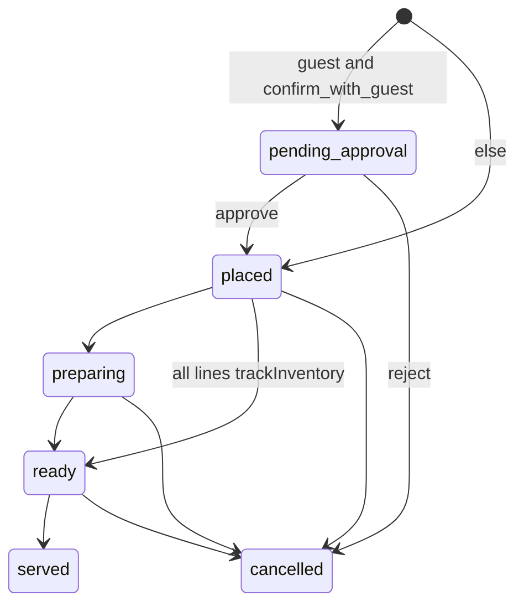

# Food and kitchen

**Git-safe.** Kitchen login: `ADMIN_PASSWORD` or `MANAGER_PASSWORD` or **any DB user password** (`authenticateKitchen`, no username). Stored in `sessionStorage.kitchen_pw`. Values: [secrets-and-access.md](secrets-and-access.md).

Menu/settings admin: `/api/admin/food` uses `canViewMenu`, `canManageMenuCategories`, `canManageMenuItems`, `canToggleMenuAvailability`, `canManageInventory`, and `canManageFoodSettings`. Admin bypasses all permissions.

Management → Menu → Menu Items includes a live search field. Typing filters the current category selection by English item name, Kannada item name, or category name; the same results appear in card and table views.

---

## Guest

`/food-order`: `GET /api/food/menu` → phone `GET /api/food/lookup` (active/recent check-ins; if none, `displayName` from latest past check-in by phone) → cart in `localStorage` (`gokoFoodCart`, `gokoFoodPhone`) → `POST /api/food/order`. Price-on-request items show an optional indicative range, create pending-price lines, and may be mixed with fixed-price items. Active guest session in `sessionStorage` (`gokoFoodSession`) restores the menu after `/my-bills` or browser back; **Logout** clears session + `gokoFoodPhone` and returns to phone entry. Browser back: category drill-down and cart use `usePanelHistory` / `history` (one step at a time); back from the menu grid does **not** return to phone (only Logout does). The View Cart FAB and reorder toast are `inset-x-4 mx-auto` — do not center them with `left-1/2 -translate-x-1/2` on the same node as Framer `y`/`scale`.

Server order of checks (`src/app/api/food/order/route.ts`):

1. Required `guestName` + non-empty `items`; each qty integer 1–50.
2. If `guestType === "hostel"`: phone must match that `checkinId` among active checkins, else recently checked-out within `food_checkout_grace_days`.
3. Idempotency key → return existing order with `duplicate: true`.
4. Kitchen hours (`food_kitchen_hours`, default `08:00-15:00,18:00-23:30` IST) — closed → 400.
5. `food_kitchen_busy === "true"` → **503**.
6. Item availability + stock (`trackInventory` → `stockQuantity`).
7. Tab limit (`food_tab_limit` paise, 0 = unlimited) for hostel guests.
8. Create order + line items + `decrementStock` (`SET qty = qty - ?`). **No** `db.transaction()` (D1 + `getDb()` bug).
9. If **every** line is `trackInventory` **and** status is `placed` (not pending_approval) → `updateFoodOrderStatus(..., "ready")` (skips kitchen cook steps).
10. Fire-and-forget web push if VAPID is set.

Hostel + `checkinId`: payment `on_tab`. Else `pending`. Guest-created + `food_confirm_with_guest === "true"` → status `pending_approval`. Admin `placeOrderForGuest` starts `placed`.

Checkout warning: `getPendingFoodTab` in `src/lib/foodTabDb.ts` sums unpaid hostel orders (`on_tab`/`pending`, not `cancelled`) for matching `checkins` (phone-normalized) and returns `orderIds`. Admin UI copy/guards live in `src/lib/foodTab.ts` (no `getDb`). Calendar Check Out Guest, Beds checkout, Timeline, and Dashboard today-checkout **live-call** it before confirming. Empty / non-normalizable phone (`canLookupFoodTab`) or lookup failure: `foodTabUncheckedMessage` (staff can still proceed). Dashboard Pay aborts checkout if `markOrderPaid` fails. Cafe walk-in tabs (`guestType=walkin`, no `checkin_id`) are not attached to a stay. Unassign is not checkout. Checkout APIs do not hard-block.

`/food-order/status`: poll ~10s until `served` or `cancelled` (`shouldPollOrderStatus` in `orderStatus.ts`).

`/my-bills`: `GET /api/food/bills?phone=`. Back uses `router.back()` (returns to `/food-order` menu when opened from there).

---

## Status machines

Item: `active` → `voided` (stock restored).

---

## Kitchen `/kitchen` — POST `/api/food/kitchen`

Actions: `listOrders`, `updateStatus`, `toggleItemAvailability`, `rejectItem`, `updateItemQuantity`, `addItemToOrder`, `toggleBusy`, `getMenuItems`, `getOrderModifications`.

Poll `listOrders` ~5s. Audio on new. Columns: New (`placed`) / Preparing / Ready. Approval section if `food_approval_in_kitchen`. Bluetooth ESC/POS (`thermalPrint.ts`); Kannada from `food_kannada_kitchen_print` / `food_kannada_kitchen_display` (default **on** unless setting is the string `"false"`).

Admin Food Orders embeds kitchen + tabs + place-for-guest + combined PDF/thermal + mark paid (cash/online/split). **Order Summary** guest drawer footer is Print (thermal) / **Bill** / Order More. Bill opens an in-drawer guest-style tab (same `GuestFoodBillCard` as My Bills) with Pay → `RecordPaymentModal` and Discount → `DiscountModal`. PDF / Cash / Online / Discount / group Kitchen are removed from that footer (per-order kitchen print remains). Pending special-price (`pricingStatus === "pending"`) lines are amber-highlighted; Bill is blocked until Set price clears them. Food Orders → Edit Order → Set price finalizes pending market-price lines; payment and final billing require all active lines to be priced. Indicative ranges are maintained in Management → Menu and are informational only.

---

## Settings keys (`/api/admin/food` `FOOD_SETTINGS_KEYS`)

Exact names in code. UI defaults in `AdminFoodSettings.tsx`.

| Key | Default-ish | Effect |
|-----|-------------|--------|
| `food_kitchen_hours` | `08:00-15:00,18:00-23:30` | Guest orders blocked when closed |
| `food_kitchen_open` / `food_kitchen_close` | legacy | UI concatenates into hours if hours empty |
| `food_kitchen_busy` | `false` | Guest POST 503 iff string `"true"` |
| `food_tax_rate` | `5` | percent. **0 is 0%** — `foodTaxPercent` in `src/lib/foodLookup.ts`. Never `Number(x) || 5`. |
| `food_tab_limit` | `0` | unpaid cap paise; 0 unlimited |
| `food_checkout_grace_days` | (parsed in `foodLookup.ts`) | hostel order after checkout |
| `food_cafe_tables` | `6` | admin place-order tables |
| `food_confirm_with_guest` | `false` | guest orders start `pending_approval` |
| `food_approval_in_kitchen` | `false` | kitchen approve/reject UI |
| `food_kannada_kitchen_print` | `true` | thermal Kannada |
| `food_kannada_kitchen_display` | `true` | kitchen screen Kannada |
| `food_kitchen_whatsapp` | `""` | kitchen WhatsApp number |
| `food_customer_whatsapp` | `true` | open wa.me after guest order |
| `food_show_out_of_stock` | `false` | show unavailable on guest menu |
| `food_payment_history_days` | `7` | payment summary retention |
| `food_bill_hostel_name` | `Goko Hostel` | PDF / thermal / My Bills header |
| `food_bill_location` | `Gokarna, Karnataka` | header subtitle |
| `food_bill_accent` | `#E67E22` | hex accent for header/status/pay amount |
| `food_bill_upi_id` | `""` | shown under “Scan to pay” |
| `food_bill_payment_qr_url` | `""` | `/api/media/bills/...` only; Cloudflare R2 |
| `food_bill_footer` | `Thanks for dining with us! Visit again` | bill footer |

**Bill Settings** (Management tab, same `canManageFoodSettings`): edit `food_bill_*` keys; payment QR upload/replace/delete auto-persists to settings (R2 folder `bills`) without waiting for Save All. Other text fields still use Save All. Staff with only `canGenerateFoodBills` load branding via `getBillBranding` (not full `getFoodSettings`). Paid PDFs/thermal omit the Scan-to-pay / UPI block.

**Guest bill layout:** left accent rail (not full-bleed orange) → Food tab meta (no order IDs) → status outline → single ITEM/QTY/AMOUNT list (items coalesced across orders; voided lines omitted by `/api/food/bills` and `mergeBillLineItems`) → Subtotal / Discount / CGST + SGST → Grand Total → QR + UPI. My Bills and admin Order Summary **Bill** share `GuestFoodBillCard`. Kitchen tickets unchanged. Bill branding keys are **not** in Pi `SYNCABLE_SETTINGS` (QR is R2/cloud-only).

**Payment Summary:** loads via `listOrders` (`all_history`) + `getGuestsWithTabs` + `getMenu` (+ walk-in / tab fallback if history empty). Those read actions accept `canViewFoodOrders` **or** `canMarkPaid` so pay-capable staff without view-orders do not see a blank tab.

**Sync drift:** `syncEngine` `SYNCABLE_SETTINGS` still lists `food_kannada_labels` (old name). Print/display keys are **not** in that list. Pi may not get Kannada flags. Do not document `food_kannada_labels` as the live UI key.
