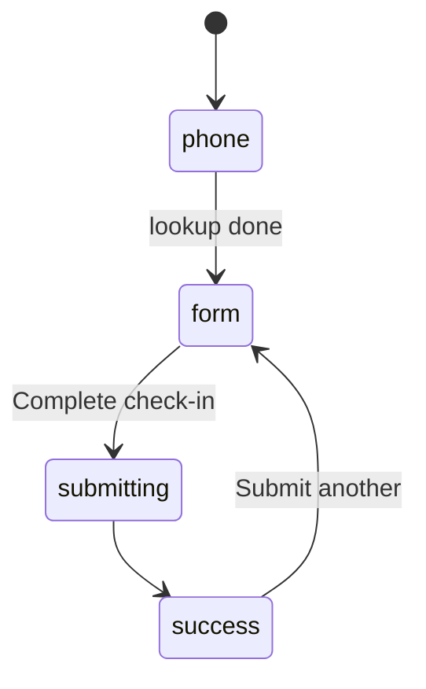
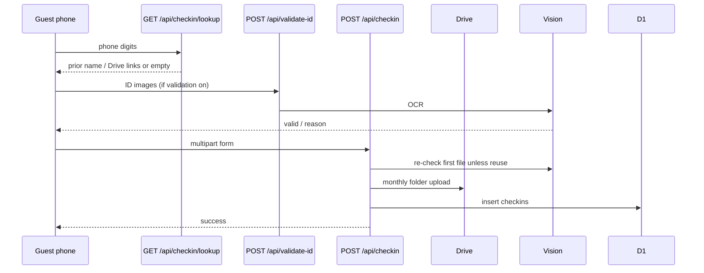

# Guest self check-in

**Git-safe.** Admin reviews records at `/admin` → Records. Password: [secrets-and-access.md](secrets-and-access.md).

Pages: `/self-checkin` (static shell). APIs: `/api/checkin/lookup`, `/api/validate-id`, `/api/checkin`.

---

## Flow

1. Phone → latest checkin by contact. Hit: prefill + reuse `idCardLink` / `visaLink`. Miss: blank form.
2. Fields: booking platform + id (auto `GOKO{date}{rand}` for Offline/Walk-in), arrival, name, persons, days, nationality, coming from, emergency, ID type + photos. Indian guests can choose Aadhaar, Driving Licence, or Passport. A non-Indian nationality automatically selects Passport, shows no other ID type, and requires visa page photo(s); APIs reject non-passport or missing-visa foreign submissions. Foreign guests also provide Form C extras. Admin Records add and past-record forms prompt for and upload the required visa; edit and ID-upload flows follow the same passport-only rule.
3. Optional Vision (`settings.image_validation`): labels → OCR → Aadhaar/DL/passport scoring → field-aware normalized name/DOB match → SafeSearch. Name matching ignores harmless case, spacing, punctuation, and limited OCR noise while excluding guardian lines. Entered DOB and ID-extracted DOB remain separate for review; a mismatch does not overwrite the entered DOB. Type mismatch: changing dropdown to `detectedIdType` accepts. Vision down: submit still allowed (`idServerError`).
4. Server: required fields → Vision again unless `prevIdCardLink` → Drive `{Guest}_{id_1}_{timestamp}` under month folder → `formCData` JSON for foreigners → insert `status: active`.
5. `verified`: `yes` (passed or reused ID), `pending` (off / error), `spoof_warning`, `no` (admin reject).

Pi offline: Drive/Vision may fail; check-in should still persist locally (`isOfflineMode`).

Staff then assign a bed (Beds tab) and/or link a booking (Bookings calendar). Check-in row is **not** an automatic bed assignment.
