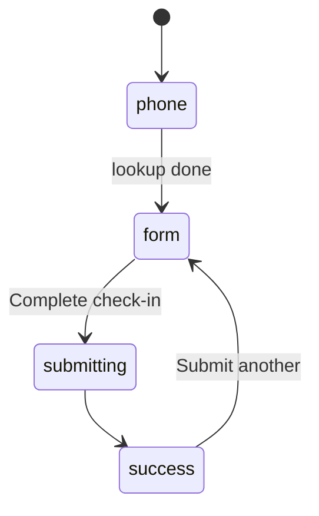
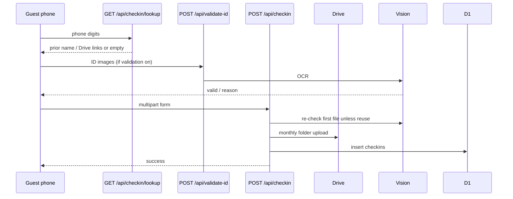

# Guest self check-in

**Git-safe.** Admin reviews records at `/admin` → Records. Password: [secrets-and-access.md](secrets-and-access.md).

Pages: `/self-checkin` (static shell). APIs: `/api/checkin/lookup`, `/api/validate-id`, `/api/checkin`.

---

## Flow

1. Phone → latest checkin by contact. Hit: prefill, show clickable previews for stored `idCardLink` / `visaLink`, and reuse those links unless replacement files are uploaded. A failed preview is retried once before showing an explicit link to open the stored document. Miss: blank form.
2. Fields: booking platform (required) + optional booking id (auto `GOKO{date}{rand}` for Offline/Walk-in when applicable), arrival, name, persons, days, nationality, coming from, emergency, ID type + photos. **India:** Aadhaar, Driving Licence, or Passport. Aadhaar and Indian passport require OCR evidence of **name + address** (hard block until the address side/page is uploaded; one combined photo is fine). DL does not require a separate address side. **Foreign:** passport bio page only as ID (address optional) + **visa compulsory**. APIs reject non-passport or missing-visa foreign submissions. Form C extras for foreigners. Admin Records add/past/edit/ID-upload follow the same passport-only + visa rule (admin uploads do not run Vision).
3. Optional Vision (`settings.image_validation`): labels → OCR → high-confidence reject of PAN / voter(EPIC) / mark sheet / clear vehicle RC → Aadhaar/DL/passport scoring (Aadhaar needs UIDAI/आधार cues, not “Government of India” alone) → name match → address check when required → SafeSearch. Name: full match (incl. initials like `Pawan D`) accepts; **partial** accepts with `verified=name_review` for staff Vibe OK; **none** rejects. Ambiguous RC-vs-DL prefers accept + `doc_review` over false reject. Type mismatch: changing dropdown to `detectedIdType` accepts. Vision down: submit still allowed (`idServerError`) with `verified=pending`. Reusing `prevIdCardLink` skips re-OCR.
4. Server: required fields → validate a supplied DOB as a real, non-future date → ignore a repeat of an active guest visit on the same arrival date (returning the existing check-in id without Vision/Drive work) → Vision again unless `prevIdCardLink` (pass `nationality` into `/api/validate-id` and check-in Vision) → Drive `{Guest}_{id_1}_{timestamp}` under month folder → save `formCData` JSON for foreigners with a persistent `draftId` and `status: draft` → insert `status: active`. Records shows that draft ID and lets staff review then use the desktop submit action; a successful FRRO submission changes the Form C status to `submitted` and stores the application ID/history. Visit matching uses normalized phone/name and arrival date; stay length and booking ID changes do not create another active check-in or another Beds assignment row. Records keeps current/previous month quick filters and supports arbitrary arrival-date ranges through start/end date selection.
5. DOB is stored separately from `dobFromId`. Age checks use the supplied DOB first, then a valid DOB extracted from the ID; if neither exists, no age warning is shown. OCR DOB equal to the arrival date is discarded. OCR accepts only DOB-labelled/MRZ dates and rejects invalid or future dates. `verified`: `yes`, `pending` (off / Vision unavailable), `spoof_warning`, `name_review`, `doc_review`, `no` (admin reject). Age/DOB/name/doc flags clear with staff **Vibe OK** (`markVibeMatched`).

Pi offline: Drive/Vision may fail; check-in should still persist locally (`isOfflineMode`).

Staff then assign a bed (Beds tab) and/or link a booking (Bookings calendar). Check-in row is **not** an automatic bed assignment.
# Walk-in/offline booking resolution

Active self-check-ins whose platform is `Walk-in` or `Offline booking` are reconciled against booking references and unique phone/name matches over the stay dates. If no booking is identified, Records users with `canAddBooking` can create a reviewed booking, link an existing booking, or mark no booking needed. Auto-matched rows also show Link matched / Create / Dismiss (matched is not a dead end). Creating a booking sets `booking_resolution=created`; a later full `cancelBooking` or Records/detail **Delete booking** (`hardDeleteRecordsWalkinBooking`) reopens the check-in to `pending` so Create returns. The list API also heals stuck `created`/`linked` rows when no live booking remains. Hard-delete via `hardDeleteRecordsWalkinBooking` covers Records-linked manual walk-in/offline bookings and **unpaid** website bookings (never OTA; paid website must cancel/refund first); it removes assignments, booking history, and booking guest receipts, nulls native checkout `bookingId`, writes `audit_log` (`walkin_booking_hard_deleted` or `website_booking_hard_deleted`), and keeps the check-in row for Records walk-ins. The create path preserves the self-check-in reference as the booking reference and uses the same admin `createBooking` rules as New Booking: past arrivals may be saved; `manualCreateStatus` sets `checked_out` / `checked_in` when check-in is before today IST so Room Revenue can count the stay. Only `online` bed assignments on **future** nights (date ≥ today IST) trigger Aiosell inventory push — fully past stays are accounting/offline only. Records **Past** (`addPast`) is a separate admin-only archival check-in row (`checked_out`); it does **not** create a PMS booking.
