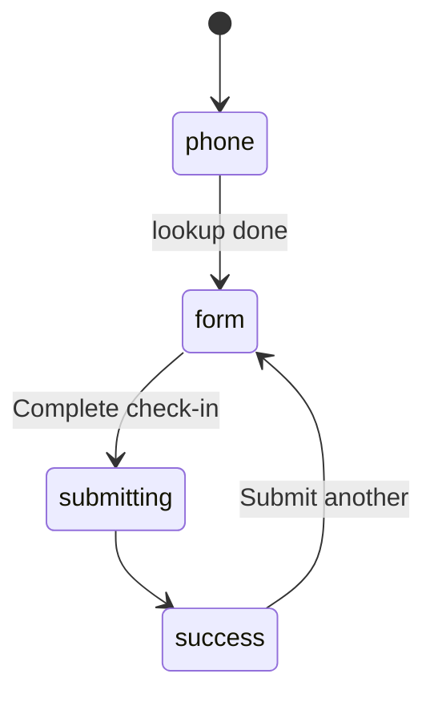
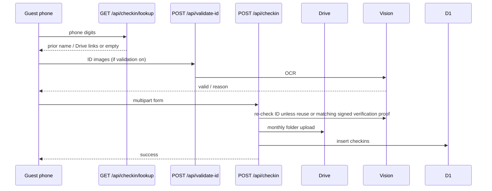

# Guest self check-in

## Race-model coverage

[`CheckinRace.p`](../tools/p-race-model/CheckinRace.p) bounds two submissions with one idempotency key. Its guarded contract claims the submission before the document-upload side effect; the unsafe fixture demonstrates why a database uniqueness constraint reached only after upload cannot by itself prevent duplicate external uploads. This informs future route changes but does not replace the existing self-check-in integration coverage.

**Git-safe.** Admin reviews records at `/admin` → Records. Password: [secrets-and-access.md](secrets-and-access.md).

Pages: `/self-checkin` (static shell with full-bleed hero loop video + frosted glass form cards — see [frosted-glass.md](frosted-glass.md)). APIs: `/api/checkin/lookup`, `/api/validate-id`, `/api/checkin`.

`POST /api/checkin` requires a UUID `idempotencyKey` (FormData). Soft active-visit dedupe (`isSameCheckinVisit`) remains; the create key (migration **0080** `checkins.idempotency_key`) closes timeout/retry duplicates for the same attempt. Before Drive work, migration **0092** takes a short-lived durable submission claim: a parallel retry returns **409** `checkin_submission_in_progress`; a completed row still returns normal duplicate success. Claims release on success or controlled failure and expire only for crash recovery. Admin Records `add` / `addPast` use the existing create-key contract. Guest abuse edge: `guestBookingRateLimit` on `POST /api/checkin` returns **429** (`Too many submissions…`); `GET /api/checkin/lookup` is not rate-limited and never leaks 500s (`found: false` on miss/error). Disposable-SQLite coverage: `src/__tests__/checkin-create.integration.test.ts` (create / foreign+visa / idempotency / parallel key race / Drive claim / soft visit / Drive-fail insert / 429 / lookup). Records gates: `markVibeMatched`=`canViewDashboard`, `addPast`=`admin_only` in `cpu-checkins-auth.test.ts`.

---

## Flow

```mermaid
stateDiagram-v2
  [*] --> phone
  phone --> form: lookup done
  form --> submitting: Complete check-in
  submitting --> success
  success --> form: Submit another
```

```mermaid
sequenceDiagram
  participant G as Guest phone
  participant L as GET /api/checkin/lookup
  participant V as POST /api/validate-id
  participant C as POST /api/checkin
  participant D as Drive
  participant VIS as Vision
  participant DB as D1
  G->>L: phone digits
  L-->>G: prior name / Drive links or empty
  G->>V: ID images (if validation on)
  V->>VIS: OCR
  VIS-->>G: valid / reason
  G->>C: multipart form
  C->>VIS: re-check ID unless reuse or matching signed verification proof
  C->>D: monthly folder upload
  C->>DB: insert checkins
  C-->>G: success
```

1. Phone → latest checkin by contact. Hit: prefill, show clickable previews for stored `idCardLink` / `visaLink`, and reuse those links unless replacement files are uploaded. Each previous preview has a **Remove X** (`aria-label` `Remove Previous ID N` / `Remove Previous visa N`) that rewrites the joined Drive link string via `removeLinkFromJoined` (multi-file ` | `-joined links drop one index). Guests can also **Clear previous ID and upload new** / **Clear previous visa and upload new**; changing ID type clears previous-ID reuse. A failed preview is retried once before showing an explicit link to open the stored document. Miss: blank form.
2. Fields: booking platform (required) + optional booking id (including **Goko Hostel Website**; auto `GOKO{date}{rand}` only for Offline/Walk-in when applicable), arrival, name, persons, days, nationality, coming from, emergency, ID type + photos. The website option records the supplied source only; it does not look up, link, create, or alter a direct website booking. Section labels: Booking / Personal details / ID documents. **India:** Aadhaar, Driving Licence, or Passport. Default UI is **one** primary upload (combined photo / DigiLocker PDF OK). A second Front/Back (or Bio/Address) slot appears **only after Verify** reports `front_missing` / `address_missing` (or the guest opens “Also upload the other side”). OCR hard-rejects a missing side; uploads are kept so the guest can add it. DL does not require a separate address side. **Foreign:** passport bio page only as ID (address optional) + **visa compulsory**. APIs reject non-passport or missing-visa foreign submissions. Form C extras for foreigners. Admin Records add/past/edit/ID-upload follow the same passport-only + visa rule (admin uploads do not run Vision). Browser coverage: Playwright `e2e/self-checkin.spec.ts` (mocked lookup / validate-id / check-in; progressive back slot; Remove X).
3. Vision is mandatory for public self check-in regardless of the admin image-validation display setting: labels → OCR → reject PAN / voter(EPIC) / mark sheet / vehicle RC / QR or generic document / unreadable OCR / SafeSearch junk / ID-type mismatch → Aadhaar/DL/passport scoring (Aadhaar needs UIDAI/आधार cues, not “Government of India” alone) → **hard both-sides check** for Aadhaar/Indian passport → name match. Password-protected PDFs are rejected before Vision or Drive upload; the guest must upload an unlocked PDF or photo. Name: full match (incl. initials like `Pawan D`) accepts; partial match is `verified=name_review` for staff Vibe OK; no guest-name token match is rejected and asks for the guest's own ID or staff-assisted check-in. Only an actual Vision/credential/timeout outage may proceed as `pending` staff review; normal unknown or unreadable uploads never do. A successful Verify returns a 15-minute HMAC proof bound to the exact file hashes and guest/ID metadata. `/api/checkin` accepts only that matching proof to skip duplicate Vision; it never trusts a browser boolean. `/api/validate-id` is same-origin and separately rate-limited. Upload accepts JPEG/PNG/WebP/HEIC/PDF via `isAcceptedIdFile` (HEIC shows filename placeholder). UI: gold **Verify document** on dark-green; red **Complete Check-in**; zinc headings/labels on frosted glass.
4. Server: required fields → validate a supplied DOB as a real, non-future date → ignore a repeat of an active guest visit on the same arrival date (returning the existing check-in id without Vision/Drive work) → verify the signed proof or run Vision → resolve the month Drive folder once and upload/share documents in batches of two → save `formCData` JSON for foreigners with a persistent `draftId` and `status: draft` → insert `status: active`. Required ID/visa Drive failure returns a retryable error and creates no check-in; placeholder values such as `Upload failed` and `offline-pending` cannot be reused as a previous ID. Records shows that draft ID and lets staff review then use the desktop submit action; a successful FRRO submission changes the Form C status to `submitted` and stores the application ID/history. Visit matching uses normalized phone/name and arrival date; stay length and booking ID changes do not create another active check-in or another Beds assignment row.
5. DOB is stored separately from `dobFromId`. Age checks use the supplied DOB first, then a valid DOB extracted from the ID; if neither exists, no age warning is shown. OCR DOB equal to the arrival date is discarded. OCR accepts only DOB-labelled/MRZ dates and rejects invalid or future dates. `verified`: `yes`, `pending` (Vision unavailable or Pi offline), `spoof_warning`, `name_review`, `doc_review`, `no` (admin reject). Age/DOB/name/doc flags clear with staff **Vibe OK** (`markVibeMatched`). Every saved check-in sends New Check-in; unresolved age/DOB/name/doc flags additionally send Check-in Needs Review with the guest first name and reasons, opening Records. Pending, rejected, spoof-warning, Vibe OK, and duplicate submissions do not send that additional alert.

Pi offline: Drive/Vision may fail; check-in should still persist locally (`isOfflineMode`).

Staff then assign a bed (Beds tab) and/or link a booking (Bookings calendar). Check-in row is **not** an automatic bed assignment.
# Walk-in/offline booking resolution

Active self-check-ins whose platform is `Walk-in` or `Offline booking` are reconciled against booking references and unique phone/name matches over the stay dates. If no booking is identified, Records users with `canAddBooking` can create a reviewed booking, link an existing booking, or mark no booking needed. Auto-matched rows also show Link matched / Create / Dismiss (matched is not a dead end). Creating a booking sets `booking_resolution=created`; a later full `cancelBooking` or Records/detail **Delete booking** (`hardDeleteRecordsWalkinBooking`) reopens the check-in to `pending` so Create returns. The list API also heals stuck `created`/`linked` rows when no live booking remains. Hard-delete via `hardDeleteRecordsWalkinBooking` covers Records-linked manual walk-in/offline bookings and **unpaid** website bookings (never OTA; paid website must cancel/refund first); it removes assignments, booking history, and booking guest receipts, nulls native checkout `bookingId`, writes `audit_log` (`walkin_booking_hard_deleted` or `website_booking_hard_deleted`), and keeps the check-in row for Records walk-ins. The create path preserves the self-check-in reference as the booking reference and uses the same admin `createBooking` rules as New Booking: past arrivals may be saved; `manualCreateStatus` sets `checked_out` / `checked_in` when check-in is before today IST so Room Revenue can count the stay. Only `online` bed assignments on **future** nights (date ≥ today IST) trigger Aiosell inventory push — fully past stays are accounting/offline only. Records **Past** (`addPast`) is a separate admin-only archival check-in row (`checked_out`); it does **not** create a PMS booking.
