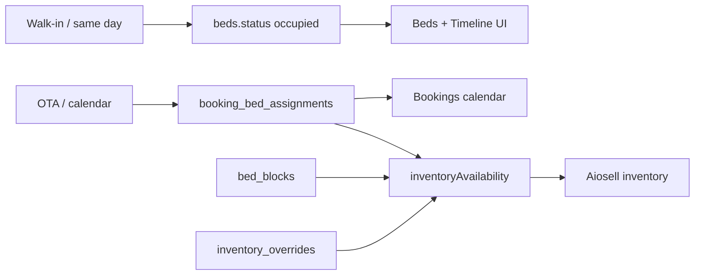
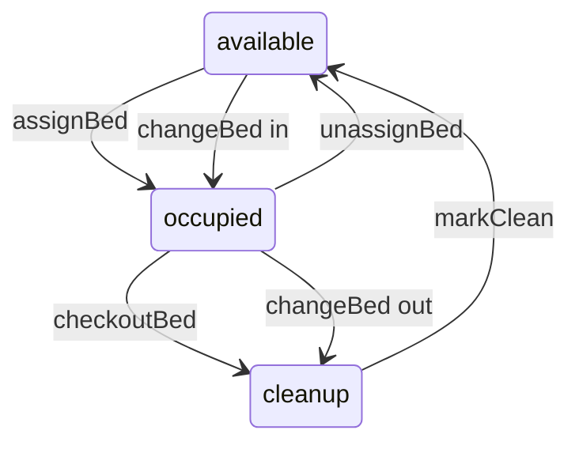
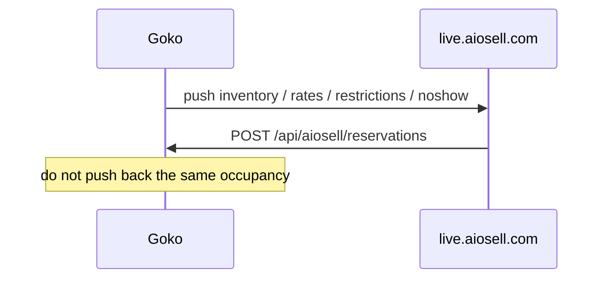

# PMS — beds, bookings, inventory, Aiosell

**Git-safe.** Admin: `/admin`. Aiosell sandbox defaults are in `src/lib/aiosell.ts`. **Live hotel credentials are in D1 `channel_config`** (values in secrets file / Channel Manager UI).

Booking double-bed rule: one guest may reserve one internal slot; two guests must reserve both slots. The picker and create API use the same validation. Booking detail / calendar collapse a full double pair to one assignment row; that row carries `capacity` and `physicalBedIds` for the assigned slots so Edit Booking persons checks and money previews match Create Booking. `editReservation` expands a remove of either half to the whole unit before capacity and pricing projection.

Ordinary non-OTA room cash collected as a new walk-in advance, at check-in, later collection, reservation adjustment, or cancellation refund is journaled prospectively in `cash_payment_events`. Cash payment changes commit the booking balance, cash journal, and split online receipt together. New cash advances are applied only after successful booking/bed creation. OTA pay-at-property collections/refunds/corrections go through `booking_payment_events` via `recordOtaBookingPayment` / `correctOtaBookingPayment`: Cloudflare commits with D1 `db.batch()` plus a NOT NULL CAS guard on `bookings.status` (Drizzle `db.transaction()` BEGIN/COMMIT is not used on D1); Pi keeps a synchronous SQLite transaction. Corrections (`canCorrectBookingPayments`) reverse mistaken journal Paid (reason required; amount `0` in the UI means full remaining on that event) and do not refund the guest. Booking Detail History lists those journal rows only — it no longer dual-writes `OTA Payment Collected` / `Refunded` / `Corrected` into `booking_history`. Correction rows show net Paid before → after (e.g. `₹1.00 → ₹0.00`). Legacy dual-write rows are filtered from Detail and booking audit. Legacy mutable booking totals are not converted into invented historical cash transactions.

---

## Two occupancy models

**Physical bed** (`available` → `occupied` → `cleanup` → `available`): Beds tab, Timeline. `assignBed` writes guest onto the row. Checkout → cleanup → `markClean`.

**Date-range assignment:** Bookings calendar creates `bookings` + `booking_bed_assignments` with `inventory_pool` `online` | `offline` | `block`. Nights are `[checkin, checkout)`. `getBookingCalendarData` also loads booking rows for assignment `bookingId`s missing from the date-window query so a tile cannot vanish when the stay row was dropped from that filter. `assignBeds` coerces `bedIds` to positive integers (JSON sometimes sends `"77"`). Dorm-match (`assignedBedsMatchNeeds`) counts `getBedById` rows even when `beds.status` is `available`/`occupied` — that field is not `booking_bed_assignments.status` (`assigned`/`unassigned`). `assignBedToBooking` retries transient D1 errors and treats an already-written stay+bed row as success.

Aiosell availability (`getDateAwareAvailability`): total beds − active blocks − assignments − **active native website holds** (`getActiveNativeHoldBedCountForDorm`: `state='held'`, `expires_at > now`, night in `[checkin, checkout)`), then min with online ceiling − already-online assignments − native hold units − **unassigned `channel_manager` rooms** mapped to that dorm (`getUnassignedOtaRoomCountForDorm` / `countUnassignedOtaRooms`, case-insensitive codes). Held beds convert to units with the same `bedsPerUnit` pattern as assignments (`heldBedsToUnits`); bulk pushes apply the same reduction after `computeNightAvailability` via `getAvailabilitySnapshot`'s native-hold list. New insert / owner release / abandoned-hold cancel call `pushIfOtaChanged` for affected dorms+nights. Default ceiling is `otaCeiling` = **total − blocked** (no override). Blocking/unblocking therefore moves the OTA number, not walk-in leftover. A staff override (`inventory_overrides.onlineAvailable`) still wins — then blocking eats walk-in first, matching a locked OTA cap. A CM stay holds those rooms until it has an **online** assignment. Auto-assign writes online and drops the hold. Overflow assigned only on **offline** beds keeps the hold so the next Goko inventory push cannot raise OTA. Count is rooms from `rawData.rooms`, not `persons`. The Unassigned panel still lists only stays with **no** assigned bed. Webhook auto-assign and staff Unassigned/`editReservation` pass `excludeBookingId` into `getAvailableBedsForRange` / `loadBedsAvailabilityForRange` so the stay can take its own held online slots **and** so date edits do not treat the stay's current beds as conflicting with itself; `getAvailableBeds` uses `omitOwnAssigned` so the add-picker still hides beds already assigned to that stay. Hold SQL uses the same exclusive end as `occupiedNights` (NULL, `''`, or `checkout <= checkin` → `date(checkin, '+1 day')`, including inverted dates and empty checkout). `exclusiveEndDate` is null when checkout `<` checkin (auto-assign/Unassigned refuse); hold still one night. `explodeUnassignedOtaHolds` has no status field — cancelled stays do not hold only because those SQL queries use `status NOT IN ('cancelled', 'checked_out', 'no_show')`. Release is booking-level `NOT EXISTS` any online assignment (one online bed drops the whole mixed-room hold — written rule, do not remaining-rooms-fix). If `rawData.rooms` is a non-empty array with no matching `roomCode`, count does not fall back to `roomType` (typed Aiosell rooms include `roomCode`; `parseReservationPayload` does not require it). Empty `rooms[]` / missing `rooms` still falls back to `roomType`.

Inventory grid cells and the override modal use the same remaining: `remainingSplit(available, otaCeiling(...), onlineAssigned + unassignedOta)`. **Unassigned OTA** is channel_manager bookings for that room type with no **online** bed yet — a hold on the OTA ceiling, not a physical bed. The OTA/walk-in numbers inside the modal (`overrideRemainingInput` / `overridePreview`) must match the cell. Saving uses `overrideCeilingToSave` so the ceiling still subtracts unassigned OTA (do not persist `ceilingFromRemaining(typed, onlineAssigned)` alone). Physical identity is `total = booked + blocked + online + offline`; unassigned OTA is a separate row.

Math: `src/lib/inventoryAvailability.ts` (tested). Past nights (`date < todayIST`) are accounting-only in the booking picker: tagged `offline`, ignoring OTA holds/online ceiling for those nights. `otaFingerprint` / `pushIfOtaChanged` only consider nights `>= todayIST`, so a fully past walk-in create does not push Aiosell.

---

## Bed status

Overdue: `expectedCheckout < today` still occupied → highlight.

Check-in records `checkoutGuest` can check out without a bed.

---

## Bookings calendar

Route `/api/admin/bookings`. Create / assign beds / check-in / check-out / move / cancel / no-show / hold. `rollbackCheckIn` / `rollbackCheckOut` = admin_only.

**Calendar `checkIn` does not create a `checkins` row** and does not flip `beds.status`. It only sets `bookings.status = checked_in`. Desk **Collected** opens the shared food `RecordPaymentModal` (Cash / Online / Split) and requires `paymentMethod`; `mergeStayCollect` writes `amountPaid = amountTotal`, `paymentStatus: paid`, and method/cash fields. **Later** is check-in with no collect (no extra “amount not received” prompt). ₹0 due skips Collected. **Prepaid** (`pah: false`) skips Collected too; check-in runs `prepaidCheckInWrite` for Room Revenue compatibility when `amountPaid` is still 0, and always calls `recognizePlatformBooking` for prepaid status (idempotent) so a platform receivable exists even if the compatibility write was already applied. That recognition is gross/deductions/expected payout — not a real-bank receipt. Aiosell ingest still leaves amountPaid 0. Guest ID register is still Self Check-in / Records. Same-day walk-in occupancy is still Beds tab `assignBed`.

**Check Out Guest** (calendar `checkOut`) first calls `getPendingFoodTab` (same perms as `checkOut`). Hostel food bills live on the **self-check-in** row (`food_orders.checkin_id` → `checkins.id`), found by normalized phone against `booking.contact`. Unpaid `on_tab` / `pending` (not `cancelled`) opens “Unpaid food bill” / Check out anyway. Beds `checkoutGuest` / `checkoutBed` and Timeline checkout use the same helper. Dashboard today-checkout **live-calls** `getPendingFoodTab` on click (does not trust the preloaded tab). `getDashboard` food tabs use **all** active checkins (`getActiveCheckins`), sum every matching id, and `Number()` SUM/COUNT. Empty phone or lookup failure uses `foodTabUncheckedMessage` (“anyway”), not a silent all-clear. Pay marks `orderIds` from that lookup and **stops** if `markOrderPaid` fails. **Unassign** is not checkout (no food warn). Cafe walk-in orders with no `checkin_id` are not matched by phone. Checkout APIs still do **not** hard-block unpaid food.

Hotel-due is **math** (`stayDueAtHotel` in `src/lib/stayPayment.ts`): prepaid → 0; else `max(0, amountTotal − net amount collected)`, where net is gross paid less recorded refunds. Booking amounts are **rupees** (walk-in `nightlyRate` 500, Aiosell `amountAfterTax` as-is); OTA postpaid journal calculations use integer paise and project to rupees. Food orders are **paise**. Stay `RecordPaymentModal` must pass `amountUnit="rupees"` so the shared food modal does not divide by 100. A `paid` row can still be due after a price-up (**Collect remaining**). After Later, Dashboard **Unpaid stay** (`getDashboard.unpaidStays`: all `checked_in` with due, plus `checked_out` whose `checkoutDate` is within the last 14 IST days) **Mark Paid** and detail **Collect** both call `collectStayPayment` (`canCheckIn` **or** `canAddBooking`) with the same modal. Remainder collect uses the due delta as the modal total; mixed methods become `split`. Same-method cash remainder keeps prior `changeGiven` so tender − change still equals `amountPaid`. Split Cash type auto-fills Online as total − cash (Online field is read-only). Split cash = full bill → use the Cash tab.

Checked-in detail **Cancel** (next to Check Out) asks for the actual refund amount, defaulting to ₹0. For eligible postpaid OTA bookings, the cancellation/no-show flow supports cash, online, or split refunds and commits refund plus lifecycle status together. A later refund can be recorded from cancelled/no-show history up to unrefunded Goko collections; online refund requires an active non-virtual receiving account. An OTA cancellation webhook never implies that Goko returned money: any advance remains unresolved until staff records a refund. Unrefunded terminal advances are not silently classified as earned room revenue. OTA-prepaid refunds continue through Platform Receivables so an expected payout is not treated as a bank balance. `rollbackCheckIn` reverses the platform recognition when migration 0054 is present and clears the compatibility amountPaid write. Room Revenue displays rupees (no `/100`). OTA prepaid card is only stays not yet recognized (`amountPaid` 0).

Aiosell `pah: true` → `paymentStatus` `pay_at_hotel` (desk **Collect payment**). `pah: false` → `prepaid` (**Payment done** / Prepaid — do not collect at the desk; check-in recognizes the platform receivable, not a bank receipt). Omitted `pah` → `unknown` (no extra Payment row; red Balance still means collect, same as walk-in `createBooking`). Ingest leaves `amountPaid` 0; calendar check-in of prepaid copies `amountPaid = amountTotal` only for compatibility. Booking detail Paid/Balance uses `displayedStayPayment`: prepaid shows Paid = `amountTotal` and Balance = ₹0 even when `amountPaid` is 0. Red Balance uses `stayDueAtHotel` (`due > 0`), not `paymentStatus === paid`. Old paid rows with empty method show as **Collected (no method)** on Room Revenue.

Eligible OTA payment collection requires explicit pay-at-property terms and explicit INR source currency; missing or foreign currency/unknown terms stay out of the new flow. `canRecordBookingPayments` grants only this payment action, not edits, lifecycle controls, or refunds. Aiosell terms are stored separately from local progress so a later webhook that omits `pah` preserves terms, and the local payment override prevents the webhook from erasing recorded payment state. Each cycle has append-only payment events; the booking's `amountPaid`/`amountRefunded` remain compatibility projections. Aiosell rebooking archives the previous financial/stay snapshot before reusing the row.

New Booking (`createBooking`) mints `goko_booking_id` as `GOKO` + IST date + 6 chars (same shape as Records walk-in `checkins.booking_id`). Detail **Goko Booking ID** shows that string, or `#` + numeric `bookings.id` for older walk-ins that have none. **OTA Booking ID** is `booking_ref` (Aiosell `bookingId`). **CM Booking ID** is `cm_booking_id`. Channel ingest still leaves `goko_booking_id` empty.

**Assign / 500 retry:** Bookings dashboard POSTs use `fetchWithRetry` (`src/components/admin/useAdminApi.ts`) — up to 2 extra attempts on network throw, 429/502/503, HTML 5xx, and JSON 500 (`retryServerError`). `createBooking` does **not** retry JSON 500 (would duplicate). Server-side `assignBedToBooking` is `dbWrite({ idempotentWrite: true })`; a zero-row insert still returns true if this stay+bed is already `assigned`, so a retried assign is not a 409. `getBookingCalendarData` also fetches booking rows referenced by visible assignments (empty checkout used to drop the stay, and the grid skipped the tile with `if (!booking) continue`).

Gmail sync (`POST /api/bookings/sync`, **env** admin/manager passwords only): last 7 days OTA mail → `otaEmailParser.ts` → dedupe `bookingRef`. MakeMyTrip + Booking.com richer than Hostelworld.

---

## Inventory UI

The Inventory grid offers 7d, 14d, 30d, and Custom ranges. Custom Start/End dates are inclusive in the UI and are applied immediately; `getInventoryGrid` receives exactly those inclusive dates. Bookings and Timeline use the same immediate-Apply inclusive custom-range behavior.

`/api/admin/inventory` — grid, channel CRUD, bed type config, blocks, overrides, bulk availability/rates/restrictions. Permission `canManageInventory`.

Bulk Update date fields (Block / Set Rates / Adjust / Restrictions): past days greyed (`min` = today IST). Choosing start auto-fills end = next day (staff can change it). **Both dates are nights included.** Block picker shows beds free on **every** night in that range (intersection / tightest night) — not booked, not already blocked — from `getBedsFreeToBlock` only (no stale grid snapshot fallback). Unblock lists **all** active blocks via `getActiveBlocks`, not only those overlapping the visible grid. API still stores blocks as `[start, exclusiveEnd)` via `exclusiveEndFromInclusive`. `getBedsFreeToBlock` / `blockBeds` reject occupied beds.

Set Rates, Adjust Rates, and Restrictions all use the same room-grouped chips (`RatePlanChipPicker`): tap any number of plans (Executive EP, 6-Bed MAP, …). Set Rates writes **one ₹** onto every selected plan (`bulkSetRates` `ratePlanIds[]`; singular `ratePlanId` still accepted). If `channelId` is set, Set Rates writes `channel_rates` only and **does not** `triggerRatePush` (that helper reads `daily_rates`). Adjust is % / ₹ relative per plan (always `daily_rates`). Restrictions apply the same flag/value to each selected plan. D1 still **preserves** other flags per night (min stay 2 does not clear an existing stop-sell in the grid). Auto-push to Aiosell (`triggerRestrictionPush` + `restrictionPatch`) sends **only the field staff set** — Aiosell restriction keys are optional/merge, so a min-stay update must not re-assert `stopSell: true` on a night that already had it. Channel Manager **Push restrictions** / `includeRestrictions` on `/api/aiosell/push-rates` still send the full D1 snapshot.

Bulk Availability uses dorm/room chips rather than rate-plan chips. `bulkSetAvailability` accepts inclusive `startDate`/`endDate`, a civil weekday filter, and `mode: set|clear`. With `preview: true`, it uses the same bounded snapshot to return current and projected values per selected room plus combined totals across the selected room-nights, without writing, auditing, or pushing. The UI keeps the per-room values primary because room capacities can differ. In `set` mode, `onlineRemaining` means the desired OTA/PMS slots remaining; each cell persists `overrideCeilingToSave(computeNightAvailability(...), onlineRemaining)` so assigned online beds and unassigned OTA holds remain protected. Values above that night’s available inventory are capped and reported. `clear` deletes only the default (`channel_id IS NULL`) override, leaving channel-specific rows alone. Offline/walk-in availability remains derived and is never bulk-written. One bounded availability snapshot feeds all cells, then one `triggerInventoryPush` covers mapped dorms; unmapped dorms are local-only. The API waits for Aiosell acceptance with a 15-second timeout before the modal shows success; a failed/timeout push leaves the local override and dirty row saved, keeps the modal open, and allows `retryPmsSync` to resend only the PMS scope. Block/unblock, Set Rates, Adjust Rates, and Restrictions follow the same local-save/PMS-confirm/retry pattern. The operation writes one summary audit entry and does not modify physical bed blocks, bed status, assignments, bookings, check-ins, rates, or restrictions.

New Booking / Unassigned Assign use `getAvailableBedsForRange`: same intersection over `[checkin, checkout)` (checkout morning is free). Chips are capped to the tightest night’s `min(online)+min(offline)` **minus unassigned OTA rooms** (`unassignedOta` on the inventory grid; `getUnassignedOtaHoldsForRange` on the picker). Pool labels are allocated across eligible free units only; occupied units never consume the remaining online/offline quota before a later free unit. Webhook auto-assign excludes the new booking’s own hold; staff Unassigned does **not**, so leftover chips stay offline. Leftover physical beds that would squeeze OTA are omitted. Changing check-in auto-sets checkout to the next day. Admin New Booking (and Records Create booking on the same modal) **allows past stay dates**. `getAvailableBeds` loads `getAllDailyRates(checkin, checkout)` and suggests stay money via `adminStayRateForStay` (`src/lib/adminBookingRates.ts`): sum of each occupied night’s calendar rate (adult1 for beds, adult2 for doubles) — same night set as the website, **without** guest stop-sell / min-stay fail-closed. Response includes `dormStayTotals`, `dormRateRanges` (`₹A–B/night` when nights differ), and `dormRates` (rounded average for Edit × nights). Create modal field is **Stay total for selected units**; `createBooking` prefers body `staySubtotal` as gross (avoids average×nights rupee drift) and stores `nightlyRate = round(staySubtotal / nights)` for legacy display. Fallback without `staySubtotal` remains `nightlyRate × nights × units`. `createBooking` uses `manualCreateStatus`: when check-in is before today IST, a fully past stay (`checkout <= today`) saves as `checked_out` with check-in/out stamps; a straddle (`checkout > today`) saves as `checked_in`; same-day or future stays stay `received` for desk check-in. Website/guest booking still rejects past arrival. Past nights tag `offline`; Aiosell push only if an `online` pool is assigned and only for nights `>= today` (`pushIfOtaChanged`). Missing checkout on assign / move / edit / modify CI-CO is coerced with `stayCheckout` (`exclusiveEndDate`) so PMS nights are never empty. Night counts (`stayNightCount` / `occupiedNights.length`) are civil dates — not `new Date(date + "T00:00:00")`. Walk-in New Booking can take a **% discount** or **amount discount** (kitchen-style tabs + reason). Tax is `booking_tax_rate` in settings (default **5%**, Channel Manager → Configuration), applied after discount. **`0` is 0%** (`bookingTaxPercent` in `src/lib/bookingPricing.ts`) — never `Number(x) || 5`. Server reads the setting — do not trust a client tax. Walk-in stores `{ gokoWalkin: { discount, discountPercent?, discountAmount?, discountReason, taxPercent } }` in `bookings.raw_data`. Do **not** write that onto Aiosell `rawData`. Booking Engine / OTA create has no discount tabs. Date change (`modifyCheckin` / `modifyCheckout`) re-applies stored walk-in percent (or capped amount) then the current tax setting, and rewrites `gokoWalkin.discount` / `taxPercent` so the detail panel stays in sync. `editReservation` amount edits clear the stored percent so a later date change cannot resurrect the old discount. Assign is all-or-nothing: if any selected bed is missing from the picker, none are inserted (create then cancels the new row). `assignTaggedBeds` / date-change re-assign roll back partial writes then 409.

Channel Manager **push** dates and Check Rates From grey past days; picking start fills end with the next day. Check Rates To is exclusive (`current < To`) so To `min` is start+1. CM push is inclusive (`current <= end`) so same-day start=end is one night. Public booking enquiry form matches New Booking. Calendar view custom range and food/ledger report dates stay able to look at the past.

Aiosell cancel webhook pushes assignment nights when beds were assigned, else `occupiedNights(checkin, checkout)` — not checkout+1. Empty stay dates skip the push (do not default to today). `modify` rewrites assigned bed CI/CO to the new stay when those beds are free; on conflict it leaves booking dates on the old stay (guest/amount still update). Occupancy shrink/type change still reseats on those old dates. It still does **not** push inventory. Calendar `checkOut` shortens remaining **assignment** nights to today IST (same-day / pre-arrival: exclusive checkout = check-in, zero nights — assignments stay `assigned` so rollback can restore). A second checkout on an already-closed booking is 409 and does not extend the shortened assignment. Zero-night rows are omitted from `getBookingCalendarData` and overlap checks (`checkoutDate > checkinDate`); the grid does not paint a tile when `endIdx <= startIdx`. `bookings.checkoutDate` stays the planned stay so `rollbackCheckOut` can restore it. Rollback conflict-checks `[assignment.checkoutDate, bookings.checkoutDate)` (the nights being put back), not `[today, checkout)` — 409 if any of those nights were taken. It does not flip `beds.status`. Aiosell `modify` and staff date/bed edits skip realign / return 409 when status is `checked_out` / `no_show` / `cancelled` so an early checkout cannot be stretched back over nights already sold. `markNoShow` treats `booking.com` and `booking_com` as Booking.com. Unblock with unmatched `blockIds` does not push today's inventory.

Dirty tracking: `inventory_dirty` then push. Bulk availability persists default overrides and mapped dirty rows before waiting for the UI-visible Aiosell call, which has a 15-second timeout; the protected five-minute Worker cron retries any rows that remain. Default Channel Manager inventory push drains unmapped-dorm dirty rows first (they cannot be sent) so incremental mode cannot stick on an empty payload. Ranged push clears only dirty rows for nights actually sent. Full Sync still clears all dirty. An Aiosell warning (for example `INVALID_ROOM_CODE`) is not confirmation: dirty rows remain and the PMS log is failed, so staff can correct the mapping and retry. Bulk rates and restrictions retain their local rows and expose a PMS-only retry in the open modal when their outbound push is rejected or times out.

Date arithmetic for stays/blocks/grid (`addCalendarDays`, `inclusiveNights`, `stayNights`) is civil `YYYY-MM-DD` via UTC — not `T00:00:00` local + IST format — so browsers east of IST do not drop a night.

---

## Aiosell

Config in Management → Channel Manager (`/api/admin/channel-manager`, admin only). Enabling `isActive` **requires** `webhookSecret`. Auto inventory push also needs `autoPushInventory`. Auto restriction push from Bulk Update needs `autoPushRateRestrictions` and sends a **patch** (`restrictionPatch`), not a full snapshot. Rate / inventory / restriction **HTTP bodies** coalesce consecutive nights that share the same payload into one `{ startDate, endDate }` block (`coalesceAiosellUpdates` in `src/lib/aiosell.ts` — Aiosell expands the range server-side). Weekday-filter gaps and nights whose leftover/rate/restriction differs stay separate objects. Callers still build per-day rows (dirty clear / `inventoryPushed` counts).

Live D1 (checked 31 Aug 2026): `hotelCode` `sandbox-pms`, `pmsId` `sample-pms`, host **`live.aiosell.com`** (Aiosell’s live API with a sandbox hotel, not a separate sandbox hostname). Auto-push inventory/rates/restrictions are all on. Goko room maps: `dorm-1`, `dorm-2`, `female-dorm`, `executive`, `shiva-dorm`. Aiosell fetch inventory/rates only returned **`executive`** and **`suite`**. `shiva-dorm` has **0** rate plans. Dorm 1/2/female each have **duplicate** EP/MAP/CP plan rows. Auto-push of `dorm-*` / `female-dorm` is logged as Aiosell `success:true` plus `INVALID_ROOM_CODE` warnings. Do **not** Full Sync / push inventory to invent `dorm-*` rooms on Aiosell until those codes exist there. `POST /api/aiosell/fetch` for inventory/rates is read-only; **`type: reservation` also ingest-creates missing Goko bookings** (skips refs that already exist, including cancelled — does not rebook). A fetch row with `action: "cancel"` is skipped even if the ref is unknown (same as webhook cancel of a missing ref — no insert). `book` / `modify` snapshots of unknown refs still go through `handleNewBooking`. Push routes write the live hotel.

Beds-tab `assignBed` / `checkoutBed` / `unassignBed` / `markClean` do **not** auto-push inventory (`beds.status` is not in OTA math). Calendar occupancy, blocks, overrides, and webhook cancel still do.

Inbound webhook `POST /api/aiosell/reservations`:

- 503 if config missing/inactive or `webhookSecret` empty.
- 401 unless `Authorization` or `x-api-key` equals the secret (or `Bearer {secret}`).
- `hotelCode` must match on the webhook **and** on fetch ingest (`ingestFetchedReservations` skips snapshots whose `hotelCode` ≠ config).
- `book` / `modify`: write `bookings` (`source: channel_manager`); `pah` true/`false`/omitted → `paymentStatus` `pay_at_hotel`/`prepaid`/`unknown` (`channelPaymentStatus`; modify keeps the existing status when `pah` is omitted). Do **not** push inventory (Aiosell already has the sale). `book`, cancelled/no-show rebook, and `modify` auto-assign online beds in the mapped room type (`channelBedNeeds` / `autoAssignOnlineChannelBeds`) for the whole stay — nights do not multiply beds. **One rooms[] row** uses occupancy as persons (1 executive × adults 2 → 2 beds). **The same `roomCode` repeated** with occupancy on every row is 1 bed per sold unit — occupancy is that unit's capacity (6 suite × adults 3 → **6 beds**, not 18). Stored `persons` matches that bed count (`channelPersonCount`). `modify` realigns the same bed IDs when dates change (keeps each assignment’s pool). If person count or room type changes (`channelAssignmentNeedsReseat`), it unassigns and re-auto-assigns all-or-nothing. Staff overflow in another dorm is kept when count and type are unchanged. Concurrent books retry `refreshTagged` up to 3 times (`autoAssignOnlineChannelBeds`: on `assignBed` false, skip that bed id, `unassignAll`, refresh, retry; without `refreshTagged` fail after the first conflict). Empty occupancy `{adults:0,children:0}` is the same as missing occupancy and uses `persons`. Mixed rooms[] keep specified occupancy counts and put leftover persons only on unspecified rooms (never inflate a specified room; omit unspecified rows when leftover is 0). Extra staff overflow beds are not occupancy growth (`previousNeedCount`). All-or-nothing: not enough online chips, inactive mapping, or unmapped code → Unassigned. Unassigned stays show under Admin → **Bookings → Unassigned** (orange badge). The panel is loaded via `getUnassigned` (all open stays with no assigned bed), **not** the visible calendar date range; response includes `requestedRoomCodes`, `requestedDormIds`, `requestedDormNames`, `requestedBedCount`, `requestedNeedLabels`, `requestedNeeds` (per-dorm `{ dormId, count, name }`). `enrichUnassignedBooking` recomputes bed count from `rawData.rooms` (so a row stored with persons 18 still asks for 6 suite beds after this rule). Rows whose stay is outside the visible dates are labelled **Off this calendar** (stays on-screen first). They do **not** appear on the calendar grid until a bed is assigned, and they do **not** create a Records/check-in row. Staff **Assign** leftover **offline** (walk-in) chips, one per requested bed, stores the chip pool, and **does not** push Aiosell. The Unassigned picker splits **Requested room(s)** vs **Other rooms (overflow)**, shows `requestedNeedLabels` / `requestedNeeds` (fallback `roomLabel` if empty), greens leftover chips with an **off** label, and caps requested-dorm chips at that dorm’s quota (`picked/quota`). `assignBeds` 400s unless the pick count matches one-per-person **and the stay currently has zero assigned beds**; mapped requested-dorm picks must match `requestedNeeds` (cannot dump 3 Executive for 2 Exec + 1 Dorm). Any selected bed outside `requestedDormIds` is overflow and skips the dorm-match 400 — mixed 2 Executive + 1 other-dorm for a 2+1 stay is 200 (intended). Once a stay already has an assigned bed, `assignBeds` still **adds** beds (`assignTaggedBeds`) but 400s if `currentAssigned + bedIds.length > requestedBedCount`. Calendar extra beds are `editReservation` `addBedIds`. **Reject** (admin/manager only) is Goko-only `cancelBooking` — confirm copy says it does **not** cancel the OTA. Staff do not see the button; a staff `cancelBooking` of a stay with no assigned beds is 403 even with `canDeleteBooking`. Calendar Cancel of an assigned stay still uses `canDeleteBooking`. Env manager can Reject unassigned without that key; assigned cancel still needs it. Detail **Cancel** on a stay with no assigned beds is the same admin/manager gate (staff with delete-booking do not see a 403 Cancel). Detail Check In / Cancel / No Show / Check Out dialogs (`CheckInPopup`, `ConfirmDialog`) and `RecordPaymentModal` are `fixed inset-0 flex items-center justify-center overflow-y-auto p-4` — do not put `left-1/2 -translate-x-1/2` on the same node as `modalVariants` (Framer overwrites transform and the card overflows on a phone). Unassigned `getAvailableBeds` does **not** send `bookingId`. A later OTA cancel webhook on an already-cancelled Goko row retries only the idempotent financial reversal for a checked-in prepaid row, then returns already-cancelled; otherwise it no-ops and does not push. After assign, the stay is a calendar bar on that bed — it leaves Unassigned. If that stay does not overlap the current window, `rangeCoveringStay` shifts the calendar to a custom range of the same length starting at check-in **without** reloading the old dates first, other dorms collapse, and the Unassigned panel closes so the bar is on screen. The Timeline tab is physical `beds.status`, not calendar assignments. Multi-room webhooks store `nightlyRate` = sum of each room’s first-night `sellRate` (if `prices` is null, `amountAfterTax / nights`). Stay totals still come from `amount`. Guest `lastName: null` is omitted (`Pawan 123`, not `Pawan 123 null`). Fetch reservation ingest uses the same insert + auto-assign path but **never rebooks** an existing ref. Empty `rooms[]` stores `roomType ""` / `persons` 1 and stays Unassigned (a leftover `roomType` field on the JSON is ignored). Duplicate `bookingId` in one fetch batch: first row inserts, second is skipped once `getBookingByRef` sees it (`booking_ref` is indexed, not unique).
- Staff occupancy of a `channel_manager` booking (assign, unassign, check-out, rollback check-out, date change, add/remove bed, move room) **does not** push inventory. A staff **cancel** is Goko-only (the OTA cancellation must be done separately) but does push the locally released availability. Full cancellation and no-show atomically claim the eligible booking status first, so a concurrent request cannot release or push the same beds twice; partial cancellation similarly changes only still-assigned rows. `markNoShow` is available on/after check-in, notifies Aiosell only for Booking.com bookings with a CM id (`POST /api/v2/cm/marknoshow/{pmsId}` with `hotelCode`, the inbound OTA `bookingId` stored as `bookingRef`, and `channel: "booking.com"`), then pushes availability. If Aiosell rejects the OTA booking reference, older rows fall back to `cmBookingId` before recording failure. If that notification fails, Goko still closes the stay and records a retryable `failed` no-show sync state; `retryNoShow` retries only that failed Booking.com notification. Walk-in / manual bookings still push when OTA availability changes.
- `cancel` **webhook**: status cancelled, capture nights from assignments (fallback booking dates), `unassignBookingBeds`, **then** `triggerInventoryPush` only if nights exist. Does **not** write a Goko refund (no `amount_refunded`) even if the stay was `checked_in`; if a prepaid receivable was recognized, an immutable financial reversal is appended. Late OTA cancel of `checked_out` / `no_show` preserves the closed operational status and skips unassign/push, while still evaluating the financial reversal. A repeated cancel on an already-cancelled checked-in prepaid row retries the idempotent financial reversal, then returns `Reservation already cancelled`. Aiosell reusing a cancelled/no-show row increments `booking_cycle` and resets current payment/refund fields. Admin `hold` has no `stayClosed` check (no Hold button in the calendar UI) — posting `action: "hold"` on a cancelled CM stay sets `status: hold`, which **re-enters** `getUnassignedOtaHoldsForRange` (`NOT IN ('cancelled', 'checked_out', 'no_show')`). `getExpiredHoldBookings` is defined and never called; expiry does not auto-release. `checkOut` of an unassigned CM stay does not map dorms (unlike `markNoShow`) and still skips occupancy push — the hold drops locally via the `checked_out` status filter. Date-realign fail + occupancy **grow** (1→2) keeps old dates and reseats the new count on the old stay (same as shrink).

## PMS logs

### Completing an unassigned OTA booking

The Unassigned picker and its `assignBeds` write pass the current `bookingId` to `getAvailableBedsForRange`. This excludes only that booking's own temporary OTA hold, allowing a previously failed OTA booking to use its reserved online capacity. Holds belonging to other unassigned OTA bookings remain unavailable.

Booking Calendar and Inventory hide the held legend/count column when the visible date range has no active unassigned OTA hold; the backend reservation remains active. Calendar cell detail alerts are cleared whenever the availability snapshot or visible date range refreshes, and any stale detail text mentioning an unassigned OTA hold is suppressed unless the current cell positively reports a hold. A cell reports held capacity only when that cell has an active hold.

`releaseForNoShow` is the Booking.com-only local “guest declined” flow: it changes the row to `guest_declined`, unassigns beds, excludes the row from OTA holds, and pushes released Aiosell inventory without cancelling Booking.com. On the following day, `markNoShow` accepts the `guest_declined` row and sends the documented Aiosell no-show request. Ordinary `received` rows remain markable on/after check-in; failed Aiosell no-show calls remain retryable through `retryNoShow`.

Every Aiosell hop writes `channel_sync_log` (Management → Logs → PMS). `logPmsCall` in `src/lib/pmsLog.ts` — never throws. Payloads stored as sent (no PII redact). Bodies capped at 32KB. The card shows an **operation** line from `summarizePmsLog` in `src/lib/pmsLogSummary.ts` (display only; Aiosell bodies unchanged). **Do not** import `pmsLog.ts` from `ManagementLogs` — that module `import()`s D1 queries. Push inventory/rates/restrictions: `executive 30 Aug 10 → 9` by diffing this request against the previous **successful** log of the same kind (`inventory` matches `inventory (auto)`). No previous overlapping cell → `executive 30 Aug → 9` (do not invent a from). Pull reservation: `Book · SAN… · 2 executive · 31 Aug–1 Sep` — inventory remaining is **not** on the webhook. Repeated same-code rooms collapse to sold units (`6 suite`, not `3 suite + 3 suite` × 6). Fetch/no-show: one-line. Caps at 6 lines + `+N more`. Full restriction snapshots collapse defaults to `open`; 1-key auto patches still show `stopSell` / `stopSell off`.

| Direction | Type | What |
|-----------|------|------|
| **pull** | `reservation` | Inbound webhook `POST /api/aiosell/reservations` (`book` / `modify` / `cancel`). URL in the log is our path, not live.aiosell.com. Auth failures do **not** store the body. |
| **pull** | `fetch (inventory\|rates\|reservation)` | Channel Manager **Fetch from Aiosell** → `POST /api/v2/cm/data/{pmsId}` |
| **push** | `inventory` / `inventory (auto)` | Manual Channel Manager push vs calendar/block auto-push → `/api/v2/cm/update/{pmsId}` |
| **push** | `rate` / `rate (auto)` | Manual push-rates vs bulk Set Rates auto-push → `/api/v2/cm/update-rates/{pmsId}` |
| **push** | `restriction` / `restriction (auto)` | Inventory restrictions or rate restrictions (auto = Bulk Update patch) |
| **push** | `noshow` | Calendar mark no-show → `/api/v2/cm/marknoshow/{pmsId}` |

`getSyncLogs` type filter is prefix: `inventory` also returns `inventory (auto)` (`LIKE` with escaped `%`/`_`). Management → Logs keeps the last **30 days** (not a 500-row cap). UI default **50 per page** (25 / 50 / 100). Response is `{ logs, total, page, pageSize }`. Download is a menu: **PDF** (full fields + pretty request/response via `logExport.formatPmsLogsForPdf`, then browser `jspdf`) or **JSON** (same payload as before). Both use `download: true` / `pageSize: LOG_DOWNLOAD_MAX` (2000). System Logs has the same PDF/JSON menu. Auto-push catch failures are typed `inventory (auto)` / `rate (auto)` / `restriction (auto)` so they do not look like a failed manual push.

Public Book now follows the saved guest Booking Engine URL (StayFlexi, Aiosell guest engine, another provider, or `/book`). Blank/error uses Booking Enquiry; `/book` currently offers enquiry only, not native checkout. Guest routing is separate from this existing Aiosell inventory loop. See [Website booking foundation](flows-website-booking.md).
# Walk-in check-in reconciliation

Records can reconcile an active Walk-in or Offline check-in that has no booking row. Staff with `canAddBooking` may create a reviewed manual booking using the check-in reference, link an existing booking by stable reference, or mark the stay as no booking needed. Created bookings use the existing assignment path; Aiosell inventory is updated only when at least one selected bed is in the `online` pool. `offline` and `block` assignments remain internal tracking.
