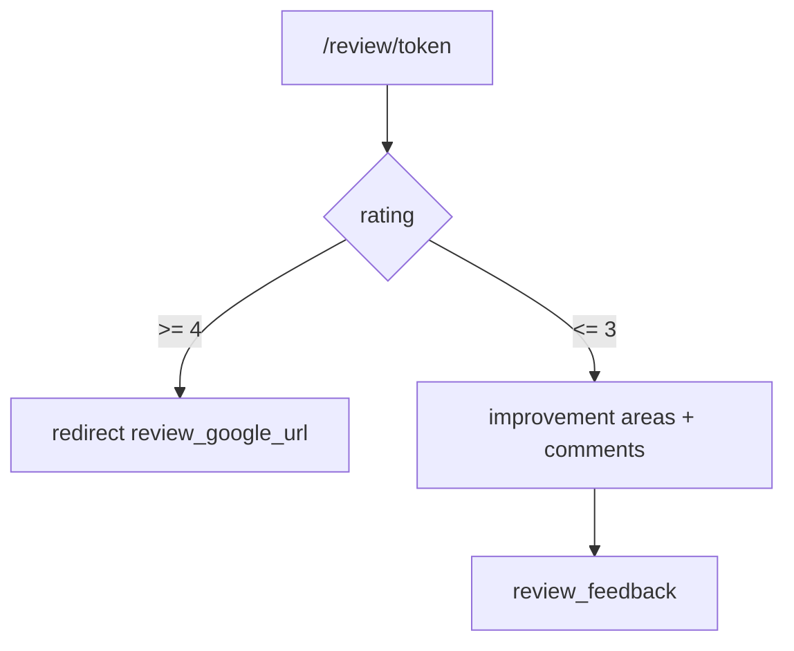
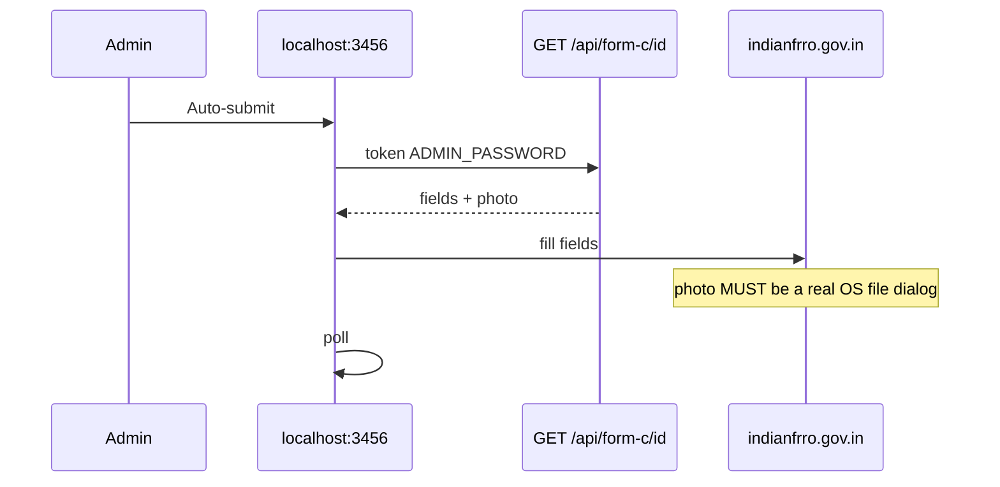

# Reviews and FRRO Form C

**Git-safe.** Form C token = `ADMIN_PASSWORD`. FRRO Playwright desktop helper: `npx tsx scripts/frro-server.ts` port **3456**. The Records workflow is intentionally desktop-only because the FRRO website is fixed-width and its upload/CAPTCHA flow is not reliable on mobile. FRRO website login is **not** in `.env.local` (see secrets file).

---

## Review funnel

Staff (Reviews tab, `canViewReviews` or admin): `listAskReview` = checked-out guests with `checkedOutAt` set. `sendWhatsApp` increments send count. Token on `review_requests`. Guest URL `/review/[token]` (robots `disallow: /review/`). Google URL from setting `review_google_url`.

Guest API `POST /api/review` (no staff password):

| action | Behavior |
|--------|----------|
| `getReviewRequest` | name, google URL, alreadyRated |
| `submitRating` | 1–5; `redirectToGoogle: rating >= 4` |
| `submitFeedback` | low-rating form; blocks duplicate `review_feedback` |

Admin actions: `listAskReview`, `sendWhatsApp`, `listResponses`, `getAnalytics`, `getSettings`, `updateSettings`, `editReviewRequest`, `resetReviewRequest`.

---

## Form C

Foreign check-in stores `form_c_data` JSON (MRZ + visa OCR, `parsePassportData.ts`) as a recoverable draft with a persistent `draftId` and `status: draft`. Records → Form C popup shows the draft ID, extracted details, and a review-and-submit action. A successful FRRO run changes the stored status to `submitted` and keeps the application ID/history. Incorrect application-history entries can be removed from Goko by an admin; this does not delete anything at FRRO. `reExtractFormC` / `updateFormCData` / `removeFormCSubmission` = admin_only.
The same phone number may be used for India and the home country when the guest has no local Indian number.

Photo max 50KB JPEG. Script writes `/tmp/photo.jpg`. Programmatic upload is rejected by FRRO. Details: `.cursor/rules/frro-form-c-findings.mdc`.
