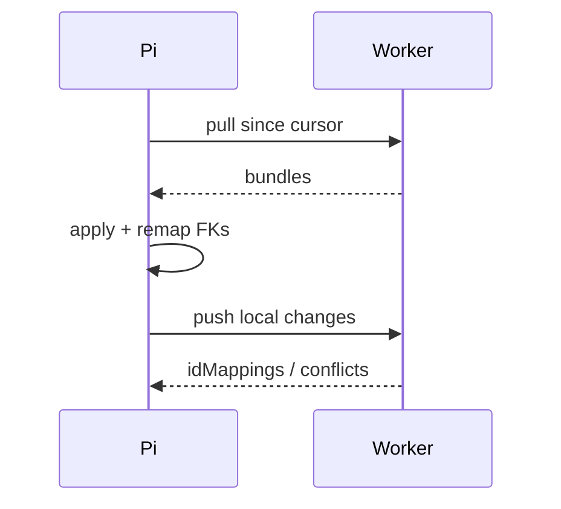

# Cloudflare ↔ Pi sync and failover

**Git-safe.** Auth: `ADMIN_PASSWORD` or `SYNC_SECRET`. Pi tunnel `https://pi.gokohostel.com`. SSH: [secrets-and-access.md](secrets-and-access.md). Worker secret `PI_PUBLIC_URL`. Optional `SYNC_SECRET` (sync also accepts admin password).

Code: `src/app/api/sync/route.ts`, `src/lib/syncEngine.ts`. UI: Management → Server Sync.

---

## Auth

`ADMIN_PASSWORD` **or** `SYNC_SECRET`. Pi remote: `CLOUDFLARE_SITE_URL` default `https://www.gokohostel.com`. Cloudflare remote: `PI_PUBLIC_URL`.

---

## What syncs

**With soft-delete:** checkins, dorms, beds, bookings, menu_categories, menu_items, food_orders, accounts, vendors, employees, expenses, daily_income, users, tasks, platform_payment_profiles.

**Append-only:** bed_history, food_order_items, order_modifications, salary_payments, daily_ledger, qr_history, guest_receipts, platform_receivable_entries, platform_settlements, platform_settlement_allocations.

**Settings keys only:** `image_validation`, `guest_min_age`, `guest_max_age`, `show_dob_in_records`, `log_level`, `food_tax_rate`, `booking_tax_rate`, `food_kitchen_hours`, `food_tab_limit`, `food_kitchen_busy`, `food_confirm_with_guest`, `food_kannada_labels`, `food_cafe_tables`, `primary_server`, `food_online_receipt_account_id`, `room_online_receipt_account_id`.

**Drift:** live Kannada flags are `food_kannada_kitchen_print` and `food_kannada_kitchen_display`. Sync still uses the old key `food_kannada_labels`. Those print/display keys do **not** sync.

**Never:** CMS `site_*`, **split_***, audit/system logs, api_stats, rate_scrapes, push, reviews, channel manager, inventory/rates/blocks, sync meta tables, **R2 objects**. Drive URLs on checkin and task rows *do* sync (files stay in Google). Task status/text works offline; attachment uploads require network access.

Pi migrator stamps `0035_site_cms.sql` and `0041_splits.sql` without applying SQL (same as CMS). It **does** apply `0042_booking_stay_payments.sql` (those columns live on synced `bookings`). Splits nav is hidden on Pi.

Integer PKs remapped via `sync_id` UUID + `sync_id_map`. FK remap table in `syncEngine.ts`. Conflicts → `sync_conflicts`.



Pull page size default 200. Heartbeat timeout 8s.

---

## Failover (LAN)

When hostel WAN dies, Pi dnsmasq can make `gokohostel.com` resolve to the Pi. Router DHCP primary DNS = `192.168.0.80`. Toggle: Server Sync → Local DNS Failover. Self-signed cert → browser warning. Log `/var/log/goko-failover.log`.

**Public internet** still hits the Worker, not the Pi. Tunnel is for **you** to reach the Pi from anywhere (`pi.gokohostel.com`).

---

## Pi app update

```bash
# SSH: secrets-and-access.md
ssh goko@goko-server.local
cd /home/goko/goko-web
git pull && npm run db:migrate:pi && npm run build:pi && pm2 restart goko
```

`db:migrate:pi` skips 0035 CMS. `NEXT_PUBLIC_GOKO_RUNTIME` must be set at **build** time.
