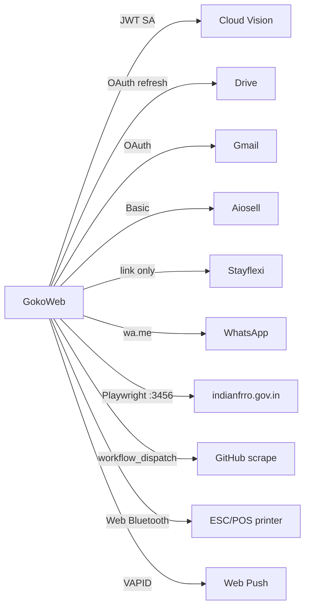

# Integrations

**Git-safe.** Credentials: [secrets-and-access.md](secrets-and-access.md).

| Service | Purpose | Auth on this project |
|---------|---------|----------------------|
| Cloudflare D1 | DB | Worker binding `DB`; HTTP token in secrets file for scripts |
| Cloudflare R2 | CMS JPEGs | Binding `MEDIA` / bucket `goko-media` |
| Cloudflare Workers | Host | Wrangler OAuth on this Mac |
| Google Vision | ID OCR | Service account JSON in env |
| Google Drive | ID + bill photos | Desktop OAuth refresh token |
| Gmail | OTA emails | Same OAuth family / web client |
| Aiosell | Channel manager | D1 `channel_config`. Webhook: header = `webhookSecret`. Sandbox UI defaults live in `src/lib/aiosell.ts` |
| Guest booking engines (StayFlexi / Aiosell / other) | Book now | Admin-saved HTTPS guest link in Channel Manager; external provider owns checkout; no hard-coded provider fallback |
| Goko native booking / Razorpay | Foundation only | `/book` enquiry entry and Booking Settings draft preferences; reservations/payment processing/webhooks/recovery remain pending |
| WhatsApp | Enquiry + food | `wa.me/919833624363` |
| FRRO | Form C | Staff portal login **not in env**; local Playwright |
| GitHub | Rate scrape | `GITHUB_TOKEN` Worker secret |
| GTM | Analytics | `GTM-WM3M8ZKP` on marketing layout only |
| Web Push | Kitchen/admin alerts | VAPID — often unset (no-op) |

Drive folder id and service-account email: [secrets-and-access.md](secrets-and-access.md).

Full vendor contract and compatibility notes: [aiosell-api-reference.md](aiosell-api-reference.md).

**Golden rule Aiosell:** `book`/`modify` webhooks must not echo inventory. `cancel` unassigns beds then **does** push (local pool freed). Goko-originated bed/booking/inventory UI changes push when auto-push is on.
