# Interaction diagrams

**Git-safe.** Sequence and state machines for how people, APIs, and stores talk. Secrets live in gitignored [secrets-and-access.md](secrets-and-access.md). Landmines: [llm-onboarding.md](llm-onboarding.md). Entity graphs: [relationships.md](relationships.md).

---

## System context

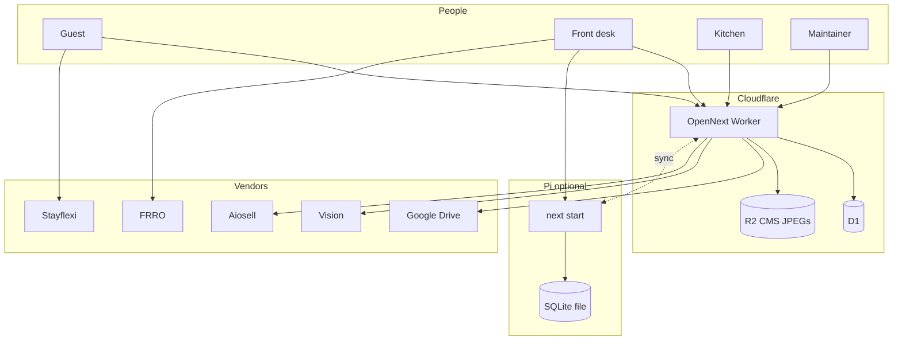

---

## Guest self check-in

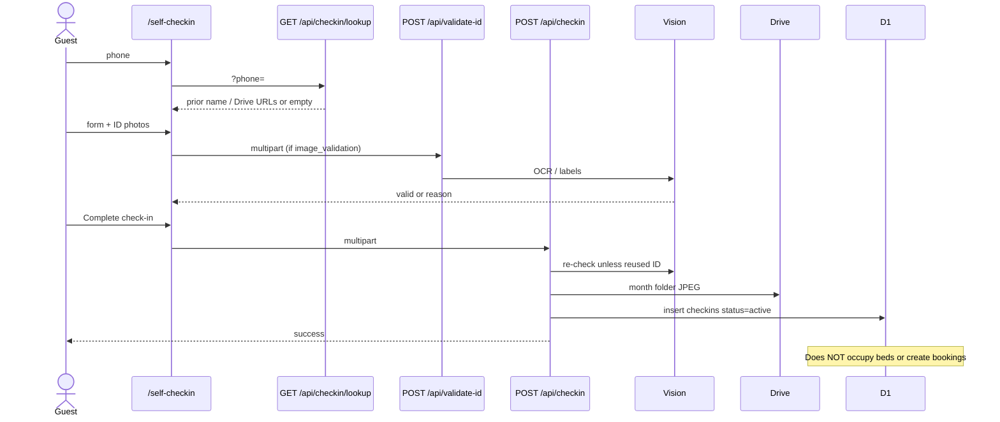

Staff then assign a physical bed (`assignBed` on `/api/admin/checkins`) and/or a calendar booking (`assignBeds` on `/api/admin/bookings`).

---

## Food order → kitchen → pay

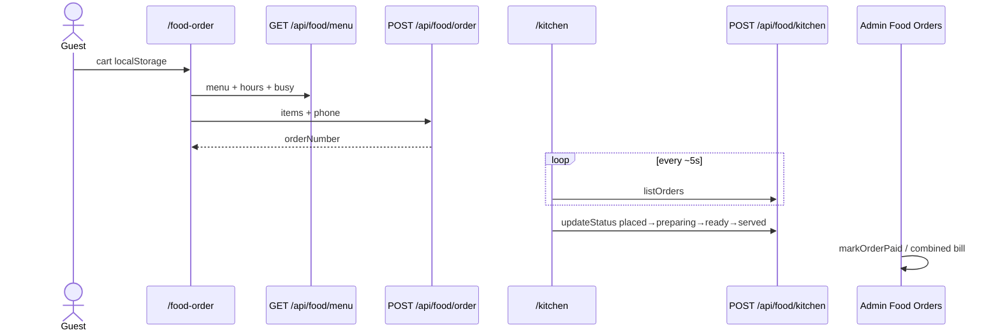

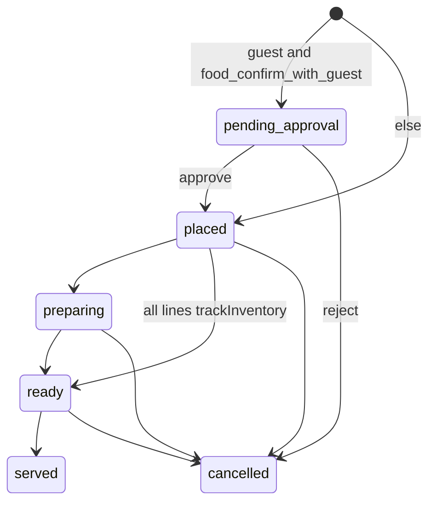

---

### Booking views

The admin Bookings dashboard has three presentation scopes:

- `Calendar`: uses `getCalendarData` and intentionally excludes cancelled bookings from calendar occupancy tiles.
- `Table`: shows the current calendar-range operational rows.
- `All Bookings`: uses `getAllBookings`, includes every booking status, filters by stays overlapping the selected date range, and paginates the result. Selecting a row opens the same `BookingDetailPanel` as the calendar/table views.

The All Bookings read path requires `canViewBookings` and does not change booking status, bed assignment, inventory, or calendar availability behavior.

### Manual booking editing

The booking detail panel offers a status-preserving editor for manual/offline/walk-in bookings. Name, phone, email, dates, derived nights, persons, nightly rate, special requests, and room/bed units are validated server-side. Date changes validate and reassign the existing active beds, then refresh PMS occupancy for both old and new nights. Bed changes validate conflicts, add before removing, and refresh occupancy. Date and bed changes must be saved separately; closed bookings allow guest/detail edits but retain historical assignments. Existing discount and tax rules are retained or recalculated by the server.

## Calendar PMS vs physical beds

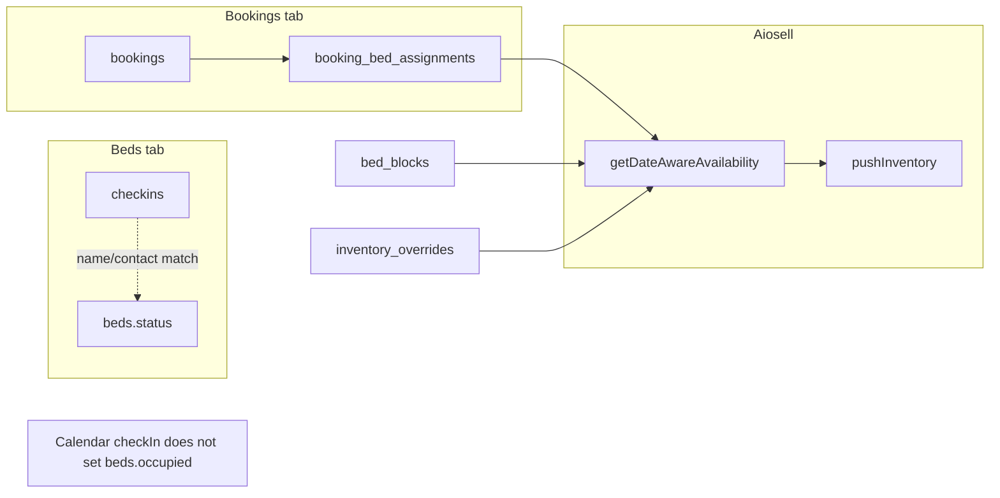

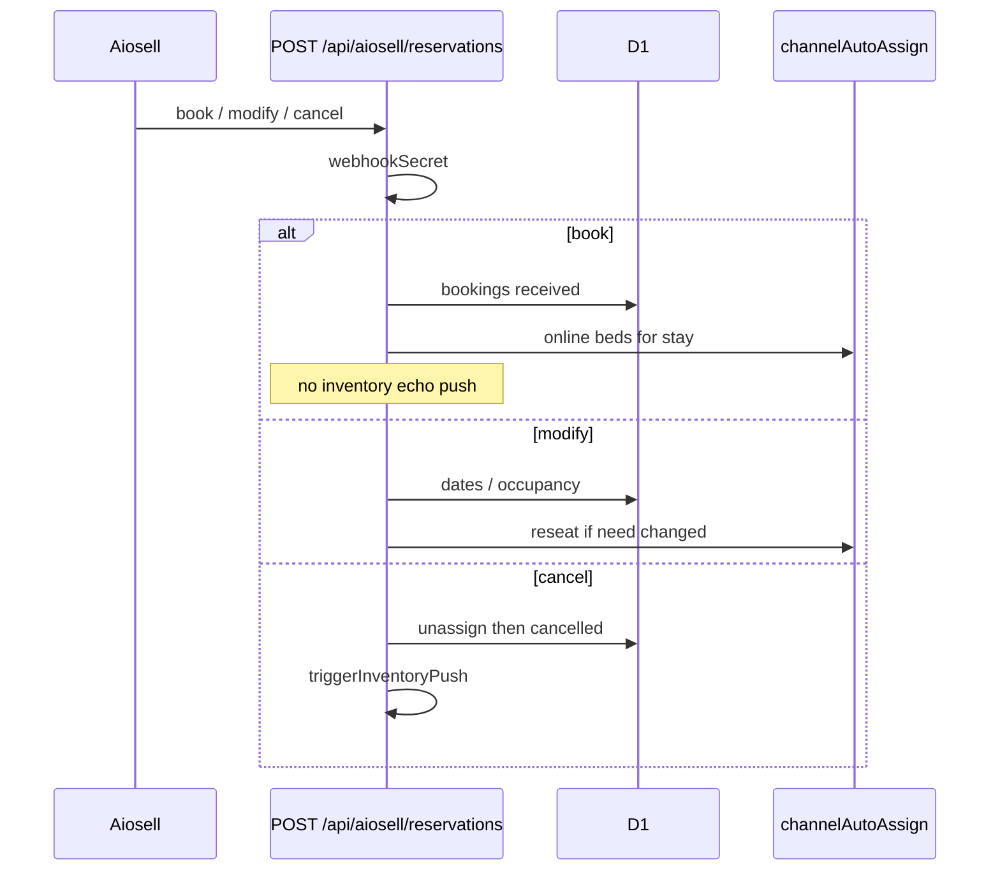

Walk-in desk path: `createBooking` → Unassigned chips → `assignBeds` (offline leftover) → `checkIn` (booking status only).

---

## Stay collect, prepaid, refund (rupees)

Kernel: `src/lib/stayPayment.ts`. Shared modal: `RecordPaymentModal` with `amountUnit="rupees"` (food stays paise).

```mermaid
sequenceDiagram
  actor Desk
  participant UI as CheckInPopup / Dashboard / Detail
  participant B as POST /api/admin/bookings
  participant DB as D1 bookings
  Desk->>UI: Check In
  alt OTA prepaid
    UI->>B: checkIn
    B->>B: prepaidCheckInWrite amountPaid=total online
    Note over DB: paymentStatus stays prepaid, hotel due 0
  else Later
    UI->>B: checkIn no collect
    Note over DB: stayDueAtHotel = total − paid
  else Collected
    UI->>B: checkIn collectPayment mergeStayCollect
    Note over DB: paymentStatus paid + paymentMethod
  end
  Desk->>UI: Mark Paid / Collect remaining
  UI->>B: collectStayPayment
  Desk->>UI: Cancel after check-in
  UI->>B: cancelBooking refundAmount refundMethod
  Note over DB: amount_refunded set; amount_paid unchanged
```

Room Revenue (`getRoomRevenue`) is occupied-for-revenue stays in the check-in date range — rupees, not ledger paise.

---

## Food tab on checkout (self-check-in, not booking id)

Hostel tabs are `food_orders.checkin_id` → `checkins.id`, matched by **normalized phone**. Calendar booking id is not the tab key.

```mermaid
sequenceDiagram
  actor Desk
  participant UI as Calendar / Beds / Timeline / Dashboard
  participant Tab as getPendingFoodTab
  participant DB as food_orders + checkins
  Desk->>UI: Check Out
  UI->>Tab: contact and/or checkinId
  Tab->>DB: active checkins by phone
  Tab-->>UI: pendingTab orderIds
  alt unpaid hostel tab
    UI->>Desk: warn; Check out anyway
  else empty / bad phone / lookup fail
    UI->>Desk: could not check; proceed anyway
  end
  Note over UI: APIs do not 409 on unpaid food
  Note over Tab: cafe walk-in (no checkin_id) is not matched
```

Admin UI imports `@/lib/foodTab` only. Routes import `@/lib/foodTabDb` (never from a client component).

---

## Accounts + Splits cash bridge

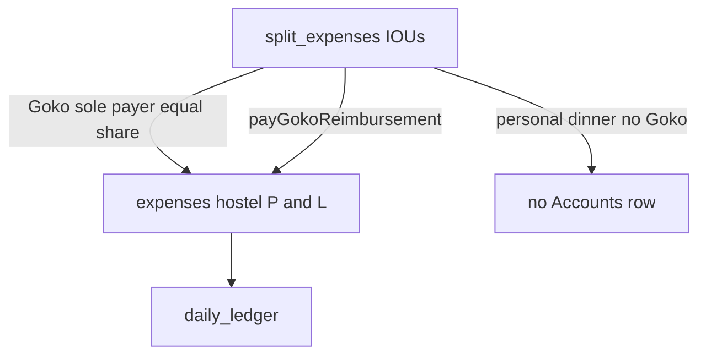

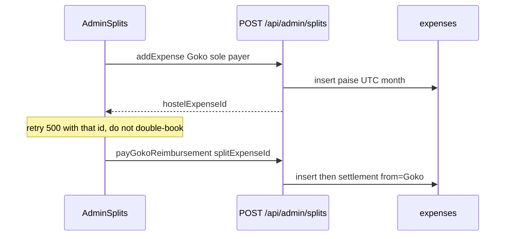

---

## CMS Events / Community

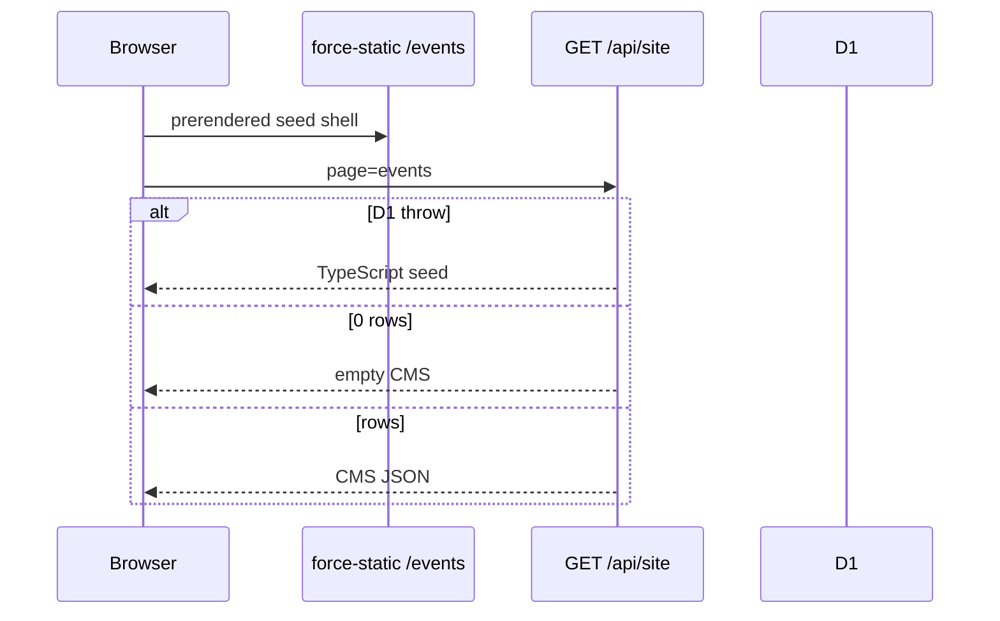

Admin upload: crop JPEG → `POST /api/admin/website/upload` → R2 → save JSON with `/api/media/...` URLs. Pi: tab hidden, API 403, migrator skips `0035`.

---

## Auth (every admin POST)

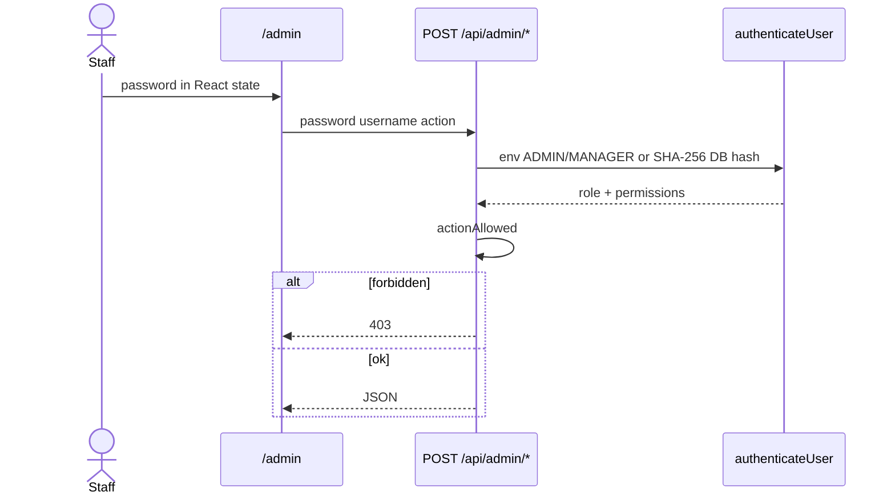

`useAdminApi` only hits `/api/admin/checkins`. Splits / food / bookings / inventory / expenses each `fetch` their own URL.

## Mobile presentation invariants

The shared shell treats fixed controls and anchor navigation as mobile-specific presentation concerns: floating actions account for device safe-area insets, anchor jumps leave room for the sticky header, and public footer/booking controls expose touch-sized targets. These changes do not alter action payloads, navigation routes, authentication, permissions, or workflow state.

---

## Pi sync + PWA failover

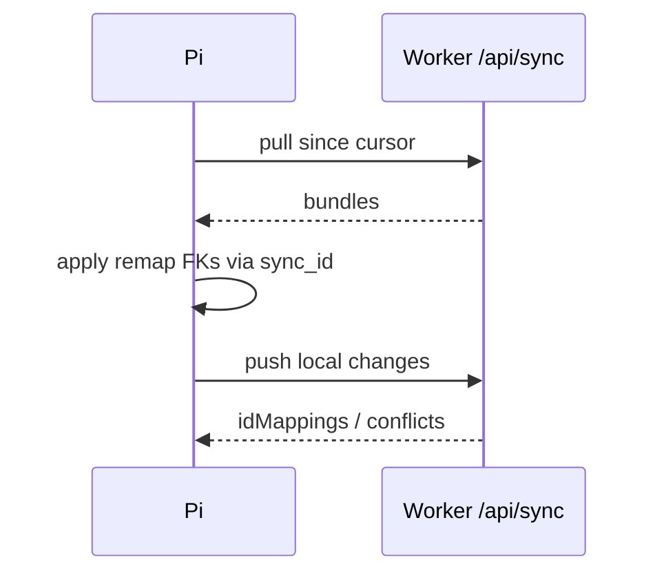

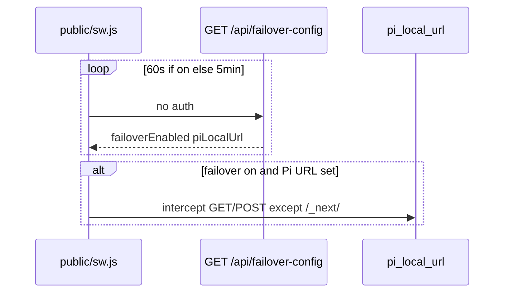

Toggle failover is `/api/sync` `toggleFailover`, not the GET.

---

## Reviews + Form C

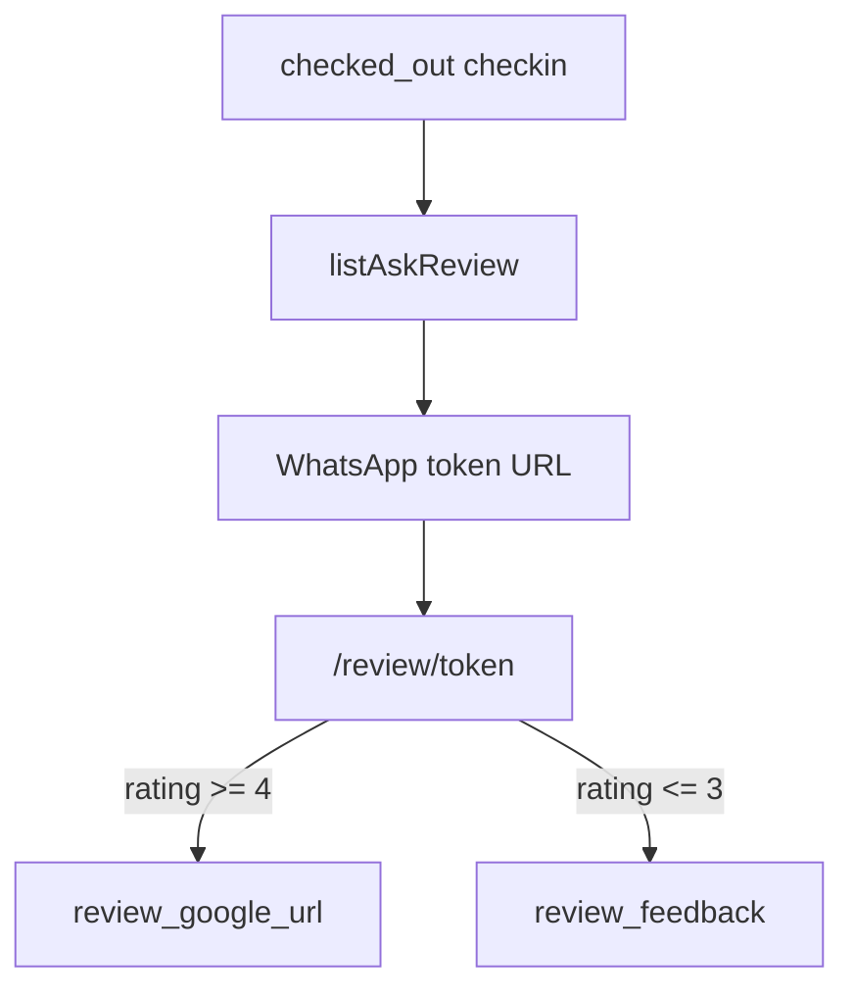

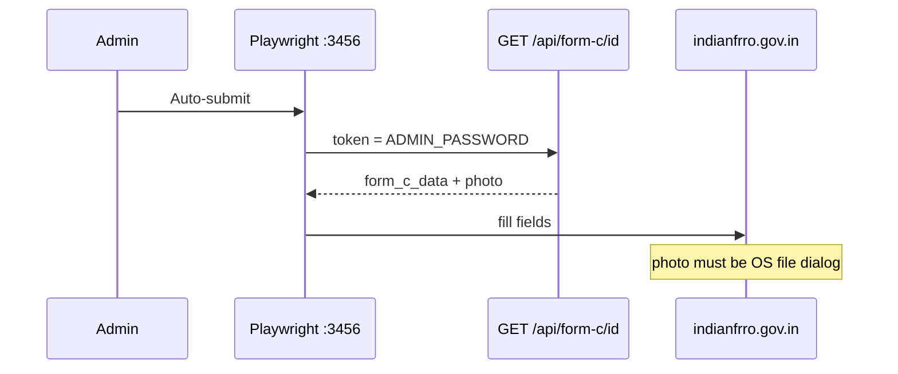

---

## Request shape (admin)

Almost all staff mutations:

```
POST /api/admin/<area>
{ "password": "<ADMIN_PASSWORD>", "username"?: "...", "action": "<name>", ... }
```

Unknown `action` → 400. No auth → 401. RBAC fail → 403. Full action lists: [api-map.md](api-map.md).
