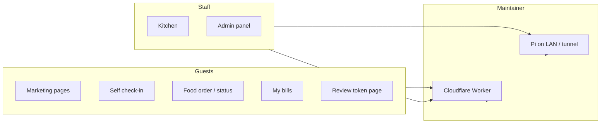
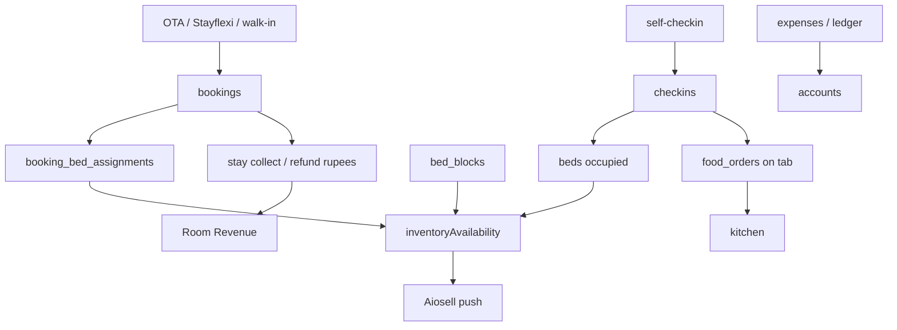

# What GokoWeb is

**Git-safe.** Logins: gitignored [secrets-and-access.md](secrets-and-access.md).

**GokoWeb** (`package.json` name `goko-premium`) is the digital backbone of **Goko Hostel & Community Space** in Gokarna, India. Canonical public URL: `https://www.gokohostel.com` (`src/lib/site.ts`).

It is one Next.js 15.5 App Router app (React 19, TypeScript, Tailwind, shadcn/Base UI) that serves:

1. A **marketing website** (administrator-configured “Book now”, GTM, CMS-backed Events + Community Area).
2. **Guest tools** — self check-in with ID photos, food ordering, my-bills, review links.
3. **Staff tools** — kitchen dashboard, full admin PMS (beds, bookings, inventory, channel manager), food ops, accounts, **splits** (staff/volunteer IOUs).
4. An optional **Raspberry Pi LAN copy** of the same app (`GOKO_RUNTIME=pi`) for front-desk when internet is down.

It is a **monolith**: one codebase, one deploy artifact per runtime, one SQLite-shaped database. Not microservices.

---

## Who uses it

| Audience | Typical paths | Auth |
|----------|---------------|------|
| Prospective guests | `/`, `/stay`, `/events`, `/community-area`, `/booking-enquiry` | None |
| Arriving guests | `/self-checkin` | None (ID upload) |
| Staying guests | `/food-order`, `/food-order/status`, `/my-bills` | Phone in query / localStorage |
| Kitchen | `/kitchen` | Kitchen password (`sessionStorage`) |
| Front desk / managers | `/admin` | Password every API call |
| Foreign-guest FRRO | Desktop Playwright helper + `/api/form-c/[id]` | Token from admin password |

---

## What it replaces

| Function | Instead of |
|----------|------------|
| Marketing site | Squarespace / WordPress |
| Guest register + ID photos | Paper + shared Drive folders by hand |
| Form C extraction | Manual FRRO typing from passport photos |
| Cafe POS + kitchen tickets | Pen-and-paper / a separate POS |
| Daily cash / expense books | Spreadsheets / Tally for this property |
| Staff/volunteer IOUs | Splitwise / WhatsApp tallies |
| Bed map + occupancy | Hostel PMS alone |
| OTA inventory / rates | Checking Booking.com / MMY / Hostelworld inboxes only |
| Events + community copy | Git commits for every photo/text change |

The public “Book now” destination is the saved Channel Manager guest Booking Engine URL, not a hard-coded StayFlexi link. External HTTPS engines handle their own checkout; blank/invalid/unavailable settings use Booking Enquiry. `/book` currently provides a branded enquiry entry only. Booking Settings holds draft preferences and credential-presence metadata; **native reservations and Razorpay checkout are not yet implemented**. Channel-manager inventory/rates still go through **Aiosell**. See [Website booking foundation](flows-website-booking.md).

---

## Product map (pages)

### Public marketing (`src/app/(marketing)/`)

Route group `(marketing)` wraps SiteShell + GTM. Pages are **`force-static`** so Workers does not SSR them (historical Error 1102 on Free CPU). Events and Community Area hydrate live CMS from `GET /api/site`.

| Path | Source of content |
|------|-------------------|
| `/` | `src/content/home.ts` + sections |
| `/stay` | `src/content/stay.ts` |
| `/story` | `src/content/story.ts` |
| `/events` | D1 CMS + seed fallback (`siteContent.ts`) |
| `/community-area` | D1 CMS + seed fallback |
| `/how-to-reach` | content + walking route |
| `/things-to-do` | `src/content/thingsToDo.ts` |
| `/faqs` | content + accordion |
| `/reviews` | content |
| `/booking-enquiry` | form → WhatsApp / email |

Sitemap (`src/app/sitemap.ts`) lists those marketing paths only. `robots.ts` **disallows:** `/self-checkin`, `/admin`, `/api/`, `/food-order`, `/kitchen`, `/my-bills`, `/review/`.

### Guest ops (no GTM shell)

| Path | Role |
|------|------|
| `/self-checkin` | Phone lookup → form → Vision → Drive → D1 |
| `/food-order` | Menu + cart; selected categories use a full-width responsive layout with a compact independently scrollable category rail beside a dense two-column dish grid with its own item scroll, compact controls, and no item descriptions (`localStorage` `gokoFoodCart` / `gokoFoodPhone`) |
| `/food-order/status` | Poll order status ~10s |
| `/my-bills` | Paid / unpaid food by phone or opaque `?t=` share token |
| `/kitchen` | Staff queue, 5s poll, Bluetooth ESC/POS |
| `/review/[token]` | Review funnel (low rating → internal form; high → Google) |

### Admin (`/admin`)

Top-level sections (`src/lib/adminNav.ts`), lazy-loaded with `next/dynamic`:

| Section | Component | Permission key (non-admin) |
|---------|-----------|----------------------------|
| Dashboard | `AdminDashboard` | `canViewDashboard` |
| Bookings | `BookingDashboard` | `canViewBookings` |
| Beds | `AdminBeds` | `canViewBeds` |
| Timeline | `AdminTimeline` | `canViewTimeline` |
| Inventory | `InventoryRatePlan` | `canManageInventory` |
| Records | `AdminRecords` | `canViewRecords` |
| Food Orders | `AdminFoodOrders` | `canViewFoodOrders` |
| Accounts | `AdminExpenditure` | `canViewAccounts` |
| Splits | `AdminSplits` | `canViewSplits` (hidden on Pi) |
| Reviews | `AdminReviews` | `canViewReviews` |
| Management | `AdminManagement` | `canViewManagement` |

Management sub-tabs (`AdminManagement.tsx`): Dorms, Users, Backup, Audit, Logs, Health & Stats, History, Rates, Menu, **Website**, Food Settings, Bulk Upload, QR Codes, Account Settings, Server Sync, Channel Manager. Channel Manager contains Configuration, Room Mapping, Rate Plans, Sales Channels, Bed Config, and Sync & Logs.

Website tab is **hidden on Pi builds** (`NEXT_PUBLIC_GOKO_RUNTIME === "pi"`).

Accounts sub-tabs: Add Expense, Daily Ledger, Records, Food Revenue, **Room Revenue**, Reconcile. Room Revenue is rupees (`getRoomRevenue`); Food Revenue is paise.

---

## Roles (product, not just DB)

| Role | How they log in | What they get |
|------|-----------------|---------------|
| **admin** | Env `ADMIN_PASSWORD` (username `admin` or omitted) or DB user `role=admin` | Bypasses permission maps |
| **manager** | Env `MANAGER_PASSWORD` or DB user | Env manager has `permissions: {}` — **centralized RBAC denies** gated actions. Use a DB user with keys, or admin env password |
| **staff** | DB `users` row with JSON permissions | Only keys set to true |

Kitchen accepts env admin/manager **or any DB user hash** (no username). See [auth-rbac.md](auth-rbac.md).

---

## Two runtimes, one product

| | Cloudflare (default) | Pi (`GOKO_RUNTIME=pi`) |
|--|----------------------|-------------------------|
| Who | Live internet | Front desk / LAN failover |
| DB | D1 `goko-hostel-db` binding `DB` | `better-sqlite3` file |
| CMS | Events + Community in D1 + R2 | Skipped; hardcoded `src/content/` |
| Deploy | `npm run deploy:cf` (OpenNext Worker) | `build:pi` + PM2 |
| Detection | `src/lib/runtime.ts` | same |

Details: [architecture.md](architecture.md), [flows-sync.md](flows-sync.md). Live IDs: `MAINTAINER.local.md`.

---

## Mental model

Guests and OTAs create **demand**. The PMS records **who is in which bed on which night**. That occupancy (plus blocks and online/offline pool) becomes **inventory** pushed to Aiosell. Walk-ins and food tabs stay inside GokoWeb. Marketing copy for Events/Community is edited in admin and stored in D1; ID photos never go to R2 — they go to Google Drive.

