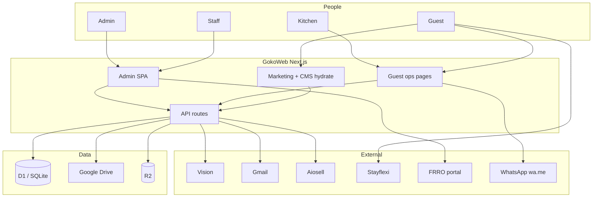
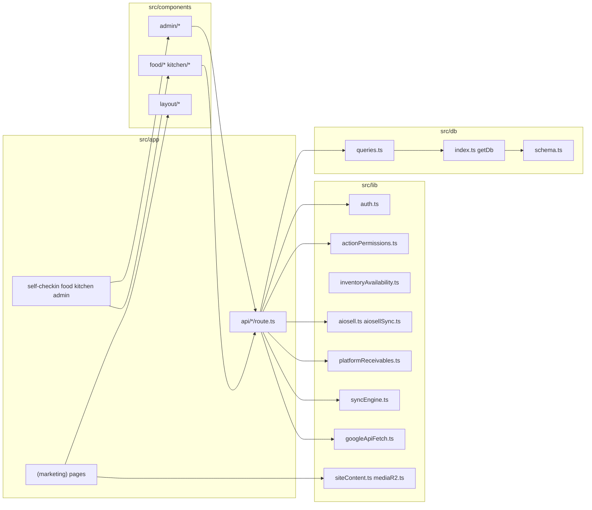
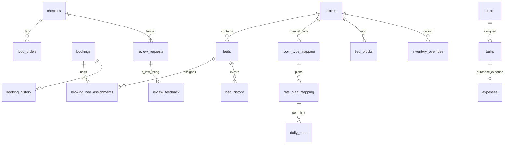
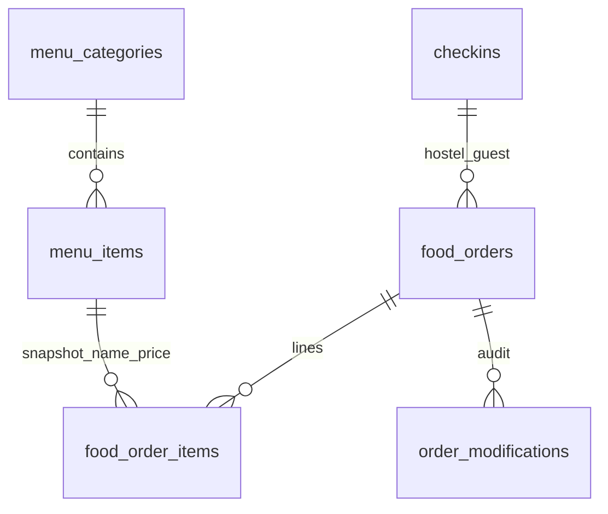
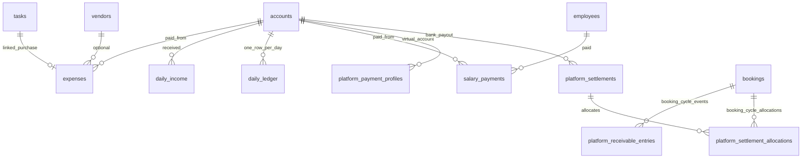
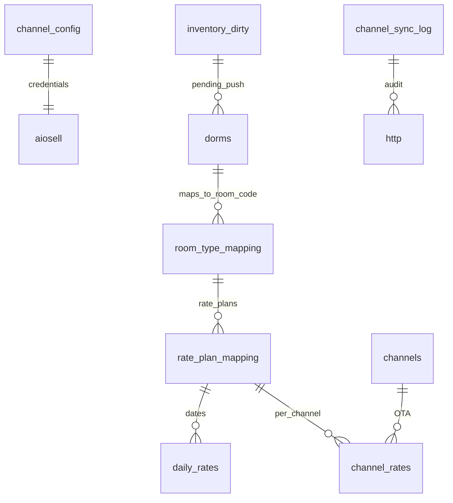
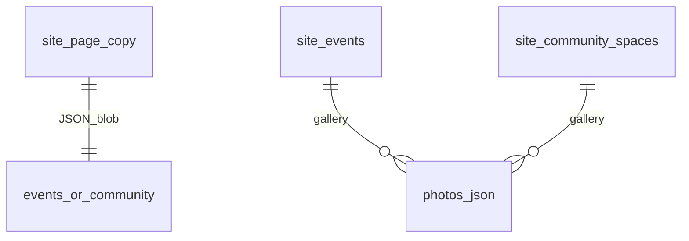
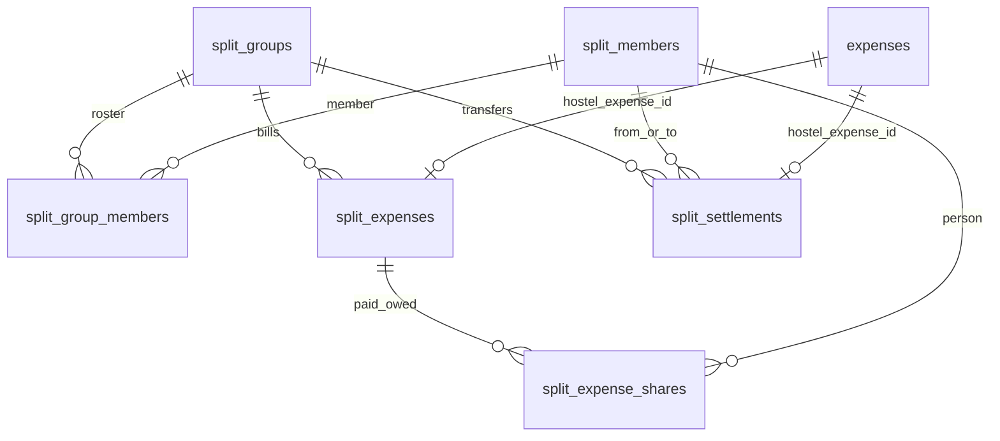
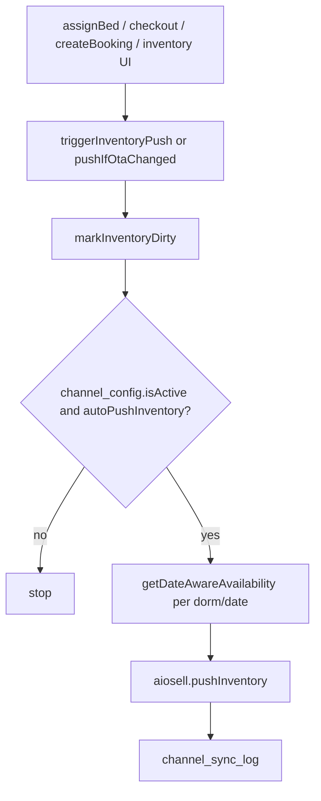
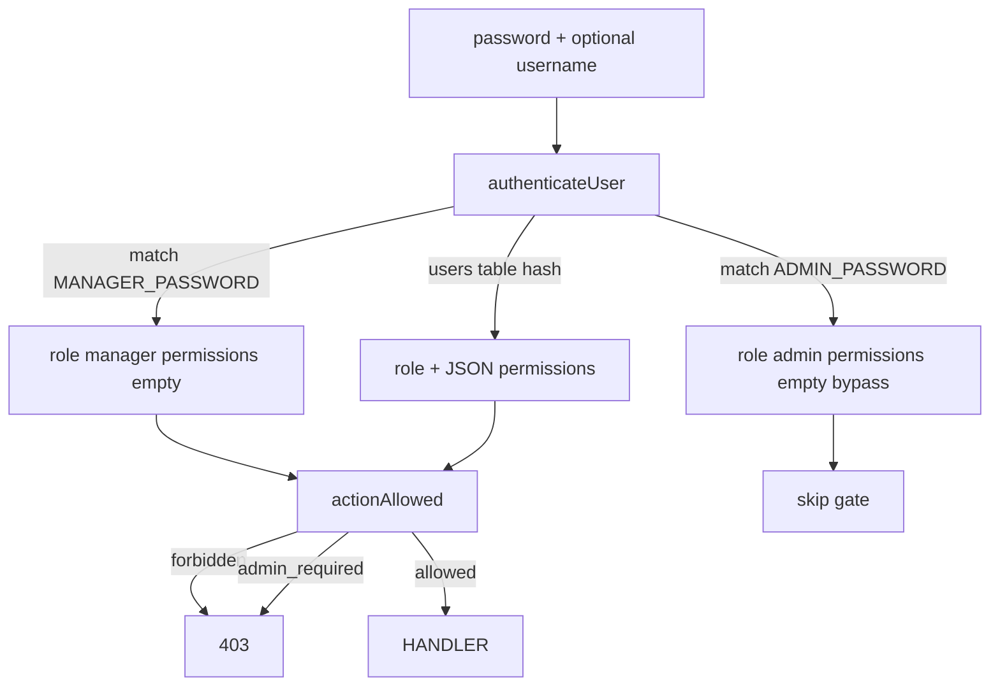

# Relationships — how the pieces connect

**Git-safe.** Table columns: [schema-columns.md](schema-columns.md). Sequences: [interactions.md](interactions.md). This file is the module/ER map.

---

## System context

---

## Module graph (code)

**Rule of thumb:** pages and admin components do not import Drizzle. They POST JSON. Routes call `queries.ts`. New SQL columns: `schema.ts` + `migrations/NNNN_name.sql` together.

---

## Guest stay — entity relationships

**Two occupancy models exist at once:**

1. **Physical bed row** (`beds.status` = available | occupied | cleanup) — walk-in / same-day map in Beds + Timeline.
2. **Date-range assignment** (`booking_bed_assignments`) — calendar PMS + OTA inventory.

Aiosell availability prefers date-aware assignment + blocks + overrides (`getDateAwareAvailability`), not only “is this bed occupied right now.”

Hostel food tabs attach to **`checkins`**, not `bookings`. Checkout lookup is phone-normalized against active check-ins (`getPendingFoodTab`). Cafe walk-in orders with no `checkin_id` are not matched.

---

## Food — entity relationships

Line items snapshot `itemName` / `itemPrice` so menu edits do not rewrite history. Stock lives on `menu_items.stock_quantity` when `track_inventory` is on.

---

## Accounts — entity relationships

Salary creates **two** rows: `salary_payments` + an `expenses` row (category Salary). Ledger unique on `(date, account_id)`.

---

## Channel manager — entity relationships

Credentials sit in D1 `channel_config` (not env), edited under Management → Channel Manager. Sandbox defaults exist in `aiosell.ts` for empty config; **production hotel/password is in D1**.

---

## CMS — entity relationships

No FK to R2. URLs are strings (`/api/media/...` or `/images/...`). GC counts URL refs with SQL `instr` before deleting R2 objects.

---

## Splits — entity relationships (Cloudflare D1 only)

App FKs are integers, not Drizzle `references()`. Unique `hostel_expense_id` where not null. Unique one house member (`is_house = 1`). Not in `syncEngine`.

---

## Call graph — inventory push (Goko-originated)

Webhook path (`/api/aiosell/reservations`) creates/updates `bookings` + assignments and **must not** blindly echo a push that re-tells Aiosell what it just sent.

---

## Call graph — admin UI → API

| UI | Route |
|----|--------|
| Records, Dashboard, Beds, Timeline, Users, Audit, Backup, Settings, Gmail bookings list (legacy actions) | `/api/admin/checkins` |
| Booking calendar | `/api/admin/bookings` |
| Inventory / rates grid | `/api/admin/inventory` |
| Food orders / tabs / pay | `/api/admin/food-orders` |
| Menu CRUD | `/api/admin/food` |
| Expenses / ledger | `/api/admin/expenses` |
| Tasks / task uploads | `/api/admin/tasks` + `/api/admin/tasks/upload` |
| Splits | `/api/admin/splits` |
| Accounts / vendors / employees | `/api/admin/account-settings` |
| Website CMS | `/api/admin/website` + `/upload` |
| Channel manager config | `/api/admin/channel-manager` |
| Reviews admin | `/api/admin/reviews` |
| QR history | `/api/admin/qr-history` |
| Check-in XLSX | `/api/admin/import` |
| Expense/income XLSX | `/api/admin/bulk-import-accounts` |
| Drive upload (manual records) | `/api/admin/upload` |
| Server sync UI | `/api/sync` |
| Kitchen (also used embedded in Food Orders) | `/api/food/kitchen` |

---

## Auth relationship

Env manager **fails** gated actions. That is not a bug; DB managers need permission keys. See [auth-rbac.md](auth-rbac.md).

---

## What is **not** related (on purpose)

| A | B | Why disconnected |
|---|---|------------------|
| `site_events` | Pi SQLite | CMS Cloudflare-only |
| R2 objects | `/api/sync` | Photos stay on CF; IDs are Drive URLs on checkin rows |
| Stayflexi | Aiosell client | Book now is a link; inventory is Aiosell |
| `qr_history` | Food order URLs | Staff paste URLs by hand |
| `rate_scrapes` | `daily_rates` | Competitor scrape is research, not live selling rates |
| `api_stats` | Billing | Internal Vision/Drive counters only |
